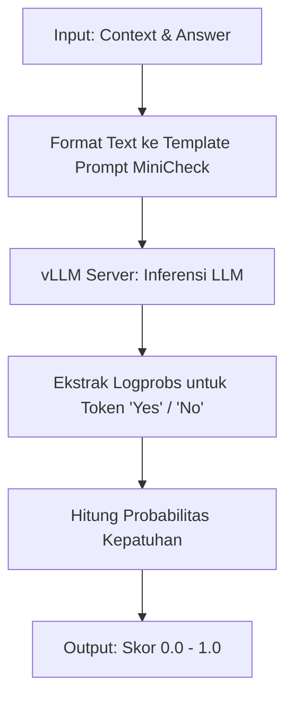
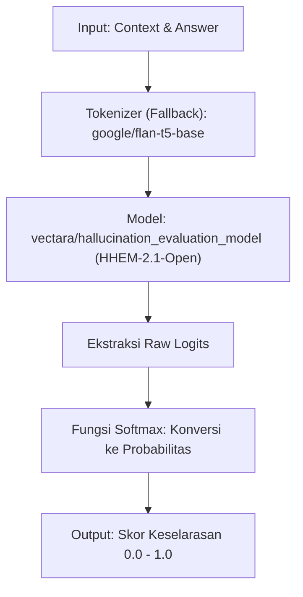

# Kalibrasi Metrik Evaluasi Faithfulness (WikiEval Dataset)

Folder ini berisi hasil pengujian (observasi dan traces) dari eksperimen kalibrasi metrik evaluasi alternatif untuk pipeline RAG, yaitu membandingkan hasil **RAGAS (Baseline LLM-as-a-judge)** dari artikel aslinya dengan metrik inferensi khusus (NLI) menggunakan model skala kecil yang dijalankan secara lokal.

## Ringkasan Hasil (Human Preference Agreement Rate)
- **RAGAS (GPT-3.5) - Baseline Paper**: 95.0%
- **Bespoke-MiniCheck-7B (Local)**: 99.0%
- **Vectara HHEM-2.1-Open (Local)**: 86.0%

Diagram perbandingan visual dapat dilihat pada file `Calibration_Comparison_Chart.png` yang dibuat secara otomatis menggunakan skrip `plot_calibration_results.py`.

## Model yang Digunakan (Hugging Face Citations)

### 1. Bespoke-MiniCheck-7B
Bespoke-MiniCheck adalah model yang secara khusus di-fine-tune untuk memverifikasi fakta (fact-checking) respons LLM berdasarkan dokumen grounding (retrieved documents). Model varian 7B ini didasarkan pada arsitektur Llama-3-8B.

**Alur Kerja (Workflow):**


* **Hugging Face Hub**: [bespoke-testing/Bespoke-MiniCheck-7B](https://huggingface.co/bespoke-testing/Bespoke-MiniCheck-7B)
* **Citation**:
```bibtex
@misc{Luo2024MiniCheck,
      title={MiniCheck: Efficient Fact-Checking of LLMs on Grounding Documents}, 
      author={Liyan Luo and Shuhuai Ren and Eliana Lorch and Jonas Mueller},
      year={2024},
      eprint={2404.10774},
      archivePrefix={arXiv},
      primaryClass={cs.CL}
}
```

### 2. Vectara HHEM-2.1-Open
Hughes Hallucination Evaluation Model (HHEM) dikembangkan oleh tim riset Vectara. Versi 2.1-Open menggunakan arsitektur Cross-Encoder (berbasis T5) untuk mendeteksi tingkat halusinasi. Metrik ini sangat dikenal karena menopang Vectara's Hallucination Leaderboard.

**Alur Kerja (Workflow):**


* **Hugging Face Hub**: [vectara/hallucination_evaluation_model](https://huggingface.co/vectara/hallucination_evaluation_model)
* **Citation**:
```bibtex
@misc{vectara2023hhem,
  author = {Hughes, Simon and others},
  title = {Hughes Hallucination Evaluation Model (HHEM)},
  year = {2023},
  publisher = {Vectara},
  howpublished = {\url{https://github.com/vectara/hallucination-leaderboard}}
}
```

## Catatan Khusus Analisis Evaluasi (Error Analysis)
Pada pengujian dengan **Bespoke-MiniCheck-7B**, model memperoleh akurasi **99.0%** alih-alih 100.0%. Berkurangnya nilai ini disebabkan oleh model yang memberikan nilai parsial (0.5) pada **Data ke-13**.

Setelah ditelusuri lebih lanjut, "kegagalan" ini justru membuktikan ketajaman model evaluator tersebut. Pada data ke-13, jawaban yang disajikan sebagai jawaban referensi "Grounded" (berdasarkan kebenaran/fakta) dari dataset WikiEval ternyata mengandung kesalahan bawaan (cacat/flawed). Jawaban referensi tersebut secara keliru memasukkan puluhan nama *landmark* yang sama sekali **tidak pernah disebutkan** di dalam teks konteks (*Context*). 

Karena *pipeline* evaluasi memecah jawaban menjadi beberapa kalimat, Bespoke-MiniCheck dengan cerdas mendeteksi bahwa salah satu kalimat dalam jawaban referensi tersebut merupakan hasil halusinasi. Oleh karena itu, model tidak memberikan nilai 1.0 yang secara efektif memvalidasi bahwa metrik lokal bekerja sangat baik, bahkan lebih teliti dibandingkan anotasinya sendiri.
