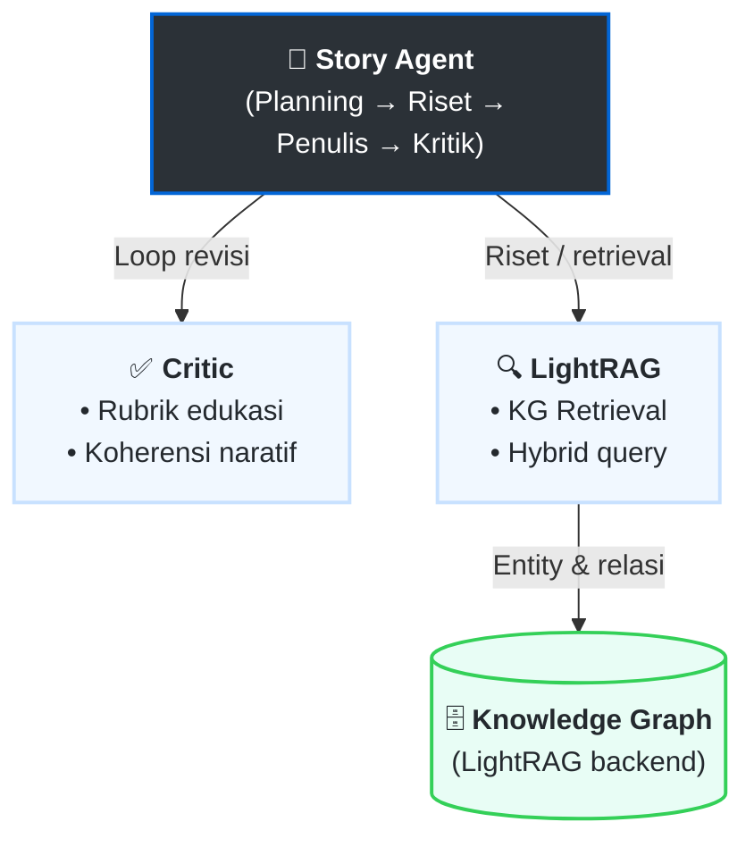

# Analisis Kinerja Koherensi Naratif dan Faithfulness pada Sistem Agentic AI dan LightRAG untuk Pembelajaran Berbasis Cerita

[](https://www.python.org/downloads/)
[](LICENSE)

> **Penelitian Skripsi** - Program Studi S1 Rekayasa Perangkat Lunak, Universitas Pendidikan Indonesia (UPI)
>
> **Peneliti**: Mohammad Raya Satriatama (NIM: 2206418)

## 📋 Deskripsi Penelitian

Penelitian ini menganalisis kinerja sistem hibrida **Agentic AI** dan **LightRAG** dalam menghasilkan konten pembelajaran berbasis cerita (*story-based learning*). Fokus evaluasi pada dua metrik utama:

1. **Koherensi Naratif** - Kemampuan mempertahankan alur cerita yang logis dan terstruktur
2. **Faithfulness** - Kemampuan tetap setia pada fakta dalam Knowledge Graph

### 🎯 Tujuan Penelitian

- Menganalisis dan mengukur kinerja koherensi naratif sistem
- Menganalisis dan mengukur kinerja faithfulness sistem
- Memberikan wawasan empiris untuk pengembangan aplikasi edukasi berbasis AI

## 📚 Dokumentasi Lengkap

Dokumentasi lengkap proyek dapat diakses di [docs/index.md](docs/index.md).

Evaluator OpenRouter yang terpisah dari model generator dan prosedur benchmark
keluaran Gemini yang sudah ada tersedia pada [konfigurasi evaluator dan
benchmark](docs/configuration.md#peran-evaluator-terpisah).

- **Arsitektur Agentic AI (alir penuh: perencanaan → riset → penulisan → kritik & revisi):** [docs/architecture/pengembangan_arsitektur_agentic_ai.md](docs/architecture/pengembangan_arsitektur_agentic_ai.md) — gambaran orkestrasi, `StoryState`, routing revisi; detail per agen dalam file terpisah di [docs/architecture/agents/](docs/architecture/agents/) (mis. [agent_critic.md](docs/architecture/agents/agent_critic.md)). *English summary included in-doc.*
- **Diagram jaringan agen lengkap (batch + interaktif, revisi, HITL, sub-agen kritik; tanpa tools):** [docs/architecture/agent_graph_diagrams.md](docs/architecture/agent_graph_diagrams.md).
- **LightRAG (spesifikasi & WikiEval):** [docs/architecture/lightrag/README.md](docs/architecture/lightrag/README.md) — indeks ke spesifikasi EN/ID dan log pengembangan injeksi; integrasi panjang tetap di [docs/architecture/lightrag_integration.md](docs/architecture/lightrag_integration.md).
- **Dataset & estimasi biaya token:** [docs/datasets/dataset_cost_estimation.md](docs/datasets/dataset_cost_estimation.md).
- **Dashboard Streamlit (Faithfulness + WikiEval + LightRAG):** [Streamlit/README.md](Streamlit/README.md) — tab **WikiEval**: EDA `dataset/wikiEval_all.json` selaras [notebooks/01_analisis_dataset_wikieval.ipynb](notebooks/01_analisis_dataset_wikieval.ipynb); tab Faithfulness: filter **ID/EN**, statistik deskriptif + histogram skor trace, kesimpulan di bawah; HTML di `Images_Faithfulness_10/` (generator menambah badge + penjelasan **false negative** untuk klaim `MANUAL_GT_FAITHFUL`); metrik FABLES/RAGAS dari `Eval_Data/Observations` + [Streamlit/lib/faithfulness_metrics.py](Streamlit/lib/faithfulness_metrics.py) (`python calc_f1.py`; RAGAS-style 2×2: pred positif hanya `FAITHFUL`, sisanya `UNFAITHFUL`/`PARTIAL_SUPPORT`/`CANT_VERIFY` sebagai pred negatif); audit kohort: [docs/faithfulness_manual_reaudit.md](docs/faithfulness_manual_reaudit.md); snapshot LightRAG: [LightRAG/backups/](LightRAG/backups/README.md).
- **Sampling data trace terbaru (min, median, max) dan perbandingan dengan `Images_Faithfulness_10`:** [docs/faithfulness_sampling_latest_vs_images_faithfulness_10.md](docs/faithfulness_sampling_latest_vs_images_faithfulness_10.md).

## 📝 Dokumen Thesis (Bab 4)

Draft bab-bab hasil penelitian tersimpan di root project:

| File | Isi |
|---|---|
| [`bab4_1_pengembangan_knowledge_graph_lightrag.md`](bab4_1_pengembangan_knowledge_graph_lightrag.md) | **Bab 4.1** — Pengembangan Knowledge Graph pada LightRAG (Data Preparation, Preprocessing, Konstruksi LightRAG) |
| [`bab4_2_pengembangan_arsitektur_agentic_ai.md`](bab4_2_pengembangan_arsitektur_agentic_ai.md) | **Bab 4.2** — Pengembangan Arsitektur Agentic AI (Planner, Researcher, Writer, Critic + 5 sub-evaluator) |

## 🏗️ Arsitektur Sistem

Sistem ini mengintegrasikan komponen-komponen berikut:



### Komponen Utama

#### 1. **Agentic AI (Orchestrator)**

- **Planning**: Merencanakan alur narasi
- **Tool Use**: Memanggil LightRAG untuk retrieval
- **Self-Reflection**: Evaluasi dan perbaikan output

#### 2. **LightRAG Integration**

- Knowledge Graph construction dari story corpus
- Dual-level retrieval (entity + relation)
- Incremental updates

## 📁 Struktur Project

```
Skripsi/
├── .github/                   # GitHub workflows
├── .gitignore                 # Git ignore rules
├── .env.example               # Template environment variables
├── requirements.txt           # Dependencies
├── scripts/                   # Utility & Test Scripts
│   ├── run_api_tests.py            # Main API Test Runner
│   ├── run_complete_tests.py       # Full Test Suite (incl. SSE)
│   ├── export_langfuse_traces.py   # Export Langfuse traces via API
│   ├── test_single.py              # Quick Endpoint Test
│   └── setup_environment.py        # Setup Utility
├── docs/                  # ✅ Documentation (See docs/index.md)
├── baseline/              # Baseline WikiEval runner (context_v1+v2 injected; Langfuse-native)
├── src/                   # Source Code
│   ├── apps/                  # Application Entrypoints
│   │   ├── api/               # FastAPI Backend
│   │   │   ├── routers/       # API Endpoints
│   │   │   └── main.py        # App Entry Point
│   │   └── story_agent_app.py # Gradio Frontend
│   ├── settings.py            # Centralized Configuration
│   ├── config.py              # Credentials Loader
│   ├── evaluation/            # Evaluation metrics (RAGAS, dll.)
│   ├── knowledge_graph/       # KG Builders
│   ├── lightrag_integration/  # LightRAG Tools
│   └── workflows/             # LangGraph Agents
│       └── story_agent/       # Main Story Agent Logic
│           └── agents/
│               ├── critic/    # Critic Agent (modular evaluation package)
│               │   ├── __init__.py          # Public API → CriticAgent
│               │   ├── agent.py             # CriticAgent orchestrator
│               │   ├── models.py            # Pydantic models & CoherenceIssue
│               │   ├── deepeval_llm.py      # DeepEval LLM wrapper
│               │   ├── eval_educational.py  # EducationalEvaluator
│               │   ├── eval_coherence.py    # CoherenceEvaluator (LLM structured)
│               │   ├── eval_geval.py        # GEvalEvaluator (5 sub-criteria parallel)
│               │   └── eval_ragas.py        # RagasEvaluator + FABLES (Kim et al. 2024, arXiv:2404.01261v2)
│               └── ...        # Other agents (writer, planner, etc.)
├── Streamlit/                 # Dashboard Faithfulness & perbandingan LightRAG (lihat Streamlit/README.md)
├── LightRAG/backups/          # Snapshot rag_storage EN/ID (lihat LightRAG/backups/README.md)
└── tests/                     # Unit Tests
```

### Catatan `.gitignore`

- `Streamlit/lib/` berisi modul Python untuk dashboard; direktori ini **tidak** diabaikan (pola `lib/` generik dari template Python sengaja dihapus agar tidak menelan folder aplikasi).
- Basis data SQLite lokal (`*.db`, `*.sqlite*`), cache alat## 🚀 Panduan Memulai (*Quick Start*)

### 1. Persiapan Awal
- **Python 3.9** atau lebih baru
- **Git** untuk kloning repositori
- **Docker** (Opsional, untuk menjalankan LightRAG)
- **API Keys** (Vertex AI / OpenAI / OpenRouter dll.)

### 2. Instalasi

```bash
# Clone repository
git clone https://github.com/RayaSatriatama/thesis_result.git
cd thesis_result

# Buat virtual environment (Direkomendasikan)
python -m venv .venv

# Aktifkan virtual environment
# Windows:
.\.venv\Scripts\activate
# Linux/Mac:
source .venv/bin/activate

# Instal dependensi menggunakan uv pip, termasuk DeepEval untuk G-Eval
pip install uv
uv pip install -r requirements.txt

# Setup variabel lingkungan
cp .env.example .env
# Buka file .env dan masukkan API Keys Anda
```

Benchmark evaluator OpenRouter memakai file JSON eksplisit. Evaluator berjalan
paralel secara default. Export historis menghasilkan overlay trace lokal yang
editable dan tidak mengubah trace Langfuse lama. Pengiriman ke Langfuse hanya
aktif bila `langfuse.enabled` serta mode penulisan eksplisit diaktifkan. Lihat
[`docs/configuration.md`](docs/configuration.md) untuk contoh konfigurasi.

### 3. Cara Menjalankan Proyek

Proyek ini memiliki tiga komponen utama yang dapat dijalankan secara terpisah:

**A. API Server (Backend Agentic AI)**
Menjalankan *backend server* berbasis FastAPI untuk melayani *request* dari *frontend*.
```bash
# Menjalankan server API biasa (Writers: Text only)
python -m src.apps.api.main

# Mode Pengembangan dengan auto-reload (Linux/Mac)
SYSTEM_LANGUAGE=id uvicorn src.apps.api.main:app --reload --host 0.0.0.0 --port 8000
```
- **Swagger UI (Dokumentasi API):** `http://localhost:8000/docs`

**B. Streamlit Dashboard**
Menjalankan dashboard analitik untuk melihat metrik evaluasi (Faithfulness, WikiEval, dll).
```bash
# Pastikan virtual environment utama (.venv) aktif
cd Streamlit
streamlit run app.py
```

**C. LightRAG Server (Knowledge Graph Backend)**
Menjalankan *backend* LightRAG (termasuk Neo4j, Qdrant, dan Redis) menggunakan Docker.
```bash
cd LightRAG
docker compose up -d
```
- Server EN beroperasi di port `8631`
- Server ID beroperasi di port `8641`

## 🧪 Pengujian (*Testing*)

Untuk memastikan semua sistem berfungsi normal, gunakan skrip pengujian berikut:

```bash
# 1. Menjalankan Health Check & API Test
python scripts/run_api_tests.py

# 2. Menjalankan Full Test Suite (Keseluruhan)
python scripts/run_complete_tests.py

# 3. Uji Coba Workflow Agentic AI (Interaktif via CLI / Terminal)
# Menguji alur Story Agent secara langsung tanpa menjalankan API server
python scripts/test_full_workflow_custom.py
python scripts/test_text_only_workflow.py
```

## 🔧 Konfigurasi

Semua konfigurasi parameter agen (LLM Provider, Temperature, LightRAG, dsb) dikendalikan melalui file `.env` dan tersentralisasi pada `src/settings.py`.

📖 **Dokumentasi Lengkap Konfigurasi:** [docs/configuration.md](docs/configuration.md)

## 🤝 Kontribusi & Lisensi

Penelitian ini merupakan bagian dari pengerjaan skripsi S1 di Universitas Pendidikan Indonesia (UPI).
- **Fase**: Prescriptive Study (Implementation)
- **Lisensi**: Dilakukan untuk keperluan akademis di bawah lisensi dan naungan UPI.
