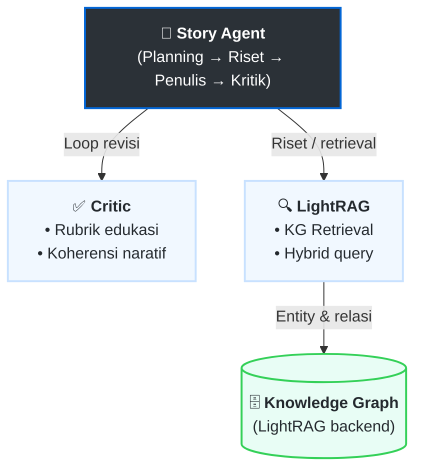

# Analisis Kinerja Koherensi Naratif dan Faithfulness pada Sistem Agentic AI dan LightRAG untuk Pembelajaran Berbasis Cerita

[](https://www.python.org/downloads/)
[](LICENSE)

> **Penelitian Skripsi** - Program Studi S1 Rekayasa Perangkat Lunak, Universitas Pendidikan Indonesia (UPI)
>
> **Peneliti**: Mohammad Raya Satriatama (NIM: 2206418)

## 📋 Deskripsi Penelitian

Penelitian ini menganalisis kinerja sistem hibrida **Agentic AI** dan **LightRAG** dalam menghasilkan konten pembelajaran berbasis cerita (*story-based learning*). Fokus evaluasi pada dua metrik utama:

1. **Koherensi Naratif** - Kemampuan mempertahankan alur cerita yang logis dan terstruktur
2. **Faithfulness** - Kemampuan tetap setia pada fakta dalam Knowledge Graph

### 🎯 Tujuan Penelitian

- Menganalisis dan mengukur kinerja koherensi naratif sistem
- Menganalisis dan mengukur kinerja faithfulness sistem
- Memberikan wawasan empiris untuk pengembangan aplikasi edukasi berbasis AI

## 📚 Dokumentasi Lengkap

Dokumentasi lengkap proyek dapat diakses di [docs/index.md](docs/index.md).

- **Arsitektur Agentic AI (alir penuh: perencanaan → riset → penulisan → kritik & revisi):** [docs/architecture/pengembangan_arsitektur_agentic_ai.md](docs/architecture/pengembangan_arsitektur_agentic_ai.md) — gambaran orkestrasi, `StoryState`, routing revisi; detail per agen dalam file terpisah di [docs/architecture/agents/](docs/architecture/agents/) (mis. [agent_critic.md](docs/architecture/agents/agent_critic.md)). *English summary included in-doc.*
- **Diagram jaringan agen lengkap (batch + interaktif, revisi, HITL, sub-agen kritik; tanpa tools):** [docs/architecture/agent_graph_diagrams.md](docs/architecture/agent_graph_diagrams.md).
- **LightRAG (spesifikasi & WikiEval):** [docs/architecture/lightrag/README.md](docs/architecture/lightrag/README.md) — indeks ke spesifikasi EN/ID dan log pengembangan injeksi; integrasi panjang tetap di [docs/architecture/lightrag_integration.md](docs/architecture/lightrag_integration.md).
- **Dataset & estimasi biaya token:** [docs/datasets/dataset_cost_estimation.md](docs/datasets/dataset_cost_estimation.md).
- **Dashboard Streamlit (Faithfulness + WikiEval + LightRAG):** [Streamlit/README.md](Streamlit/README.md) — tab **WikiEval**: EDA `dataset/wikiEval_all.json` selaras [notebooks/01_analisis_dataset_wikieval.ipynb](notebooks/01_analisis_dataset_wikieval.ipynb); tab Faithfulness: filter **ID/EN**, statistik deskriptif + histogram skor trace, kesimpulan di bawah; HTML di `Images_Faithfulness_10/` (generator menambah badge + penjelasan **false negative** untuk klaim `MANUAL_GT_FAITHFUL`); metrik FABLES/RAGAS dari `Eval_Data/Observations` + [Streamlit/lib/faithfulness_metrics.py](Streamlit/lib/faithfulness_metrics.py) (`python calc_f1.py`; RAGAS-style 2×2: pred positif hanya `FAITHFUL`, sisanya `UNFAITHFUL`/`PARTIAL_SUPPORT`/`CANT_VERIFY` sebagai pred negatif); audit kohort: [docs/faithfulness_manual_reaudit.md](docs/faithfulness_manual_reaudit.md); snapshot LightRAG: [LightRAG/backups/](LightRAG/backups/README.md).
- **Sampling data trace terbaru (min, median, max) dan perbandingan dengan `Images_Faithfulness_10`:** [docs/faithfulness_sampling_latest_vs_images_faithfulness_10.md](docs/faithfulness_sampling_latest_vs_images_faithfulness_10.md).

## 📝 Dokumen Thesis (Bab 4)

Draft bab-bab hasil penelitian tersimpan di root project:

| File | Isi |
|---|---|
| [`bab4_1_pengembangan_knowledge_graph_lightrag.md`](bab4_1_pengembangan_knowledge_graph_lightrag.md) | **Bab 4.1** — Pengembangan Knowledge Graph pada LightRAG (Data Preparation, Preprocessing, Konstruksi LightRAG) |
| [`bab4_2_pengembangan_arsitektur_agentic_ai.md`](bab4_2_pengembangan_arsitektur_agentic_ai.md) | **Bab 4.2** — Pengembangan Arsitektur Agentic AI (Planner, Researcher, Writer, Critic + 5 sub-evaluator) |

## 🏗️ Arsitektur Sistem

Sistem ini mengintegrasikan komponen-komponen berikut:



### Komponen Utama

#### 1. **Agentic AI (Orchestrator)**

- **Planning**: Merencanakan alur narasi
- **Tool Use**: Memanggil LightRAG untuk retrieval
- **Self-Reflection**: Evaluasi dan perbaikan output

#### 2. **LightRAG Integration**

- Knowledge Graph construction dari story corpus
- Dual-level retrieval (entity + relation)
- Incremental updates

## 📁 Struktur Project

```
Skripsi/
├── .github/                   # GitHub workflows
├── .gitignore                 # Git ignore rules
├── .env.example               # Template environment variables
├── requirements.txt           # Dependencies
├── scripts/                   # Utility & Test Scripts
│   ├── run_api_tests.py            # Main API Test Runner
│   ├── run_complete_tests.py       # Full Test Suite (incl. SSE)
│   ├── export_langfuse_traces.py   # Export Langfuse traces via API
│   ├── test_single.py              # Quick Endpoint Test
│   └── setup_environment.py        # Setup Utility
├── docs/                  # ✅ Documentation (See docs/index.md)
├── baseline/              # Baseline WikiEval runner (context_v1+v2 injected; Langfuse-native)
├── src/                   # Source Code
│   ├── apps/                  # Application Entrypoints
│   │   ├── api/               # FastAPI Backend
│   │   │   ├── routers/       # API Endpoints
│   │   │   └── main.py        # App Entry Point
│   │   └── story_agent_app.py # Gradio Frontend
│   ├── settings.py            # Centralized Configuration
│   ├── config.py              # Credentials Loader
│   ├── evaluation/            # Evaluation metrics (RAGAS, dll.)
│   ├── knowledge_graph/       # KG Builders
│   ├── lightrag_integration/  # LightRAG Tools
│   └── workflows/             # LangGraph Agents
│       └── story_agent/       # Main Story Agent Logic
│           └── agents/
│               ├── critic/    # Critic Agent (modular evaluation package)
│               │   ├── __init__.py          # Public API → CriticAgent
│               │   ├── agent.py             # CriticAgent orchestrator
│               │   ├── models.py            # Pydantic models & CoherenceIssue
│               │   ├── deepeval_llm.py      # DeepEval LLM wrapper
│               │   ├── eval_educational.py  # EducationalEvaluator
│               │   ├── eval_coherence.py    # CoherenceEvaluator (LLM structured)
│               │   ├── eval_geval.py        # GEvalEvaluator (5 sub-criteria parallel)
│               │   └── eval_ragas.py        # RagasEvaluator + FABLES (Kim et al. 2024, arXiv:2404.01261v2)
│               └── ...        # Other agents (writer, planner, etc.)
├── story-agent-ui/            # UI: SPA (index.html) + Story Studio (Next, lihat docs/skripsi-story-studio.md)
├── Streamlit/                 # Dashboard Faithfulness & perbandingan LightRAG (lihat Streamlit/README.md)
├── LightRAG/backups/          # Snapshot rag_storage EN/ID (lihat LightRAG/backups/README.md)
└── tests/                     # Unit Tests
```

### Catatan `.gitignore`

- `Streamlit/lib/` berisi modul Python untuk dashboard; direktori ini **tidak** diabaikan (pola `lib/` generik dari template Python sengaja dihapus agar tidak menelan folder aplikasi).
- Basis data SQLite lokal (`*.db`, `*.sqlite*`), cache alat uji (mis. `.pytest_cache/`, `.ruff_cache/`, `htmlcov/`), dan berkas `*.stackdump` (Git Bash di Windows) diabaikan.
- Aturan data besar lainnya tetap seperti di pohon di atas (`data/**`, `dataset/`, `output/`, dll.).
- Arsip aset besar di `story-agent-ui/sprite/*.zip` (mis. paket Modern Interiors) diabaikan; simpan ZIP secara lokal atau unduh ulang sesuai dokumentasi modul sprite.

## Baseline WikiEval (Context Injection)

Folder `baseline/` menyediakan runner baseline untuk WikiEval dengan skenario:

- `context_v1` dan `context_v2` digabung (dedup) lalu diinjeksi sebagai `research_notes` dan `retrieved_contexts`
- Pembuatan cerita dilakukan dengan satu kali panggilan model memakai prompt **user-only** (tanpa system prompt, dan prompt didefinisikan di script; tanpa Planner/Researcher/Writer agents)
- Evaluasi memakai Critic yang sama (GEval + RAGAS + FABLES), dan hasil dicatat ke Langfuse

Menjalankan baseline (100 run: 50 item ID + 50 item EN):

```bash
python baseline/run_baseline.py
```

Resume ke output folder tertentu:

```bash
python baseline/run_baseline.py --out output/baseline_wikieval/<timestamp>
```

Uji cepat: hanya baris pertama dataset (`--limit 1` memotong daftar item; per baris tetap dijalankan **id** lalu **en**, jadi 2 run total):

```bash
python baseline/run_baseline.py --limit 1
```

Opsional: `--start N` (indeks 0-based) untuk mulai dari baris ke-N.

## 🚀 Quick Start

### 1. Prerequisites

- Python 3.9 atau lebih tinggi
- Git
- API Keys untuk Google Gemini (Vertex AI)

### 2. Installation

```bash
# Clone repository
git clone https://github.com/yourusername/Skripsi.git
cd Skripsi

# Create virtual environment
python -m venv .venv

# Activate virtual environment
# Windows
.\.venv\Scripts\activate
# Linux/Mac
source .venv/bin/activate

# Install dependencies
pip install -r requirements.txt

# Setup environment variables
cp .env.example .env
# EDIT .env dengan API keys Anda
```

### 3. Running the Application

**Opsi 1: API Server (FastAPI)**
Menjalankan backend server modern dengan kontrol penulis.

```bash
# Default (Writers: Text only)
python -m src.apps.api.main

# With English Language
python -m src.apps.api.main --lang en

# With Image Writer (requires ImageKit)
$env:ENABLE_IMAGE_WRITER="true"; python -m src.apps.api.main
```

- Swagger UI: `http://localhost:8000/docs`
- ReDoc: `http://localhost:8000/redoc`

### Deploy (Vercel)

Panduan deploy backend FastAPI ke Vercel ada di `docs/deploy/vercel-backend.md` (gunakan `requirements.vercel.txt` untuk Install Command).

**Opsi 1b: Mode Pengembangan (Auto-Reload)**
Gunakan `uvicorn` secara langsung untuk mengaktifkan fitur auto-reload saat ada perubahan kode. Gunakan environment variable untuk konfigurasi bahasa.

```bash
# Windows (PowerShell) - English
$env:SYSTEM_LANGUAGE="id"; .venv\Scripts\python.exe -m uvicorn src.apps.api.main:app --reload --host 0.0.0.0 --port 8000

# Linux/Mac - English
SYSTEM_LANGUAGE=id uvicorn src.apps.api.main:app --reload --host 0.0.0.0 --port 8000 2>&1 | tee server-id.log

# Linux/Mac - English
SYSTEM_LANGUAGE=en uvicorn src.apps.api.main:app --reload --host 0.0.0.0 --port 8001 2>&1 | tee server-en.log
```

**Opsi 2: Streamlit Dashboard**
Menjalankan dashboard analitik untuk metrik Faithfulness, evaluasi WikiEval, dan komparasi state LightRAG.

```bash
# Pastikan virtual environment utama (.venv) aktif, lalu:
cd Streamlit
streamlit run app.py
```

**Opsi 3: Menjalankan LightRAG Server (Docker)**
Mengaktifkan backend Knowledge Graph LightRAG beserta *database* pendukungnya (Neo4j, Qdrant, Redis) menggunakan Docker Compose. Terdapat dua *instance* (Bahasa Inggris dan Bahasa Indonesia).

```bash
cd LightRAG
docker compose up -d
```
- Server EN akan berjalan di port `8631`
- Server ID akan berjalan di port `8641`

### 4. Running Tests

```bash
# Run Health & API Check
python scripts/run_api_tests.py

# Run Full Test Suite (Recommended)
python scripts/run_complete_tests.py
```

### Export Langfuse traces (API)

Ekspor trace dari Langfuse lewat Python SDK (membutuhkan kunci API yang sama dengan aplikasi). Jalankan dari root proyek; disarankan `uv run` agar memakai dependensi proyek.

```bash
uv run python scripts/export_langfuse_traces.py --limit 50
uv run python scripts/export_langfuse_traces.py --trace-id "<trace_id>" --with-observations
uv run python scripts/export_langfuse_traces.py --format jsonl --max-traces 200 -o output/langfuse_export/batch.jsonl
```

Output default: `output/langfuse_export/traces_<UTC-timestamp>.json`. Variabel lingkungan: `LANGFUSE_PUBLIC_KEY`, `LANGFUSE_SECRET_KEY`, `LANGFUSE_HOST` (lihat `ObservabilityConfig` di `src/settings.py`).

**Replay FABLES (default) / RAGAS penuh (opsional)** pada trace yang sudah ada: [`scripts/replay_faithfulness_langfuse.py`](scripts/replay_faithfulness_langfuse.py) — default **in-place** (`generation-update` / `span-update`) pada tiga id **kanonik** (paling awal per nama jika ada duplikat), tanpa AR/CR; waktu FABLES mengikuti **export asli** kecuali `--fables-timeline-wall-clock`; **`--fables-recreate-leaves --delete-old`** = jalur lama hapus leaf + generasi baru; **`--replace-fables-block --delete-old`** = hapus seluruh blok FABLES + span baru (**disarankan** bila durasi UI salah/ratusan jam). Pada **Langfuse bawaan**, `start_time` sering **tidak** tertimpa oleh update — timeline bisa tetap salah kecuali worker di-patch atau replace. Skor FABLES: **level trace**. Setelah sukses, **restore metadata trace** dari `Eval_Data/Traces/*.jsonl` atau API (`--fetch-live`); `--no-restore-trace` mematikan. `--full-ragas-replay` = perilaku lama penuh. Backup: [`scripts/backup_eval_data.py`](scripts/backup_eval_data.py); detail: [`docs/replay_faithfulness_langfuse.md`](docs/replay_faithfulness_langfuse.md). Restore pasca-replay buruk: [`docs/traces_restore_after_bad_replay.md`](docs/traces_restore_after_bad_replay.md).

**Impor ulang trace + observasi + skor** setelah hapus di Langfuse: [`scripts/import_langfuse_backup_ingestion.py`](scripts/import_langfuse_backup_ingestion.py) (`--dry-run`, `--trace-id`, `--traces-csv`, `--backup-root`, `--no-scores` bila perlu).

**Perbaiki input/output baris trace saja** (tanpa RAGAS): `python scripts/replay_faithfulness_langfuse.py --skip-backup --restore-trace-metadata-only --trace-id "<id>"` (butuh baris trace di `Eval_Data/Traces/*.jsonl`).

**Verifikasi inkremental untuk trace dengan >10 klaim:** [`scripts/incremental_fables_verify.py`](scripts/incremental_fables_verify.py) menambah generasi `fables_verify_all_claims_2`, `_3`, ... untuk klaim 11-20, 21-30, dst, **tanpa** menyentuh observasi lama. Anchoring `startTime`/`endTime` dari `endTime` `fables_verify_all_claims` paling akhir di export sehingga durasi trace **tidak** memanjang. Output 3 SPAN (`fables_faithfulness`, `ragas_evaluation`, `critic_agent`) di-patch surgical via `_ingestion_span_update` dengan timestamp original (immutable di server). Skor `fables_faithfulness` (Kim et al. §4: `faithful / (faithful + unfaithful)`) dan `ragas_standard_faithfulness` (`faithful / total`) dihitung ulang dan ditulis ke level trace; jejak nilai lama disimpan ke `output/incremental_runs/<trace_id>_<UTC>.json`. Pilot: `--trace-id <id> --dry-run` lalu tanpa `--dry-run`; batch: `--auto-discover --limit N`. Skrip yang sama dipakai untuk dataset baseline lewat `--observations-dir Eval_Data/Baselines/Observations` (lihat [`Eval_Data/README.md`](Eval_Data/README.md)). Detail: [`docs/replay_faithfulness_langfuse.md`](docs/replay_faithfulness_langfuse.md#verifikasi-inkremental-untuk-trace-10-klaim).

**Backup dataset Baselines:** `python scripts/backup_eval_data.py --include-baselines` menyalin `Eval_Data/Traces`, `Eval_Data/Observations`, dan `Eval_Data/Baselines/{Traces,Observations}` ke folder backup yang sama sebelum eksekusi batch incremental/reorder pada baseline.

## 🔧 Configuration

Konfigurasi proyek terpusat di `src/settings.py` dan dikontrol melalui environment variables di file `.env`.

**Kunci Konfigurasi Utama (.env):**

- `GEMINI_MODEL`: Model yang digunakan (default: `gemini-2.5-flash`)
- `PROJECT_ID`: Google Cloud Project ID
- `VERTEX_LOCATION`: Region Vertex AI (e.g., `us-central1`)
- `LOG_LEVEL`: Level logging (`INFO`, `DEBUG`)
- `LANGFUSE_PUBLIC_KEY`, `LANGFUSE_SECRET_KEY`, `LANGFUSE_HOST`: Observability Langfuse (opsional; untuk tracing dan skrip ekspor trace)
- `OPENROUTER_API_KEY`: Jika diset, **Image Generator** memakai OpenRouter (`google/gemini-2.5-flash-image`); respons gambar di-parse menjadi **base64 mentah** + **`mime_type`** (bukan data URL ganda) agar konsisten dengan jalur Gemini dan aman untuk klien yang membungkus `data:<mime>;base64,`.
- **`POST /api/interactive/chat`**: Body JSON mendukung `thread_id` (multi-turn + `MemorySaver`), **`history`** opsional berisi daftar `{ "role", "text" }` dari UI; isi ini disalin ke state sebagai `user_chat_history` dan disertakan di konteks **Supervisor** (tanpa wajib menyimpan chat ke database). **`prior_stories`** opsional: daftar `{ "title", "excerpt" }` untuk cerita yang sudah selesai di sesi UI; dinormalisasi ke `prior_stories_archive` dan ditambahkan ke prompt supervisor agar bisa mengacu atau melanjutkan cerita lama meskipun checkpoint LangGraph di-reset untuk generasi baru.

## 📊 Evaluation Metrics

### Critic Agent (alur produksi cerita)

| Metric | Deskripsi |
|--------|-----------|
| **Educational score** | Rata-rata lima dimensi rubrik edukasi (skala 1–5); selaras dengan `QUALITY_THRESHOLD` |
| **Coherence score** | Skor koherensi naratif LLM-as-a-Judge (skala 0–10) + isu ber-`severity` |

### RAGAS Framework

| Metric | Deskripsi |
|--------|-----------|
| **Answer Relevancy / Context Relevance** | Metrik RAGAS pada `eval_ragas.py` (jawaban vs pertanyaan; konteks vs pertanyaan) |
| **FABLES faithfulness** | Klaim atomik dari cerita diverifikasi terhadap konteks riset (termasuk chunk perencana). Mengikuti **Kim et al. (2024), [arXiv:2404.01261v2](https://arxiv.org/abs/2404.01261)** — *Faithfulness Annotations for Book-Length Summarization*: empat label (Faithful, Unfaithful, Partial support, Can't verify); skor agregat §4 memakai hanya Faithful vs Unfaithful (Partial & Can't verify di luar penyebut). |

Catatan: Tabel di atas menggantikan entri generik “Faithfulness / Context Recall” agar selaras dengan implementasi aktual di `eval_ragas.py` (RAGAS + FABLES).

## 🤝 Contributing

Penelitian ini merupakan bagian dari skripsi S1.

- **Status**: � Phase: Prescriptive Study (Implementation)
- **Last Updated**: February 2026

## 📄 License

Penelitian ini dilakukan untuk keperluan akademis di bawah lisensi UPI.
