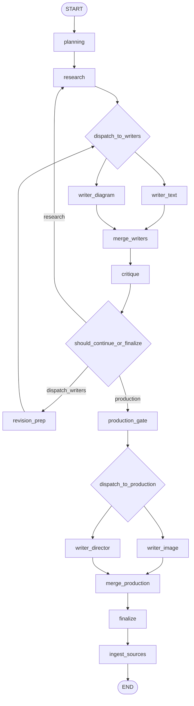
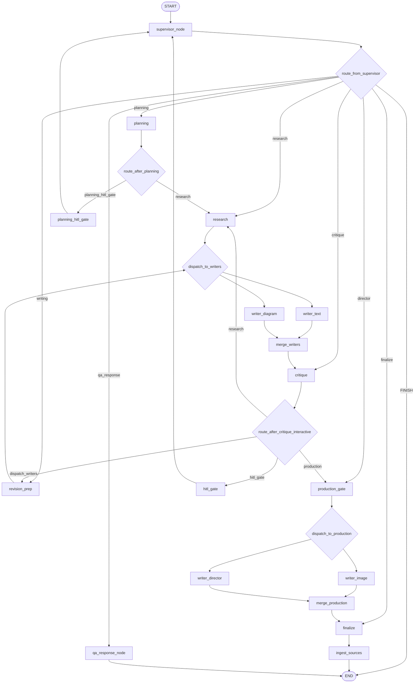
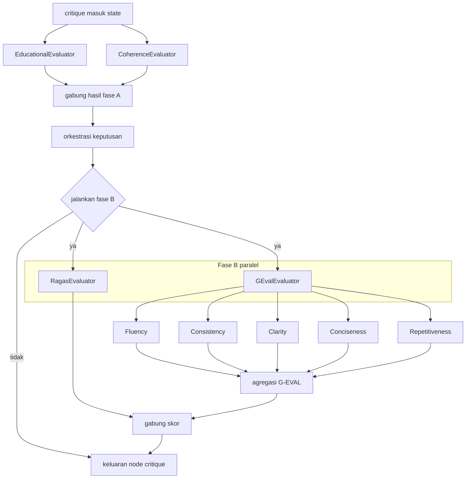

# Diagram jaringan agen (murni koneksi, revisi, repetisi, sub-agen)

**EN:** LangGraph topology for both compiled workflows in [`graph.py`](../../src/workflows/story_agent/graph.py), plus the **internal decomposition** of `CriticAgent` into sub-evaluators. No tools, APIs, or external services—only **nodes**, **edges**, **conditional branches**, **parallel sends**, **loops**, and **human-interrupt gates**.

**ID:** Topologi LangGraph untuk kedua workflow yang di-`compile` di `graph.py`, plus **urunan internal** `CriticAgent` ke sub-evaluator. Tanpa tools/API—hanya **node**, **sisi**, **cabang**, **kirim paralel**, **loop**, dan **gate HITL**.

---

## 1. Daftar node (semua tanpa terkecuali)

| Node | Kelas / fungsi | Tipe |
|------|----------------|------|
| `supervisor_node` | `SupervisorAgent.decide` | Agen orkestrasi (hanya alur interaktif) |
| `planning` | `PlannerAgent.plan` | Agen |
| `research` | `ResearchAgent.research` | Agen |
| `writer_text` | `WriterAgent.write` | Agen |
| `writer_diagram` | `WriterDiagramAgent.generate_diagram` | Agen |
| `writer_image` | `ImageGeneratorAgent.generate_illustrations` | Agen |
| `writer_director` | `DirectorAgent.direct` | Agen |
| `critique` | `CriticAgent.critique` | Agen (berisi sub-agen; lihat §5) |
| `qa_response_node` | pass-through (jawaban sudah di state) | Sink langkah graf |
| `planning_hitl_gate` | `interrupt` rencana | Gate HITL |
| `hitl_gate` | `interrupt` kritik modifikasi | Gate HITL |
| `merge_writers` | `merge_writer_results` | Sink sinkron paralel |
| `revision_prep` | `revision_prep` | Sink persiapan revisi |
| `production_gate` | `production_gate` | Sink sebelum produksi |
| `merge_production` | `merge_production_results` | Sink sinkron produksi |
| `finalize` | `finalize_story` | Sink finalisasi |
| `ingest_sources` | `ResearchAgent.finalize_ingestion` | Agen (langkah akhir riset) |

---

## 2. Alur batch: `create_story_workflow()` (entry `planning`)

Tidak ada `supervisor_node`. `writer_image` **tidak** dipanggil dari `research`; hanya setelah cabang **produksi** dari `critique`.

**Repetisi / revisi (batch):**

- **Loop A — revisi teks/diagram:** `critique` → `revision_prep` → `dispatch_to_writers` → `writer_*` → `merge_writers` → `critique` (dibatasi `MAX_REVISIONS`, keputusan dari `structured_critique.decision`).
- **Loop B — riset ulang:** `critique` → `research` → … (alur sama ke writers).
- **Stop revisi paksa:** jika `revision_count >= MAX_REVISIONS` → arah ke **produksi** (bukan `dispatch_writers`).

---

## 3. Alur interaktif: `create_interactive_workflow()` (entry `supervisor_node`)

Memakai **MemorySaver**. `supervisor_node` memutus target berikutnya lewat `supervisor_next` di state.

**Repetisi / revisi / multi-putaran (interaktif):**

- **Putaran baru dari pengguna:** pemanggilan `invoke` lagi dengan `user_message` (thread sama) → masuk **`supervisor_node`**.
- **Setelah `hitl_gate`:** `interrupt` selesai → edge ke **`supervisor_node`** (baca `hitl_feedback`).
- **Setelah `planning_hitl_gate`:** edge ke **`supervisor_node`** (rencana disetujui/diubah).
- **Mode modifikasi:** `route_after_critique_interactive` memaksa **`hitl_gate`** (bukan loop otomatis `revision_prep` seperti mode generasi).
- **Cabang Q&A singkat:** `supervisor_next == qa_response` → **`qa_response_node` → END** (tanpa planner/writer).

---

## 4. Paralel `Send` (ringkasan)

Satu panah logis ke banyak agen penulis:

| Asal | Fungsi | Target node |
|------|--------|-------------|
| `research` | `dispatch_to_writers` | `writer_text`, `writer_diagram` (subset menurut `active_writers` + flag revisi) |
| `revision_prep` | `dispatch_to_writers` | sama |
| `production_gate` | `dispatch_to_production` | `writer_image` selalu; `writer_director` jika flag konfigurasi + `active_writers` |

Semua cabang paralel bertemu di **`merge_writers`** atau **`merge_production`**.

---

## 5. Sub-agen di dalam node `critique` (`CriticAgent`)

Satu node graf, beberapa **sub-evaluator** (kelas terpisah). Tanpa nama tool—hanya alur data dan paralelisme.

Alur sebenarnya di kode: jika fase B tidak dijalankan, `orch` langsung menuju keluaran; jika dijalankan, **RagasEvaluator** dan **GEvalEvaluator** (beserta lima sub-kriteria) berjalan lalu hasil digabung sebelum return.

**Catatan repetisi di dalam kritik:**

- `revision_count` di state **di-increment** di keluaran `critique` setiap kali node ini selesai (siklus evaluasi berikutnya melihat angka lebih tinggi).
- **Fase B** (RAGAS + G-EVAL) hanya dijalankan bila kondisi “final pass” terpenuhi di kode (`next_stage == finalize` dan konteks retrieval ada, dll.)—tetap digambarkan sebagai **sub-alur** agen kritik.

---

## 6. Peta routing `supervisor_node` (target literal)

| Nilai `supervisor_next` | Node berikut |
|------------------------|--------------|
| `planning` | `planning` |
| `research` | `research` |
| `writing` | `revision_prep` |
| `critique` | `critique` |
| `finalize` | `finalize` |
| `qa_response` | `qa_response_node` |
| `director` | `production_gate` |
| `FINISH` | `END` |

---

## 7. Ringkasan perbedaan dua graf

| Aspek | `create_story_workflow` | `create_interactive_workflow` |
|-------|-------------------------|------------------------------|
| Entry | `planning` | `supervisor_node` |
| Checkpoint | tidak | `MemorySaver` |
| HITL rencana | tidak | `planning_hitl_gate` |
| HITL kritik modifikasi | tidak | `hitl_gate` → kembali supervisor |
| Kritik setelah modifikasi | `should_continue_or_finalize` | `route_after_critique_interactive` |
| Q&A singkat | tidak | `qa_response_node` |

---

*Referensi kode: [`src/workflows/story_agent/graph.py`](../../src/workflows/story_agent/graph.py), [`src/workflows/story_agent/agents/critic/agent.py`](../../src/workflows/story_agent/agents/critic/agent.py).*
