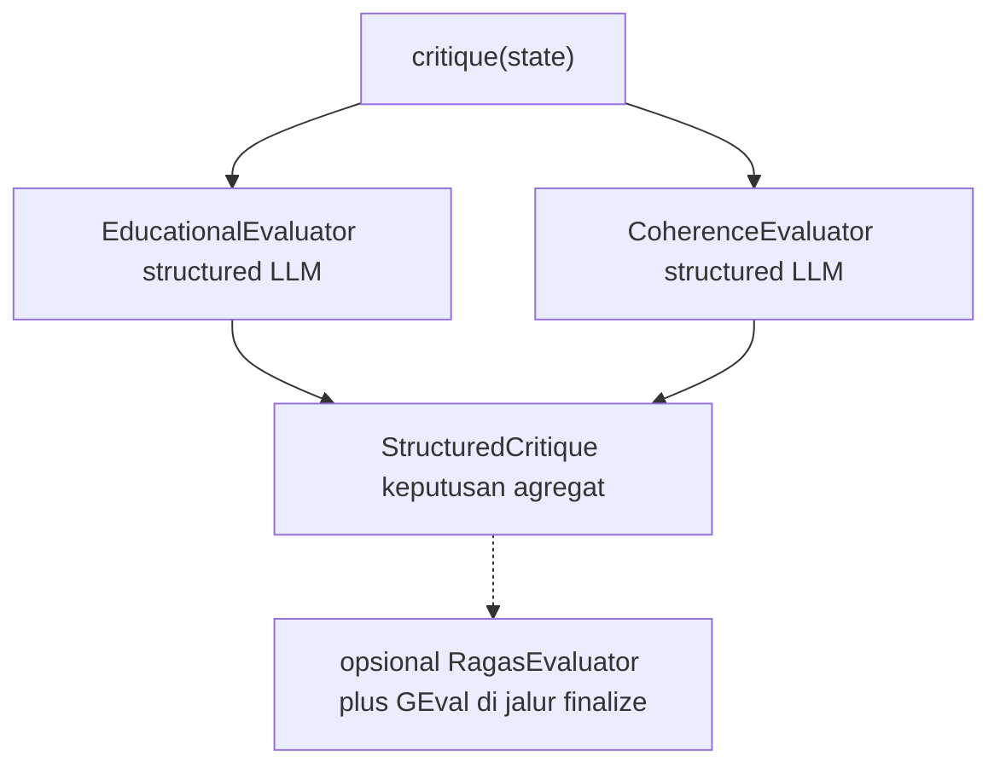

# Critic Agent (`EducationalEvaluator` & `CoherenceEvaluator`)

> **Kode:** [`src/workflows/story_agent/agents/critic/agent.py`](../../../src/workflows/story_agent/agents/critic/agent.py) · **Sub-modul:** [`eval_educational.py`](../../../src/workflows/story_agent/agents/critic/eval_educational.py) & [`eval_coherence.py`](../../../src/workflows/story_agent/agents/critic/eval_coherence.py) · **Node graf:** `critique` · [Indeks agen](README.md)

## Peran dan Kemampuan Non-Teknis

Critic Agent bertindak sebagai editor senior, kurator edukasi, dan penilai kualitas independen di dalam sistem kecerdasan buatan berbasis agen ini. Agen tersebut bertanggung jawab untuk memantau mutu draf cerita yang dihasilkan oleh Writer Agent agar terjamin keselarasan faktanya dengan hasil riset, ketepatan penyampaian materi edukasi, serta koherensi alur cerita dari awal hingga akhir.

Kemampuan utama Critic Agent meliputi:
1. Melakukan evaluasi paralel dari dua sudut pandang utama: kriteria kelayakan edukasi (rubrik lima dimensi) dan koherensi sastra (logika serta konsistensi naratif).
2. Mendeteksi inkonsistensi fakta ilmiah, pengulangan kalimat, penjelasan bertele-tele, serta ketidaksesuaian tata bahasa.
3. Memberikan rekomendasi perbaikan spesifik berupa penunjukan nomor paragraf yang bermasalah disertai saran solusi perbaikan yang konkret.
4. Menentukan kelanjutan alur sistem secara cerdas, apakah cerita dapat disetujui (APPROVE), harus direvisi kembali (REVISE), atau memerlukan pencarian materi tambahan oleh Research Agent (NEED_MORE_RESEARCH).

---

## Representasi Input dan Output dalam Langfuse

Dalam platform observabilitas Langfuse, aktivitas evaluasi oleh Critic Agent terekam secara komprehensif sebagai berikut:

### 1. Span Utama: `critic_agent`
Mengukur seluruh rangkaian evaluasi terintegrasi untuk satu draf cerita.
* **Metadata yang direkam:**
  * `agent`: `critic`
  * `target_age`: Target kelompok usia pembaca.
  * `parent_trace_id`: ID jejak induk.
  * `session_id`: ID sesi.
* **Input yang dikirim:**
  * `story_length_chars`: Jumlah karakter dari draf cerita yang dinilai.
  * `revision_count`: Jumlah siklus revisi yang telah dilalui.
  * `target_age`: Target usia.
  * `theme`: Tema cerita yang dievaluasi.
  * `story_style`: Gaya cerita yang digunakan.
* **Output yang dihasilkan:**
  * `educational_score`: Skor rata-rata aspek kelayakan edukatif (skala 1.0 sampai 5.0).
  * `overall_score`: Skor koherensi naratif (skala 0.0 sampai 10.0).
  * `decision`: Keputusan yang diambil (misalnya `REVISE`, `APPROVE`, `NEED_MORE_RESEARCH`).
  * `coherence_issues_count`: Jumlah masalah koherensi naratif yang terdeteksi.
  * `issue_breakdown`: Pengelompokan isu berdasarkan tingkat keparahan (kritis, penting, atau minor).
  * `revision_count`: Nilai hitungan revisi terbaru setelah proses evaluasi.
  * `next_stage`: Tahapan berikutnya dalam alur graf.
  * `ragas_scores`: Skor pendukung dari metrik eksternal (jika ada).
  * `chars`: Total karakter teks yang dievaluasi.
  * `elapsed_time_seconds`: Durasi waktu evaluasi dalam detik.

### 2. Generasi LLM: `critic_educational_eval_llm`
Representasi panggilan model bahasa besar untuk menilai keselarasan tema dan relevansi edukasi.
* **Input terstruktur:**
  * `system_prompt`: Kumpulan instruksi yang mendefinisikan rubrik penilaian edukasi anak yang ketat dan objektif.
  * `user_input`: Draf cerita terbaru yang diajukan untuk dinilai.
* **Output terstruktur:**
  * `theme_relevance_score`, `age_appropriateness_score`, `narrative_engagement_score`, `educational_value_score`, `instruction_alignment_score`: Skor numerik per dimensi penilaian (skala 1 sampai 5).
  * `score`: Nilai rata-rata dari kelima dimensi tersebut.
  * `gap_analysis`: Ketersediaan informasi pendukung.
  * `decision`: Usulan keputusan dari modul edukasi.
  * `needs_revision`: Indikator kebutuhan revisi.
  * `feedback`: Umpan balik naratif berisi kekuatan dan kelemahan draf cerita.

### 3. Generasi LLM: `critic_coherence_eval_llm`
Representasi panggilan model bahasa besar untuk menilai logika narasi dan konsistensi fakta.
* **Input terstruktur:**
  * `system_prompt`: Panduan instruksi sistem untuk mengevaluasi kelogisan alur, kontinuitas cerita, kelancaran bahasa, dan ketepatan fakta ilmiah.
  * `user_input`: Draf cerita terbaru yang dievaluasi.
* **Output terstruktur:**
  * `coherence_score`: Skor kelogisan cerita (skala 0.0 sampai 10.0).
  * `needs_revision`: Indikator kebutuhan revisi koherensi.
  * `revision_reason`: Alasan utama jika cerita memerlukan revisi koherensi.
  * `issues`: Daftar objek masalah koherensi yang ditemukan, yang memuat tipe isu, tingkat keparahan, saran perbaikan, serta lokasi paragraf bermasalah.
  * `strengths`: Kekuatan naratif draf cerita.
  * `summary`: Ringkasan analisis koherensi cerita.

---

Sub-modul: [`eval_educational.py`](../../../src/workflows/story_agent/agents/critic/eval_educational.py), [`eval_coherence.py`](../../../src/workflows/story_agent/agents/critic/eval_coherence.py), serta evaluator opsional (RAGAS, G-EVAL) di luar cakupan detail dokumen arsitektur utama.

## Diagram: tools & antarmuka eksekusi

**Tidak ada** *function tools* terdaftar ke LLM utama. Yang ada: **LLM structured output** (edukasi + koherensi), **opsional RAGAS** via `AsyncOpenAI` kompatibel OpenRouter, **GEval** (DeepEval), dan **Langfuse** untuk tracing.

---

## Rubrik edukasi (lima dimensi)

**Prompt kanonis:** [`prompts/id/critic.md`](../../../src/workflows/story_agent/prompts/id/critic.md) (dan `en/critic.md`).  
**Model keluaran:** [`LLMEducationalEvaluation`](../../../src/workflows/story_agent/agents/critic/models.py).

### Konteks penulis paralel (teks vs aset lain)

Prompt `critic` menyuntikkan **`diagram_active`** dan **`image_active`** agar penilai **tidak** menilai draf teks karena tidak memuat diagram/gambar jika aset tersebut sedang dibuat di jalur terpisah.

### Skor per dimensi (1–5)

| Field Pydantic | Dimensi | Inti penilaian |
|----------------|---------|----------------|
| `theme_relevance_score` | Relevansi tema & tujuan | Selaras dengan permintaan awal dan tema (constructive alignment). |
| `age_appropriateness_score` | Usia, kognitif, scaffolding | Kosakata, struktur kalimat, kompleksitas, perancah konsep. |
| `narrative_engagement_score` | Keterlibatan naratif & emosional | Perhatian, rasa ingin tahu, dinamika karakter. |
| `educational_value_score` | Nilai pendidikan & konkretisasi konsep | Pesan moral/akademik, pemikiran kritis, konsep abstrak ke situasi konkret. |
| `instruction_alignment_score` | Instruksi, QA, aksesibilitas | Kepatuhan panjang/gaya/instruksi khusus; inklusivitas; **pelanggaran teknis wajib memaksa skor rendah** pada dimensi ini sesuai prompt. |

### Agregat dan keputusan awal (dari LLM)

| Field | Arti |
|-------|------|
| `score` | Rata-rata lima dimensi (**1.0–5.0**). |
| `gap_analysis` | `"Sufficient"` atau **`Missing Info`** (indikasi perlu riset tambahan). |
| `decision` | Salah satu: **`APPROVE`**, **`REVISE`**, **`NEED_MORE_RESEARCH`**. |
| `needs_revision` | Boolean selaras dengan keputusan. |
| `feedback`, `strengths`, `weaknesses` | Umpan balik naratif; kelemahan dapat memakai format **ISSUE** ber-lokasi paragraf. |

Prompt juga mendefinisikan **aturan keputusan revisi** berbasis skor per dimensi (mis. skor 1–2 = kelemahan mendasar; skor 3 = perlu revisi substansial; lihat teks penuh di `critic.md`).

### Integrasi dengan `CriticAgent` (logika tambahan)

Di `agent.py`:

- `edu_score = edu_result.score`
- `educational_passed = edu_score >= QUALITY_THRESHOLD` (`StoryConfig`)
- `alignment_passed = instruction_alignment_score >= 4.0`
- `research_needed` jika `decision == "NEED_MORE_RESEARCH"` **atau** `"Missing" in gap_status`

Jika **alignment** gagal, isu sintetis tipe **`alignment`** dapat disisipkan ke daftar masalah koherensi untuk revisi terarah.

---

## Koherensi naratif & `coherence_score`

**Evaluator:** [`CoherenceEvaluator`](../../../src/workflows/story_agent/agents/critic/eval_coherence.py).  
**Prompt:** [`critic_coherence.md`](../../../src/workflows/story_agent/prompts/id/critic_coherence.md).  
**Model:** [`LLMCoherenceEvaluation`](../../../src/workflows/story_agent/agents/critic/models.py).

### Skala skor

- **`coherence_score`**: bilangan riil **0.0–10.0** (berbeda dari skor edukasi 1–5).

### Struktur keluaran

| Field | Arti |
|-------|------|
| `issues[]` | Daftar `LLMCoherenceIssue`: `issue_type`, `description`, `location`, **`severity`** (`critical` \| `major` \| `minor`), `suggestion`. |
| `needs_revision` | Boolean: apakah koherensi cukup buruk sehingga perlu revisi. |
| `revision_reason` | Alasan singkat. |
| `summary`, `strengths` | Ringkasan dan kekuatan. |

### Kriteria evaluasi (ringkas dari prompt)

1. **Fabula & logicality** — kausalitas, aturan dunia, motivasi karakter, waktu.  
2. **Plot & consistency** — kontinuitas topik, tidak out-of-character tanpa provokasi, fakta tidak kontradiktif.  
3. **Discourse** — kelancaran narasi, variasi, keterbacaan.  
4. **Long-term causal network** — batas kejadian, episodic memory antar paragraf.  
5. **Knowledge grounding & faithfulness** — tidak halusinasi fakta; tetap pada konteks.

### Dampak pada keputusan agregat

- `has_coherence_issues = any(issue.severity in ("critical", "major") for issue in coherence_issues)`
- Isu **`minor`** dicatat; hanya **critical/major** yang memaksa revisi melalui jalur severity (sesuai komentar kode).

`coherence_score` disimpan di **`StructuredCritique.coherence_score`**.

**Catatan:** evaluasi koherensi memakai `state.get("global_summary", "")` untuk konteks episodik opsional.

---

## Gabungan keputusan di `CriticAgent` (sebelum graf)

Setelah evaluasi paralel:

1. **`both_passed`** = `educational_passed` **dan** `alignment_passed`.
2. **`research_needed`** = `NEED_MORE_RESEARCH` **atau** `gap_analysis` mengandung **`"Missing"`**.
3. Jika **`both_passed`** dan **bukan** `research_needed`, **bukan** `needs_revision` (koherensi), dan **tidak** ada isu **critical/major** → **`APPROVE`**, tahap berikutnya **finalize** (menuju produksi).
4. Jika **`revision_count` setelah increment ≥ `MAX_REVISIONS`** → **`APPROVE (max revisi)`**.
5. Jika **`research_needed`** dan **`alignment_passed`** → **`NEED_MORE_RESEARCH`**, tahap **research**.
6. Jika **`needs_revision`** (koherensi) **atau** `has_coherence_issues` **atau** **tidak** `alignment_passed` → **`REVISE`**, tahap **writing**.
7. Cabang `else` fallback: **`REVISE`**.

**`revision_targets`:** dari `_build_revision_targets(coherence_issues, edu_weaknesses)`.

Routing setelah kritik di graf (`should_continue_or_finalize`) dijelaskan di [pengembangan_arsitektur_agentic_ai.md §11.2–11.3](../pengembangan_arsitektur_agentic_ai.md#112-di-dalam-graf-should_continue_or_finalize).

---

## Prompt registry

- `critic`, `critic_coherence` — lihat [`prompts.py`](../../../src/workflows/story_agent/prompts.py).

## LLM

`get_llm_for_agent("critic", ...)`; evaluator koherensi dan edukasi memakai instance LLM yang sama kecuali didefinisi lain di kode.
