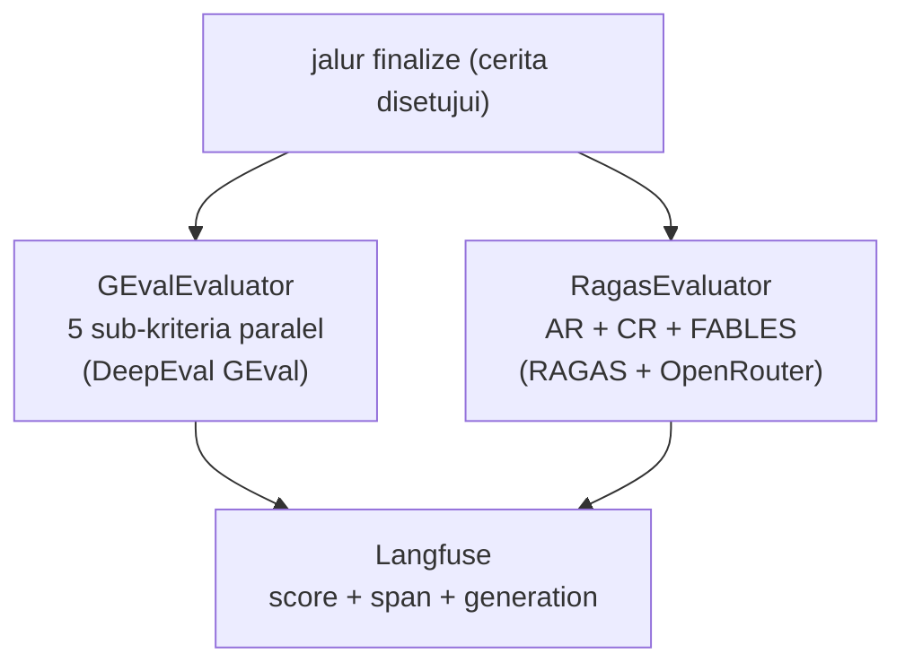

# Critic Evaluator (`GEvalEvaluator` & `RagasEvaluator`)

> **Kode:** [`src/workflows/story_agent/agents/critic/eval_geval.py`](../../../src/workflows/story_agent/agents/critic/eval_geval.py) · [`src/workflows/story_agent/agents/critic/eval_ragas.py`](../../../src/workflows/story_agent/agents/critic/eval_ragas.py) · [Indeks agen](README.md)

## Peran dan Kemampuan Non-Teknis

Critic Evaluator bertindak sebagai auditor eksternal, penilai independen standar global, dan analis kebenaran ilmiah di dalam sistem kecerdasan buatan berbasis agen ini. Evaluator ini beroperasi sepenuhnya di luar siklus revisi cerita. Tugas utamanya adalah melakukan audit kualitas akhir secara mendalam terhadap cerita yang telah disetujui, guna kepentingan pelaporan penelitian ilmiah dan visualisasi dasbor evaluasi.

Kemampuan utama Critic Evaluator meliputi:
1. Melakukan evaluasi koherensi linguistik multidimensi berbasis kerangka kerja G-Eval secara paralel guna meminimalkan bias subjektivitas model bahasa besar.
2. Mengekstrak klaim-klaim ilmiah yang termuat di dalam cerita naratif pembelajaran menjadi simpul klaim atomik terpisah.
3. Memverifikasi kebenaran setiap klaim atomik tersebut secara langsung terhadap korpus riset tepercaya menggunakan kerangka verifikasi fakta teoretis FABLES.
4. Menghasilkan skor kelayakan akhir (faithfulness dan koherensi) secara transparan dan terukur yang langsung diintegrasikan dengan platform observabilitas.

---

## Representasi Input dan Output dalam Langfuse

Dalam platform observabilitas Langfuse, aktivitas audit kualitas oleh Critic Evaluator dipetakan secara detail melalui modul-modul berikut:

### 1. Span Audit G-Eval: `geval_coherence`
Mengukur kelancaran dan kualitas bahasa draf cerita akhir secara multidimensi.
* **Input terstruktur:**
  * `metric`: Jenis metrik yang diuji (misalnya `geval_coherence`).
  * `framework`: Kerangka kerja yang digunakan (`DeepEval GEval`).
  * `user_input`: Pertanyaan atau arahan awal cerita.
  * `story_length`: Jumlah karakter cerita yang dinilai.
  * `model`: Model bahasa penilai.
* **Output terstruktur:**
  * `geval_coherence`: Rata-rata skor kelogisan cerita (skala 1 sampai 5).
  * `geval_coherence_normalized`: Rata-rata skor ternormalisasi (skala 0 sampai 1).
  * `geval_coherence_sub_scores`: Rincian skor mentah per sub-kriteria (Fluency, Consistency, Clarity, Conciseness, Repetitiveness).
  * `elapsed_seconds`: Durasi waktu audit dalam detik.

### 2. Generasi Ekstraksi FABLES: `fables_extract_claims`
Representasi proses pemilahan fakta ilmiah dari teks cerita naratif kreatif.
* **Metadata yang direkam:**
  * `claims_extracted`: Jumlah klaim ilmiah atomik yang berhasil diekstrak (misalnya `16` klaim).
  * `trace_id`: ID jejak pelacakan observasi.
* **Input terstruktur:**
  * `metric`: Metrik ekstraksi.
  * `model`: Model bahasa besar yang digunakan.
  * `user_input`: Cerita naratif lengkap.
  * `story_length_chars`: Jumlah karakter teks cerita.
* **Output terstruktur:**
  * `claims_extracted`: Jumlah klaim terdeteksi.
  * `claims`: Daftar teks pernyataan ilmiah atomik yang siap diuji kebenaran faktanya.

### 3. Generasi Verifikasi FABLES: `fables_verify_all_claims`
Representasi proses pengujian kebenaran setiap klaim ilmiah terhadap korpus data riset asli.
* **Metadata yang direkam:**
  * `total_claims`: Jumlah total klaim yang diuji (misalnya `10` klaim).
  * `faithful`: Jumlah klaim yang terbukti benar dan didukung penuh oleh hasil riset (misalnya `9` klaim).
  * `unfaithful`: Jumlah klaim salah atau bertentangan (misalnya `0` klaim).
  * `cant_verify`: Jumlah klaim yang tidak dapat diverifikasi karena keterbatasan data riset (misalnya `1` klaim).
  * `partial_support`: Jumlah klaim yang didukung sebagian.
* **Input terstruktur:**
  * `claims`: Daftar teks klaim atomik.
  * `contexts`: Isi rangkuman korpus data riset asli sebagai acuan kebenaran fakta (*ground truth*).
  * `context_chars`: Jumlah karakter teks korpus riset.
* **Output terstruktur:**
  * `faithful`, `unfaithful`, `partial_support`, `cant_verify`: Ringkasan jumlah klaim per kategori verdict.
  * `verdicts`: Daftar lengkap hasil keputusan per klaim yang memuat teks klaim asli beserta verdict yang diperoleh (FAITHFUL, UNFAITHFUL, PARTIAL_SUPPORT, atau CANT_VERIFY).
---

## Diagram: alur eksekusi



---

## G-Eval (`GEvalEvaluator`)

**Referensi:** Liu et al., 2023 — *G-Eval: NLG Evaluation using GPT-4 with Better Human Alignment* (arXiv:2303.16634).  
**Framework:** [DeepEval](https://docs.confident-ai.com/) via `from deepeval.metrics import GEval`.  
**LLM adapter:** [`CriticDeepEvalLLM`](../../../src/workflows/story_agent/agents/critic/deepeval_llm.py) — membungkus LangChain LLM agar kompatibel dengan antarmuka DeepEval.

### Lima sub-kriteria (paralel, 1–5)

Setiap sub-kriteria diukur secara independen menggunakan `LLMTestCaseParams.ACTUAL_OUTPUT`, kemudian dirata-rata untuk menghindari bias antar-kriteria.

| Sub-kriteria | Skala | Inti penilaian |
|---|---|---|
| **Fluency** | 1–5 | Kelancaran tata bahasa dan sintaksis; kesesuaian kosakata. |
| **Consistency** | 1–5 | Keseragaman nada, gaya, dan sudut pandang dari awal hingga akhir. |
| **Clarity** | 1–5 | Kejelasan bahasa dan kemudahan pemahaman tanpa jargon tak terjelaskan. |
| **Conciseness** | 1–5 | Tidak adanya kata pengisi atau elaborasi berlebih yang tidak menambah nilai. |
| **Repetitiveness** | 1–5 (5 = tidak ada repetisi) | Ketiadaan pengulangan kalimat, frasa, atau ide yang redundan. |

### Skor keluaran

| Key dict keluaran | Tipe | Keterangan |
|---|---|---|
| `geval_coherence` | `float` | Rata-rata skor mentah (skala 1–5). |
| `geval_coherence_normalized` | `float` | Rata-rata skor normalisasi (skala 0–1). Formula: `(raw − 1) / 4`. |
| `geval_coherence_reason` | `dict[str, str]` | Alasan per sub-kriteria dari LLM. |
| `geval_coherence_{name}` | `int` | Skor mentah per sub-kriteria (mis. `geval_coherence_fluency`). |

### Konversi skor mentah

DeepEval mengembalikan skor normalisasi 0–1. Konversi ke skala 1–5 (raw) dilakukan di kode:

```
raw = int(round((normalized × 4.0) + 1.0))
```

### Langfuse tracing

- Span: `geval_coherence` (dibuka di awal, ditutup setelah semua sub-kriteria selesai).
- Generation per sub-kriteria: `geval_{name}` (mis. `geval_fluency`, `geval_consistency`).
- Score trace-level: `geval_coherence_normalized` (nilai agregat 0–1).

---

## RAGAS + FABLES (`RagasEvaluator`)

**Referensi FABLES:** Kim et al., 2024 — *FABLES: Evaluating faithfulness and content selection in book-length summarization* (arXiv:2404.01261v2).  
**Referensi RAGAS:** `AnswerRelevancy` + `ContextRelevance` dari pustaka [RAGAS](https://docs.ragas.io/).  
**LLM:** via `AsyncOpenAI` kompatibel OpenRouter (terpisah dari LLM utama graf).

### Sub-metrik

| Metrik | Komponen | Keterangan |
|--------|----------|------------|
| **Answer Relevancy (AR)** | RAGAS | Relevansi cerita terhadap pertanyaan/permintaan awal. |
| **Context Relevance (CR)** | RAGAS | Relevansi konteks riset terhadap pertanyaan awal. |
| **FABLES Faithfulness** | FABLES | Rasio klaim faktual `FAITHFUL / (FAITHFUL + UNFAITHFUL)`. Klaim `CANT_VERIFY` dan `PARTIAL_SUPPORT` dikecualikan dari penyebut (Kim et al. §4). |
| **RAGAS Standard Faithfulness** | FABLES (strict) | Rasio ketat: `FAITHFUL / total_claims`. Semua label non-`FAITHFUL` menurunkan skor. |

### Alur FABLES (dua tahap)

```
1. _fables_extract_claims(story_text)
   → LLM mengekstrak klaim faktual atomik (maks. 10 klaim)
   → setiap klaim bersifat mandiri (tanpa pronoun tak terselesaikan)

2. _fables_verify_claim(claim, ctx_str) × N klaim (paralel)
   → LLM menetapkan satu label per klaim:
     FAITHFUL | UNFAITHFUL | PARTIAL_SUPPORT | CANT_VERIFY
```

### Label klaim FABLES

| Label | Arti |
|-------|------|
| `FAITHFUL` | Klaim didukung penuh oleh konteks riset. |
| `UNFAITHFUL` | Klaim bertentangan atau salah menggambarkan konteks. |
| `PARTIAL_SUPPORT` | Sebagian didukung; sebagian melampaui atau tidak ada dalam konteks. |
| `CANT_VERIFY` | Konteks tidak cukup untuk membuktikan atau membantah klaim. |

### Skor keluaran RAGAS + FABLES

| Key dict keluaran | Keterangan |
|---|---|
| `ragas_answer_relevancy` | Skor AR (0–1). |
| `ragas_context_relevance` | Skor CR (0–1). |
| `fables_faithfulness` | Skor FABLES standar (0–1), Kim et al. §4. |
| `ragas_standard_faithfulness` | Skor FABLES ketat (0–1). |
| `fables_claims_total` | Total klaim yang diekstrak dan diverifikasi. |
| `fables_claims_faithful` | Jumlah klaim `FAITHFUL`. |
| `fables_claims_unfaithful` | Jumlah klaim `UNFAITHFUL`. |
| `fables_claims_cant_verify` | Jumlah klaim `CANT_VERIFY`. |
| `fables_claims_partial_support` | Jumlah klaim `PARTIAL_SUPPORT`. |

### Mode replay FABLES

`RagasEvaluator.run()` mendukung tiga mode replay untuk keperluan analisis pasca-hoc di Langfuse:

| Parameter | Perilaku |
|---|---|
| `fables_replay_only=True` | Lewati AR + CR; jalankan hanya FABLES ulang. |
| `fables_recreate_span=True` | Buat span `fables_faithfulness` baru di bawah parent yang ada. |
| `fables_in_place_ids={...}` | Perbarui tiga observasi FABLES yang sudah ada via ingestion API (tanpa span baru). |
| `fables_export_timeline={...}` | Gunakan timestamp JSONL/API export agar replay mempertahankan timeline trace asli. |

### Langfuse tracing

- Span: `ragas_evaluation` (membungkus AR + CR + FABLES).
- Span anak: `fables_faithfulness` → generation `fables_extract_claims` + `fables_verify_all_claims`.
- Score trace-level: `ragas_answer_relevancy`, `ragas_context_relevance`, `geval_coherence_normalized`.

---

## Perbedaan dengan `CriticAgent` (loop revisi)

| Aspek | `CriticAgent` (loop) | Evaluator (finalize) |
|---|---|---|
| Kapan dijalankan | Setiap iterasi draf | Hanya pada cerita final yang disetujui |
| Mempengaruhi keputusan alur | Ya (`REVISE / APPROVE / NEED_MORE_RESEARCH`) | Tidak |
| LLM | LLM utama graf (`get_llm_for_agent`) | DeepEval LLM adapter + OpenRouter async client |
| Metrik | Rubrik edukasi (5 dimensi, 1–5) + koherensi LLM (0–10) | G-Eval (5 kriteria, 0–1) + RAGAS AR/CR + FABLES |
| Tujuan | Kendali kualitas iteratif | Observabilitas dan pengukuran penelitian |
