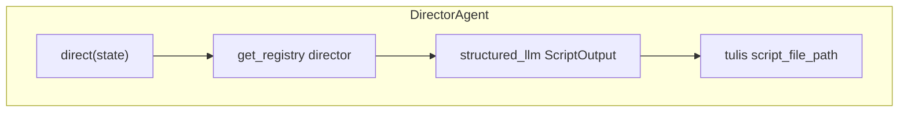

# Director Agent (`DirectorAgent`)

> **Kode:** [`src/workflows/story_agent/agents/director.py`](../../../src/workflows/story_agent/agents/director.py) · **Node graf:** `writer_director` · [Indeks agen](README.md)

## Peran dan Kemampuan Non-Teknis

Director Agent bertindak sebagai sutradara pementasan, penyusun naskah drama, dan penata adegan di dalam sistem kecerdasan buatan berbasis agen ini. Agen tersebut bertanggung jawab untuk mengadaptasi teks cerita final yang telah disetujui menjadi sebuah skenario naskah (*screenplay*) interaktif yang terstruktur, lengkap dengan petunjuk dialog tokoh, narasi latar, serta panduan transisi adegan. Naskah ini dirancang agar siap digunakan untuk kebutuhan sulih suara (*text-to-speech*) maupun dasar pembuatan video animasi pembelajaran. Agen ini dijalankan pada fase produksi secara paralel dengan pembuatan gambar ilustrasi.

Kemampuan utama Director Agent meliputi:
1. Menerjemahkan alur cerita naratif biasa menjadi skenario terbagi per adegan (*scene blocks*).
2. Memisahkan teks penceritaan menjadi bagian dialog langsung tokoh, suara narator (*voiceover*), dan deskripsi aksi visual.
3. Menyematkan petunjuk waktu (*time hints*) dan panduan suasana latar (*setting hints*) untuk memperjelas nuansa dramatisasi setiap adegan.
4. Memformat naskah ke format Markdown khusus yang mudah dibaca baik oleh manusia maupun modul pemroses audio/video otomatis.

---

## Representasi Input dan Output dalam Langfuse

Dalam platform observabilitas Langfuse, aktivitas penyusunan skenario oleh Director Agent dipetakan melalui entitas berikut untuk memastikan pemantauan integritas naskah cerita berjalan lancar:

### 1. Span Utama: `writer_director`
Mengukur durasi waktu adaptasi cerita naratif menjadi skenario visual.
* **Metadata yang direkam:**
  * `agent`: `director`
  * `enable_director`: Status keaktifan fitur penyusunan skenario drama.
* **Input yang dikirim:**
  * `theme`: Tema cerita yang diusung.
  * `target_age`: Target kelompok usia pembaca.
  * `active_story_content`: Teks cerita final yang disetujui.
* **Output yang dihasilkan:**
  * `script_scene_count`: Jumlah total adegan yang berhasil diidentifikasi dan disusun.
  * `script_file_path`: Jalur lokasi penyimpanan file skenario Markdown di disk.
  * `elapsed_time_seconds`: Durasi waktu eksekusi penulisan skenario dalam detik.

### 2. Generasi LLM: `director_script_llm`
Representasi panggilan model bahasa besar untuk menghasilkan skenario naskah terstruktur.
* **Input terstruktur:**
  * `system_prompt`: Panduan instruksi sistem untuk membagi cerita menjadi adegan terstruktur, menulis dialog interaktif yang menarik untuk anak, serta mengelompokkan jenis adegan (dialog, narasi, atau transisi).
  * `user_input`: Teks cerita final lengkap.
* **Output terstruktur:**
  * `title`: Judul skenario drama pembelajaran.
  * `scene_count`: Jumlah adegan.
  * `scenes`: Daftar objek adegan yang memuat jenis adegan, nama tokoh yang berbicara, teks dialog/narasi, petunjuk waktu, deskripsi latar adegan, serta panduan transisi.

---

## Diagram: tools & antarmuka eksekusi

Satu jalur: **LLM** + **`ScriptOutput` terstruktur** + **penulisan file** ke disk (`output/...`).

## Model keluaran: `ScriptOutput`

- **`title`**, **`scene_count`**, **`scenes[]`** — tiap `SceneBlock`: `scene_type` (`dialog` \| `narasi` \| `transisi`), `character`, `text`, `time_hint`, `narrator_text`, `scene_setting`, dll.

## State

- **`draft_script`**, **`script_file_path`**, **`script_scene_count`** — isi dan metadata file keluaran (mis. `output/{session_id}_script.md`).

## Prompt

- **`director`** — [`prompts/<lang>/director.md`](../../../src/workflows/story_agent/prompts/id/director.md).

## LLM

`get_llm_for_agent("director")` + `with_structured_output(ScriptOutput)`.
