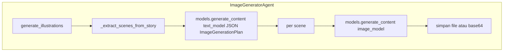

# Image Generator Agent (`ImageGeneratorAgent`)

> **Kode:** [`src/workflows/story_agent/agents/image_generator.py`](../../../src/workflows/story_agent/agents/image_generator.py) · **Node graf:** `writer_image` · [Indeks agen](README.md)

## Peran dan Kemampuan Non-Teknis

Image Generator Agent bertindak sebagai ilustrator kreatif di dalam sistem kecerdasan buatan berbasis agen ini. Agen tersebut bertanggung jawab untuk memvisualisasikan adegan-adegan penting dalam cerita menjadi gambar ilustrasi yang menarik, konsisten, dan sesuai dengan target usia pembaca. Agen ini hanya dipanggil pada akhir alur produksi setelah draf teks cerita dinyatakan lulus evaluasi kelayakan oleh Critic Agent.

Kemampuan utama Image Generator Agent meliputi:
1. Menganalisis draf teks cerita untuk mengekstrak beberapa adegan yang paling representatif untuk diilustrasikan secara visual.
2. Merumuskan panduan gaya seni (art style) dan palet warna yang serasi agar seluruh ilustrasi memiliki keseragaman estetika.
3. Menyusun deskripsi perintah gambar (image prompts) yang detail, aman, dan edukatif untuk dimasukkan ke dalam model generator gambar.
4. Menghasilkan file gambar berkualitas tinggi secara otomatis dan memetakan lokasinya agar siap diintegrasikan ke dalam cerita.

---

## Representasi Input dan Output dalam Langfuse

Dalam platform observabilitas Langfuse, aktivitas generasi gambar oleh Image Generator Agent dipetakan melalui entitas berikut untuk memastikan pemantauan biaya dan kualitas estetika:

### 1. Span Utama: `writer_image`
Mengukur waktu pemrosesan perencanaan ilustrasi dan pemanggilan model Imagen eksternal.
* **Metadata yang direkam:**
  * `agent`: `image_generator`
  * `enable_image_writer`: Status keaktifan fitur ilustrasi gambar.
* **Input yang dikirim:**
  * `story_content`: Teks cerita final yang disetujui.
  * `target_age`: Target usia pembaca.
  * `theme`: Tema pembelajaran.
* **Output yang dihasilkan:**
  * `scenes_count`: Jumlah adegan yang direncanakan untuk diilustrasikan.
  * `generated_images_metadata`: Daftar data gambar yang dihasilkan (mencakup jalur file, status keberhasilan, dan pesan kesalahan jika terjadi kegagalan).
  * `elapsed_time_seconds`: Durasi waktu eksekusi generasi gambar dalam satuan detik.

### 2. Generasi LLM: `image_scene_planning`
Representasi langkah analisis cerita untuk memilah adegan yang layak diilustrasikan secara terstruktur.
* **Input terstruktur:**
  * `system_prompt`: Panduan instruksi sistem untuk mengekstrak adegan dinamis, menentukan palet warna ramah anak, dan menghindari penggambaran objek sensitif.
  * `user_input`: Teks cerita lengkap.
* **Output terstruktur:**
  * `scenes_to_illustrate`: Daftar objek rencana adegan yang memuat nomor adegan, deskripsi visual adegan, serta saran perintah gambar (*image prompt*).
  * `overall_art_style`: Gaya seni visual yang dipilih (misalnya gaya kartun 2D, cat air, dll.).
  * `color_palette`: Palet warna yang direkomendasikan.

---

## Diagram: tools & antarmuka eksekusi

**Google GenAI SDK** `genai.Client`: (1) **text** `generate_content` dengan `response_schema=ImageGenerationPlan` (JSON) untuk memilih adegan; (2) **image** `generate_content` pada model gambar untuk tiap adegan. Bukan `bind_tools` klasik.

## Model terstruktur (ringkas)

- **`ImageGenerationPlan`** — `scenes_to_illustrate` (daftar `ImagePrompt`), `overall_art_style`, `color_palette`.
- **`GeneratedImage`** — metadata per gambar: `file_path`, `success`, `error_message`, dll.
- State: **`generated_images`** — daftar dict hasil di `StoryState`.

## Prompt

- **`image_gen_style`**, **`image_gen_scenes`** — dari registry [`prompts.py`](../../../src/workflows/story_agent/prompts.py).

## Dependensi

- Google GenAI / Imagen (lihat implementasi; memerlukan kredensial dan environment yang sesuai).
- Fitur dikontrol **`ENABLE_IMAGE_WRITER`** dan keberadaan `image` dalam `active_writers` pada fase produksi.

## Observabilitas

Langfuse dapat tersedia; beberapa jalur hanya memakai `loguru` — verifikasi versi terkini di file sumber.
