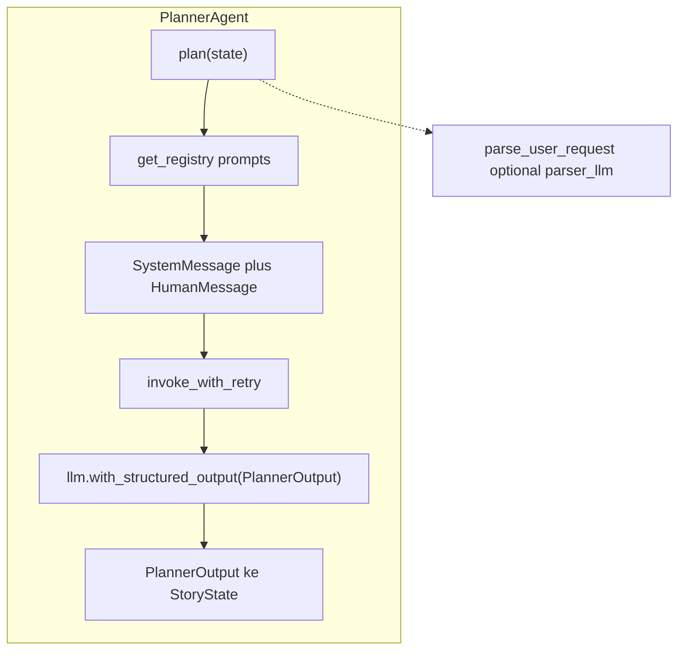

# Planner Agent (`PlannerAgent`)

> **Kode:** [`src/workflows/story_agent/agents/planner.py`](../../../src/workflows/story_agent/agents/planner.py) · **Node graf:** `planning` · [Indeks agen](README.md)

## Peran dan Kemampuan Non-Teknis

Planner Agent berfungsi sebagai arsitek naratif utama dalam sistem kecerdasan buatan berbasis agen ini. Agen tersebut bertanggung jawab untuk menerjemahkan permintaan awal pengguna yang bersifat umum atau informal menjadi cetak biru pembelajaran yang terstruktur dan siap pakai.

Kemampuan utama Planner Agent meliputi:
1. Memetakan target usia pembaca secara presisi untuk menyesuaikan kompleksitas bahasa dan materi pembelajaran.
2. Merumuskan tujuan pembelajaran terarah berdasarkan topik yang diminta.
3. Menyusun kerangka naratif cerita yang lengkap mulai dari pengenalan, konflik, klimaks, hingga resolusi.
4. Menentukan karakter, latar cerita, dan nada emosional yang mendukung penyampaian pesan pembelajaran secara humanis.
5. Memilih jenis penulis pendukung yang diperlukan (seperti pembuat teks, gambar, atau diagram) untuk memproduksi aset cerita.

---

## Representasi Input dan Output dalam Langfuse

Dalam platform observabilitas Langfuse, aktivitas Planner Agent dipetakan melalui entitas berikut untuk memastikan pemantauan kualitas berjalan optimal:

### 1. Span Utama: `planner_agent`
Menunjukkan durasi total dan status eksekusi dari proses perencanaan awal.
* **Metadata yang direkam:**
  * `agent`: `planner`
  * `unified`: `True` (menunjukkan penggunaan model perencanaan tunggal terpadu)
  * `model`: Model bahasa yang digunakan (misalnya `google/gemini-2.5-flash`)
* **Input yang dikirim:**
  * `user_input`: Permintaan orisinal dari pengguna.
  * `language`: Bahasa tujuan penulisan cerita (misalnya `id` atau `en`).
  * `story_length`: Estimasi panjang cerita yang diharapkan.
* **Output yang dihasilkan:**
  * `theme`: Tema besar cerita yang disintesis.
  * `target_age`: Target kelompok usia pembaca.
  * `story_style`: Gaya penceritaan yang dipilih.
  * `story_length`: Panjang cerita terencana dalam jumlah kata.
  * `character_count`: Jumlah karakter yang dirancang.
  * `active_writers`: Daftar penulis aktif (misalnya `['text', 'image', 'diagram']`).
  * `chars`: Jumlah karakter dari draf rencana.
  * `elapsed_time_seconds`: Waktu eksekusi perencanaan dalam detik.

### 2. Generasi LLM: `planner_unified_call`
Representasi panggilan model bahasa besar yang menghasilkan data terstruktur untuk draf rencana cerita.
* **Metadata yang direkam:**
  * `theme`: Tema cerita yang diidentifikasi dari data evaluasi (misalnya `Comparative Rocket Science: Starship vs. Other Rockets`).
  * `target_age`: Kelompok usia sasaran (misalnya `15-18` tahun).
  * `writers`: Penulis yang diaktifkan (misalnya `['text', 'image', 'diagram']`).
* **Input terstruktur:**
  * `system_prompt`: Panduan instruksi sistem untuk memandu model menyusun rencana secara objektif dan edukatif.
  * `user_input`: Permintaan pemicu cerita dari pengguna.
  * `research_notes`: Catatan riset pendukung (jika ada).
* **Output terstruktur:**
  * `theme`: Tema yang disepakati.
  * `target_age`: Usia target.
  * `learning_objectives`: Daftar sasaran edukasi yang ingin dicapai melalui cerita.
  * `story_style`, `narrative_style`, `emotional_tone`: Parameter estetika cerita.
  * `setting_ideas`, `character_ideas`: Konsep latar dan tokoh.
  * `draft_title`: Usulan judul cerita.
  * `story_outline`: Kerangka lengkap cerita.
  * `characters`: Detail profil tokoh cerita.
  * `moral_message`: Nilai moral pembelajaran.
  * `active_writers`, `writer_reasoning`: Keputusan pemilihan penulis aset beserta alasannya.

---

## Diagram: tools & antarmuka eksekusi

Agen ini **tidak** memakai *function calling* / `bind_tools` ke API eksternal. Inti eksekusi: **LLM** + **keluaran terstruktur Pydantic** + **`invoke_with_retry`** (lihat kode).

## Model keluaran: `PlannerOutput`

Didefinisikan sebagai model Pydantic di `planner.py`. Ringkasan field:

| Kelompok | Field | Fungsi |
|----------|--------|--------|
| **Parsing permintaan** | `theme`, `target_age`, `learning_objectives`, `story_style`, `narrative_style`, `emotional_tone`, `setting_ideas`, `character_ideas`, `story_length` | Menormalisasi permintaan pengguna menjadi parameter konsisten untuk riset dan penulis. |
| **Rencana naratif** | `draft_title`, `story_outline` (introduction, conflict, climax, resolution), `characters[]`, `moral_message` | Landasan alur cerita dan pesan pembelajaran. |
| **Pemilihan penulis** | `active_writers`, `writer_reasoning` | Daftar string seperti `text`, `image`, `diagram`; alasan singkat pemilihan. |

**Catatan:** `text` biasanya selalu relevan. Opsi `image` / `diagram` mengaktifkan penulis lain di graf (gambar umumnya di fase produksi setelah kritik; diagram jika `diagram ∈ active_writers` dan fitur diizinkan).

## Antarmuka

- **Metode:** `plan` — menerima `StoryState`, mengisi field rencana dan `active_writers`.
- **Input utama:** `user_message` dan field yang sudah diisi upstream.
- **Output state:** outline, karakter, moral, judul, parameter kreatif, **`active_writers`**, **`writer_reasoning`**.
- **Structured output:** satu panggilan LLM dengan `PlannerOutput` (lihat implementasi untuk detail `invoke_with_retry` / Langfuse).

## Prompt & bahasa

- **`planner_unified`** — instruksi sistem untuk satu panggilan terpadu.
- Registry: [`prompts.py`](../../../src/workflows/story_agent/prompts.py); file: `prompts/<lang>/planner_unified.md`.
- Terkait: `planner_parser`, `planner_short_guide` (jika dipakai di jalur parsing).

## LLM

Diinstansiasi melalui [`get_llm_for_agent("planner", ...)`](../../../src/providers/llm_factory.py) sesuai `LLM_PROVIDER` / `LLM_MODEL` di environment.
