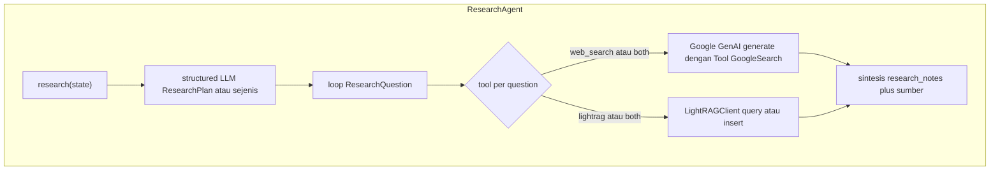

# Research Agent (`ResearchAgent`)

> **Kode:** [`src/workflows/story_agent/agents/researcher.py`](../../../src/workflows/story_agent/agents/researcher.py) · **Node graf:** `research` · [Indeks agen](README.md)

## Peran dan Kemampuan Non-Teknis

Research Agent bertindak sebagai pustakawan dan peneliti cerdas di dalam sistem kecerdasan buatan berbasis agen ini. Agen tersebut bertanggung jawab untuk memverifikasi, mencari, dan mengumpulkan informasi ilmiah serta fakta tepercaya yang relevan dengan rencana pembelajaran yang telah dirancang oleh Planner Agent.

Kemampuan utama Research Agent meliputi:
1. Menyusun rencana pertanyaan riset yang spesifik untuk membedah topik pembelajaran menjadi submateri yang lebih mudah diteliti.
2. Memilih sumber pencarian terbaik secara dinamis untuk setiap pertanyaan riset, baik melalui pencarian web (Google Search) maupun basis pengetahuan terstruktur (LightRAG).
3. Melakukan sintesis informasi secara objektif untuk menghindari penyertaan opini atau bias dalam draf materi.
4. Menyediakan daftar referensi dan detail pencarian yang transparan agar akurasi fakta dapat ditelusuri kembali.

---

## Representasi Input dan Output dalam Langfuse

Dalam platform observabilitas Langfuse, aktivitas Research Agent dipetakan secara detail untuk memantau efektivitas pencarian data dan konsumsi token:

### 1. Span Utama: `research_agent`
Mengukur waktu pencarian informasi dari berbagai sumber pengetahuan eksternal dan internal.
* **Metadata yang direkam:**
  * `parent_trace_id`: ID jejak induk untuk mengaitkan riset dengan alur pembuatan cerita global.
  * `session_id`: ID sesi pengguna yang aktif.
* **Input yang dikirim:**
  * `theme`: Tema cerita yang direncanakan.
  * `target_age`: Target kelompok usia pembaca.
  * `learning_objectives`: Daftar sasaran edukasi yang ingin dicapai.
* **Output yang dihasilkan:**
  * `source_count`: Jumlah sumber referensi yang berhasil dihimpun.
  * `chars`: Jumlah karakter dari rangkuman hasil riset.
  * `word_count`: Jumlah kata dari rangkuman hasil riset.
  * `elapsed_seconds`: Waktu pengerjaan riset dalam satuan detik.
  * `plan_questions`: Daftar pertanyaan riset yang dirumuskan.
  * `tool_selection`: Detail alat pencari yang digunakan untuk setiap pertanyaan.

### 2. Generasi LLM: `research_planning`
Representasi panggilan model bahasa besar yang merumuskan rencana pertanyaan riset berdasarkan parameter pembelajaran.
* **Metadata yang direkam:**
  * `question_count`: Jumlah pertanyaan riset yang direncanakan (misalnya `4` pertanyaan).
* **Input terstruktur:**
  * `system_prompt`: Panduan instruksi sistem untuk memandu model merumuskan pertanyaan riset yang tajam, faktual, dan objektif.
  * `theme`: Tema besar materi (misalnya sains populer, astronomi, dll.).
  * `target_age`: Usia target sasaran pembaca.
  * `learning_objectives`: Tujuan pembelajaran terarah.
* **Output terstruktur:**
  * `questions`: Kumpulan objek pertanyaan riset yang mencakup pertanyaan spesifik, pilihan alat pencari (Google Search, LightRAG, atau keduanya), serta penalaran pemilihan alat tersebut.

---

## Diagram: tools & antarmuka eksekusi

**Tools** di sini = kombinasi (1) **Google GenAI native tool** `Tool(google_search=GoogleSearch())` pada jalur web, dan (2) **LightRAG HTTP client** — bukan daftar fungsi `bind_tools` LangChain generik.

*(Node lain pada graf: `ingest_sources` memanggil `ResearchAgent.finalize_ingestion` — injeksi selektif ke LightRAG setelah cerita final, bukan bagian dari `research()`.)*

## Model internal (ringkas)

- **`ResearchQuestion`:** `question`, **`tool`** ∈ `web_search` | `lightrag` | `both`, `reasoning`.
- **`ResearchPlan`:** daftar pertanyaan.
- Output disintesis ke **`research_notes`**, **`research_sources`**, **`web_research_details`**, **`retrieved_contexts`** (untuk jejak / evaluasi lanjutan).

## Pemilihan alat (`ResearchQuestion.tool`)

| Nilai | Kapan dipakai (konsep) |
|-------|-------------------------|
| `web_search` | Butuh fakta aktual / web (memerlukan provider Google untuk grounding; lihat kode). |
| `lightrag` | Retrieval dari knowledge graph / korpus yang terindeks. |
| `both` | Kombinasi. |

**Google Search:** `Tool(google_search=GoogleSearch())` pada client Google GenAI **hanya** jika `LLMProviderConfig.is_google()` — selain itu riset mengandalkan LightRAG / jalur tanpa web.

**LightRAG:** client HTTP di [`lightrag_client.py`](../../../src/workflows/story_agent/integrations/lightrag_client.py) — panduan deploy: [`lightrag_integration.md`](../lightrag_integration.md).

## Prompt

- **`researcher_planner`** — merencanakan pertanyaan.
- **`researcher_web`** — konteks eksekusi web.

## Antarmuka

- **Metode:** `research` — mengisi state riset dari `StoryState` (tema, usia, outline, dll.).
- **Node lanjutan:** `finalize_ingestion` (ingest sumber ke LightRAG selektif, jika diaktifkan) — dipanggil dari graf setelah `finalize`.

## LLM

[`get_llm_for_agent("researcher", ...)`](../../../src/providers/llm_factory.py).
