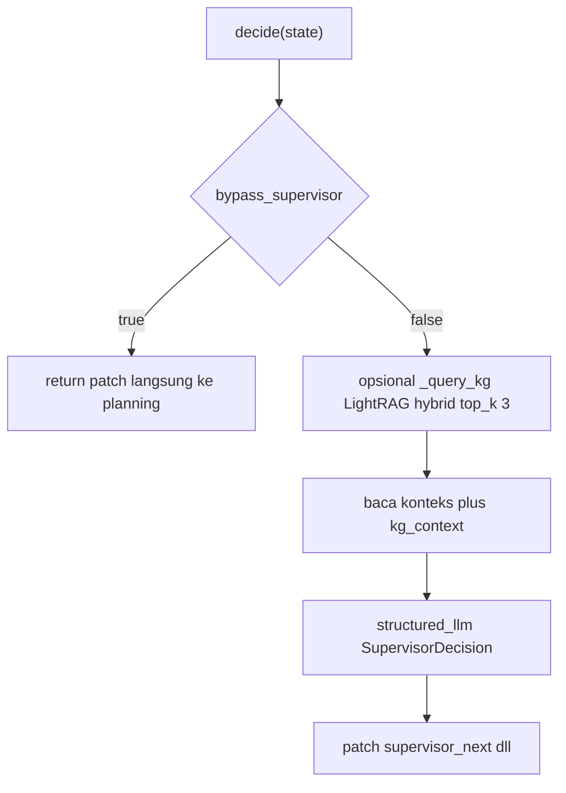

# Supervisor Agent (`SupervisorAgent`)

> **Kode:** [`src/workflows/story_agent/agents/supervisor.py`](../../../src/workflows/story_agent/agents/supervisor.py) · **Node graf:** `supervisor_node` (hanya pada **workflow interaktif**) · [Indeks agen](README.md)

## Peran dan Kemampuan Non-Teknis

Supervisor Agent bertindak sebagai pengatur lalu lintas, koordinator interaksi manusia, dan asisten dinamis di dalam sistem kecerdasan buatan berbasis agen ini. Agen tersebut hanya aktif dalam alur kerja interaktif, yang menjembatani komunikasi langsung antara pengguna manusia dengan jaringan agen pembuat cerita.

Kemampuan utama Supervisor Agent meliputi:
1. Menganalisis pesan pengguna secara kontekstual untuk menentukan intensi tindakan: apakah ingin membuat cerita baru (generation), merevisi cerita yang sudah ada (modification), atau sekadar mengajukan pertanyaan (Q&A).
2. Melakukan koordinasi Human-in-the-Loop (HITL) dengan meminta persetujuan manusia atas draf rencana sebelum agen peneliti mulai bekerja.
3. Menyediakan modul tanya-jawab interaktif dengan mengambil informasi relevan secara langsung dari basis pengetahuan LightRAG tanpa harus memicu penulisan cerita ulang.
4. Mengidentifikasi ruang lingkup modifikasi cerita secara spesifik (misalnya mengubah akhir cerita saja atau menyesuaikan salah satu karakter) berdasarkan masukan pengguna.

---

## Representasi Input dan Output dalam Langfuse

Dalam platform observabilitas Langfuse, aktivitas Supervisor Agent dipantau melalui pencatatan interaktif berikut untuk memastikan kelancaran alur navigasi:

### 1. Span Utama: `supervisor_agent` (Interaktif)
Mencatat jalannya keputusan routing dan interaksi pengguna manusia.
* **Metadata yang direkam:**
  * `agent`: `supervisor`
  * `interactive`: `True` (menunjukkan mode interaksi aktif)
* **Input yang dikirim:**
  * `user_message`: Pesan masukan orisinal dari pengguna (misalnya: "ubah latar cerita menjadi di luar angkasa").
  * `chat_history`: Riwayat dialog sebelumnya untuk menjaga kesinambungan konteks.
  * `active_story`: Draf cerita saat ini yang sedang menjadi objek diskusi (jika ada).
* **Output yang dihasilkan:**
  * `next_step`: Langkah graf berikutnya yang diputuskan (seperti `planning`, `research`, `writing`, atau `finalize`).
  * `interaction_mode`: Kategori aksi yang dipilih (seperti `generation`, `modification`, atau `qa`).
  * `reasoning`: Penjelasan logis mengapa arah rute tersebut dipilih.
  * `elapsed_seconds`: Kecepatan respon supervisor dalam satuan detik.

### 2. Generasi LLM: `supervisor_call`
Representasi panggilan model bahasa besar untuk menghasilkan objek keputusan terstruktur `SupervisorDecision`.
* **Input terstruktur:**
  * `system_prompt`: Panduan instruksi sistem untuk memilah niat pengguna secara objektif, menolak masukan luar domain, dan memilih langkah perbaikan secara efisien.
  * `user_input`: Kalimat pemicu dari pengguna.
* **Output terstruktur:**
  * `next_step`: Rute graf tujuan.
  * `reasoning`: Penalaran di balik rute terpilih.
  * `interaction_mode`: Kategori interaksi.
  * `direct_response`: Jawaban teks langsung jika pengguna hanya melakukan tanya jawab (Q&A).
  * `modification_scope`: Cakupan suntingan cerita yang direncanakan.
  * `needs_text_revision`: Boolean kebutuhan revisi cerita.
  * `review_plan`: Boolean apakah memerlukan review manual oleh manusia atas rencana awal.

---

## Diagram: tools & antarmuka eksekusi

Routing utama = **LLM + `SupervisorDecision` terstruktur**. **Tool** tambahan opsional: **LightRAG** `query_context_only` untuk Q&A ketika konteks state tipis (bukan setiap putaran).

## Model keputusan: `SupervisorDecision`

| Field | Makna |
|-------|--------|
| `next_step` | `planning`, `research`, `writing`, `critique`, `finalize`, `qa_response`, `director`, `FINISH` |
| `reasoning` | Alasan routing (teks) |
| `interaction_mode` | `generation` \| `modification` \| `qa` |
| `direct_response` | Jawaban Q&A penuh jika `next_step == qa_response` |
| `modification_scope` | Cakupan edit, mis. `ending`, `character:Nama`, `full` |
| `needs_text_revision`, `needs_diagram_revision` | Relevansi saat `next_step == writing` |
| `review_plan` | Jika `true`, supervisor meminta jeda review rencana manusia sebelum riset (**`planning_hitl_gate`** di graf) |

## Prompt

- **`supervisor`** — dari [`prompts.py`](../../../src/workflows/story_agent/prompts.py), folder `prompts/<lang>/supervisor.md`.

## Integrasi opsional

- **LightRAG** untuk Q&A ketika konteks state tipis (`get_lightrag_client`) — lihat kode.

## LLM

`get_llm_for_agent("supervisor", ...)` + `with_structured_output(SupervisorDecision)`.

## Alur graf terkait

Node tambahan: `hitl_gate`, `qa_response_node`, `planning_hitl_gate`. Detail: docstring **`create_interactive_workflow`** di [`graph.py`](../../../src/workflows/story_agent/graph.py).
