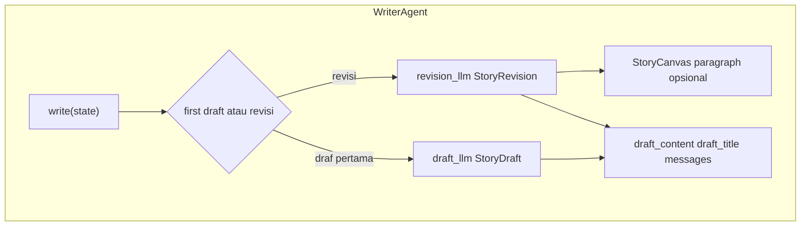

# Writer Agent — teks (`WriterAgent`)

> **Kode:** [`src/workflows/story_agent/agents/writer.py`](../../../src/workflows/story_agent/agents/writer.py) · **Node graf:** `writer_text` · [Indeks agen](README.md)

## Peran dan Kemampuan Non-Teknis

Writer Agent bertindak sebagai pengarang dan penyusun cerita utama di dalam sistem kecerdasan buatan berbasis agen ini. Agen tersebut bertanggung jawab untuk memadukan rencana naratif dari Planner Agent dan rangkuman fakta ilmiah dari Research Agent menjadi sebuah kisah edukatif yang mengalir secara alami, mudah dipahami, dan menyenangkan untuk dibaca.

Kemampuan utama Writer Agent meliputi:
1. Menyusun cerita berdasarkan draf awal dengan bahasa yang santun, ekspresif, dan disesuaikan dengan kelompok usia target pembaca.
2. Membaca dan menerapkan umpan balik koreksi dari Critic Agent secara terarah untuk memperbaiki kesalahan fakta atau kelemahan narasi.
3. Melakukan perencanaan revisi secara matang dengan menyusun langkah-langkah perbaikan khusus sebelum menulis ulang cerita.
4. Menyertakan kutipan referensi ilmiah secara rapi di akhir cerita untuk menjaga transparansi data dan integritas fakta.

---

## Representasi Input dan Output dalam Langfuse

Dalam platform observabilitas Langfuse, aktivitas Writer Agent dipantau secara ketat melalui dua fase eksekusi (generasi awal dan proses revisi):

### 1. Span Utama: `writer_agent`
Mengukur waktu pengerjaan draf cerita serta memantau status iterasi penulisan.
* **Metadata yang direkam:**
  * `agent`: `writer`
  * `is_revision`: Menunjukkan apakah penulisan saat ini merupakan draf baru atau hasil perbaikan (`True` / `False`).
  * `parent_trace_id`: ID jejak pelacakan induk.
  * `session_id`: ID sesi yang terhubung.
* **Input yang dikirim:**
  * `revision_num`: Angka iterasi revisi saat ini.
  * `is_revision`: Status revisi cerita.
  * `language`: Bahasa sasaran penulisan cerita.
  * `story_length`: Target panjang cerita.
  * `narrative_style`: Gaya narasi yang ditetapkan.
  * `target_age`: Target kelompok usia pembaca.
  * `theme`: Tema cerita yang diusung.
* **Output yang dihasilkan:**
  * `is_revision`: Status revisi akhir pada span.
  * `chars`: Jumlah karakter cerita yang berhasil ditulis.
  * `word_count`: Jumlah kata dari cerita yang diproduksi.
  * `elapsed_time_seconds`: Durasi waktu penulisan cerita dalam satuan detik.

### 2. Generasi LLM: `writer_drafting`
Representasi pembuatan draf cerita pertama sebelum memasuki siklus evaluasi.
* **Metadata yang direkam:**
  * `title`: Usulan judul draf pertama cerita (misalnya `Petualangan Taksonomi Lebah Penyerbuk`).
  * `length`: Perkiraan jumlah kata dalam draf terencana.
* **Input terstruktur:**
  * `system_prompt`: Panduan gaya bahasa, format paragraf, dan instruksi penjangkaran fakta ilmiah agar cerita bermutu tinggi.
  * `theme`: Tema cerita.
  * `target_age`: Usia target.
  * `story_length`: Sasaran panjang teks.
  * `narrative_style`: Gaya naratif.
* **Output terstruktur:**
  * `title`: Judul cerita yang disepakati.
  * `content`: Teks cerita lengkap dari paragraf pembuka hingga penutup.
  * `references`: Daftar referensi ilmiah yang valid.

### 3. Generasi LLM: `writer_revision_planning`
Representasi proses perancangan langkah revisi ketika cerita memerlukan perbaikan berdasarkan analisis umpan balik Critic Agent.
* **Metadata yang direkam:**
  * `edit_count`: Jumlah poin koreksi spesifik yang direncanakan.
  * `thought_process`: Proses berpikir terperinci yang berisi analisis atas skor yang diperoleh, perbandingan data riset asli dengan draf lama, serta langkah taktis untuk meningkatkan kualitas teks.
* **Input terstruktur:**
  * `system_prompt`: Panduan instruksi sistem untuk menganalisis kritik dan merancang langkah perbaikan paragraf secara terarah.
  * `revision_num`: Angka urutan revisi saat ini.
  * `critique_feedback`: Teks umpan balik lengkap dari Critic Agent.
  * `current_story_length`: Panjang draf cerita sebelum direvisi.
* **Output terstruktur:**
  * `edits`: Daftar rencana penyuntingan per paragraf yang mencakup nomor paragraf sasaran, tindakan (sisipkan, ubah, atau hapus), serta draf teks baru yang diajukan.
  * `thought_process`: Penjelasan naratif proses berpikir perbaikan model.

---

## Diagram: tools & antarmuka eksekusi

Tidak ada *tool* pihak ketiga (search/RAG) di dalam writer: hanya **LLM** dengan dua mode **structured output** (`StoryDraft` vs `StoryRevision`) dan manipulasi **`StoryCanvas`** di memori.

## Alur internal (ringkas)

Implementasi membedakan setidaknya:

- **Draf pertama** — `_write_first_draft` menggabungkan konteks rencana + riset.
- **Revisi terarah** — `_targeted_revision` memakai isu paragraf / canvas jika tersedia.
- **Fallback revisi penuh** — `_fallback_full_revision` jika revisi terarah tidak cukup.

Lihat method `write` sebagai titik masuk yang memilih cabang berdasarkan `revision_count` dan keberadaan kritik terstruktur.

## Prompt (registry)

| Nama | Peran |
|------|--------|
| `writer` | System / instruksi utama penulisan |
| `writer_instructions` | Aturan format dan gaya |
| `writer_user` | Konteks user-facing |
| `writer_revision` | Revisi berdasarkan kritik |
| `writer_revision_fallback` | Cadangan jika revisi terarah gagal |

Loader: [`prompts.py`](../../../src/workflows/story_agent/prompts.py).

## State yang dibaca/ditulis

**Baca:** `story_outline`, `characters`, `moral_message`, `research_notes`, `language`, `story_length`, `narrative_style`, `critique_feedback`, `structured_critique`, `story_canvas`, dll.

**Tulis:** `draft_content`, `draft_title`, pembaruan `messages`, dan field pendukung lain sesuai implementasi.

## LLM

`get_llm_for_agent("writer", ...)` — sesuaikan dengan entri aktual di [`llm_factory.py`](../../../src/providers/llm_factory.py).

## Lihat juga

- [agent_critic.md](agent_critic.md) — sumber umpan balik revisi.
- [`story_canvas.py`](../../../src/workflows/story_agent/story_canvas.py) — revisi tingkat paragraf.
