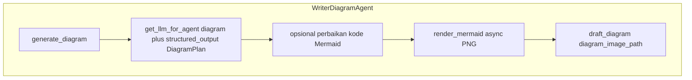

# Writer Diagram Agent (`WriterDiagramAgent`)

> **Kode:** [`src/workflows/story_agent/agents/writer_diagram.py`](../../../src/workflows/story_agent/agents/writer_diagram.py) · **Node graf:** `writer_diagram` · [Indeks agen](README.md)

## Peran dan Kemampuan Non-Teknis

Writer Diagram Agent bertindak sebagai perancang infografis dan desainer skema di dalam sistem kecerdasan buatan berbasis agen ini. Agen tersebut bertanggung jawab untuk mempermudah pemahaman konsep ilmiah yang rumit atau abstrak dengan cara menyusun diagram alir atau bagan terstruktur berbasis teks Mermaid yang representatif dan mudah dipahami.

Kemampuan utama Writer Diagram Agent meliputi:
1. Menganalisis garis besar cerita (*story outline*) dan catatan riset untuk mengidentifikasi konsep inti yang membutuhkan penjelasan visual.
2. Memilih tipe diagram yang paling sesuai (seperti diagram alir, bagan hubungan, atau pohon keputusan) berdasarkan karakteristik materi pembelajaran.
3. Menyusun kode diagram berbasis sintaksis Mermaid secara otomatis yang terstruktur, bebas kesalahan sintaksis, dan siap dirender.
4. Memvalidasi dan melakukan koreksi otomatis jika kode Mermaid yang dihasilkan mengalami kegagalan saat proses kompilasi awal.

---

## Representasi Input dan Output dalam Langfuse

Dalam platform observabilitas Langfuse, aktivitas Writer Diagram Agent dipetakan melalui entitas berikut untuk memastikan pemantauan integritas kode Mermaid dan efisiensi render:

### 1. Span Utama: `writer_diagram`
Mengukur waktu analisis data dan kompilasi diagram ke bentuk gambar (PNG).
* **Metadata yang direkam:**
  * `agent`: `diagram_writer`
  * `enable_diagram_writer`: Status keaktifan fitur penyusun diagram.
* **Input yang dikirim:**
  * `theme`: Tema cerita yang diusung.
  * `target_age`: Target kelompok usia pembaca.
  * `learning_objectives`: Tujuan pembelajaran terarah.
  * `research_notes`: Catatan riset pendukung.
  * `story_outline`: Rencana alur cerita dari Planner Agent.
* **Output yang dihasilkan:**
  * `diagram_type`: Tipe bagan yang dihasilkan (misalnya `flowchart` atau `sequenceDiagram`).
  * `diagram_title`: Judul infografis.
  * `diagram_image_path`: Jalur file lokasi gambar diagram hasil render.
  * `is_rendered`: Status keberhasilan kompilasi diagram ke format gambar.
  * `elapsed_time_seconds`: Durasi waktu eksekusi pembuatan diagram dalam detik.

### 2. Generasi LLM: `diagram_planning_llm`
Representasi panggilan model bahasa besar untuk menyusun kode diagram Mermaid.
* **Input terstruktur:**
  * `system_prompt`: Panduan instruksi sistem untuk menyusun kode Mermaid yang bersih, memilih tipe bagan yang sesuai, serta melabeli simpul diagram dengan bahasa yang ramah anak.
  * `user_input`: Rangkuman materi sains dan garis besar cerita.
* **Output terstruktur:**
  * `diagram_type`: Tipe diagram yang dipilih.
  * `title`: Judul diagram.
  * `main_concept`: Konsep utama yang divisualisasikan.
  * `key_elements`: Daftar elemen penting dalam diagram.
  * `relationships`: Hubungan keterkaitan antar elemen.
  * `mermaid_code`: Kode program Mermaid lengkap.

---

## Diagram: tools & antarmuka eksekusi

**LLM** → `DiagramPlan` terstruktur; **render** → [`vendor_mermaid.render_mermaid`](../../../src/workflows/story_agent/integrations/vendor_mermaid.py) (bukan tool LLM).

## Model keluaran: `DiagramPlan`

Field utama: `diagram_type`, `title`, `main_concept`, `key_elements`, `relationships`, **`mermaid_code`**.

## State

- **`draft_diagram`** — kode Mermaid.
- **`diagram_image_path`**, **`diagram_title`** — aset visual/metadata.

## Prompt

- **`writer_diagram`**, **`writer_diagram_system`**, **`writer_diagram_fix`** — registry [`prompts.py`](../../../src/workflows/story_agent/prompts.py).

## Dispatch

Node dijalankan dari **`dispatch_to_writers`** hanya jika **`diagram` ∈ `active_writers`** dan **`ENABLE_DIAGRAM_WRITER`** sesuai konfigurasi.

## LLM

[`get_llm_for_agent("diagram", ...)`](../../../src/providers/llm_factory.py) — suhu default 0.5.
