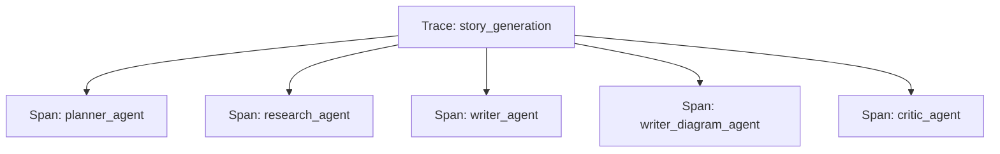

# Dokumentasi Struktur Output Langfuse

Dokumen ini menjelaskan struktur data yang dikirim ke Langfuse untuk observabilitas sistem Story Agent.

## 1. Trace & Span Hierarchy

Satu sesi pembuatan cerita direpresentasikan sebagai satu **Trace** utama.

**Root Trace:** `story_generation`

* **Source**: `src/apps/story_agent_app.py`
* **Input**: `user_prompt`
* **Metadata**: `source="gradio_chat"`, `model="gemini-2.0-flash"`
* **Tags**: `["story-agent", "agentic-ai", "vertex-ai", "reflexion-loop"]`

## 2. Agent Data Structures

### A. Planner Agent (`planner_agent`)

Bertanggung jawab untuk merencanakan struktur cerita.

* **Type**: Span
* **Input Data**:
  * `user_message`: Permintaan asli pengguna.
  * `prompt_to_llm`: Prompt lengkap yang dikirim ke LLM (Unified Prompt).
* **Output Data** (Structured Output):
  * `parsed_params`: Parameter cerita yang diekstrak (theme, target_age, emotional_tone, dll).
  * `story_plan`: Outline cerita (introduction, conflict, climax, resolution), karakter, dan pesan moral.
  * `planner_decision`: Daftar `active_writers` (text, image, diagram).
  * `elapsed_time_seconds`: Durasi eksekusi.
* **Metadata**:
  * `agent`: "planner"
  * `unified`: True

### B. Research Agent (`research_agent`)

Mengumpulkan materi edukasi dan konteks (LightRAG / web sesuai rencana riset).

* **Type**: Span
* **Input/Output**: Tergantung implementasi; umumnya `research_notes`, sumber, dan rencana pertanyaan riset.

### C. Critic Agent (`critic_agent`) — evaluasi kualitas

#### Sub-Components

1. **Educational Evaluation (`critic_educational_eval`)**
    * **Type**: Generation
    * **Metadata**: `eval_type`: "educational"
    * **Data**: Input prompt dan Output raw dari LLM untuk evaluasi edukasi.

2. **Coherence Evaluation (`critic_coherence_eval` / `critic_coherence_eval_llm`)**
    * **Type**: Generation / Span anak
    * **Metadata**: `eval_type`: "coherence"

3. **Scores (Langfuse Scores)** (dari Critic)
    * `educational_score`: Numeric (skala rubrik, umumnya 1–5). Metadata: `strengths`, `weaknesses`.
    * `overall_score`: Skor gabungan yang dicatat. Metadata: `decision`, `revision_count`.
    * Detail isu koherensi: di output span Critic (`coherence_issues_count`, `issue_breakdown`, dll.).

### E. Writer Diagram Agent (`writer_diagram_agent`)

Membuat diagram edukasi menggunakan Mermaid dan merender ke PNG.

* **Type**: Span
* **Input Data**:
  * `theme`: Tema cerita.
  * `session_id`: ID Sesi.
  * `revision_count`: Counter revisi.
* **Output Data**:
  * `diagram_type`: Tipe diagram (flowchart, mindmap, etc).
  * `title`: Judul diagram.
  * `has_png`: Boolean (berhasil render PNG).
  * `elapsed_time`: Durasi.
  * `error`: Pesan error (jika ada).
* **Metadata**:
  * `agent`: "writer_diagram"

### F. Image Generator Agent

**Status**: ⚠️ Belum terintegrasi dengan Langfuse.
Saat ini `ImageGeneratorAgent` hanya menggunakan `loguru` untuk logging standard output dan belum mengirim trace/span ke Langfuse.

### G. Supervisor Agent

**Status**: ⚠️ Belum terintegrasi dengan Langfuse.
Agent ini bertanggung jawab untuk routing antar state, namun saat ini belum memiliki logging trace/span ke Langfuse.

### H. LightRAG Integration

**Status**: ⛔ Tidak terintegrasi dengan Langfuse.
`LightRAGClient` (`src/workflows/story_agent/integrations/lightrag_client.py`) beroperasi secara independen melalui HTTP call ke server LightRAG dan tidak mengirim telemetry ke Langfuse.

### J. API Layer

**Status**: ⛔ Tidak ada integrasi langsung (Middleware/ Decorator).

* `src/apps/api/routers/workflow.py`: Menangani SSE streaming menggunakan `loguru`. Tidak ada kode tracing Langfuse manual.
* `src/apps/api/routers/agents.py`: Endpoint wrapper. Tracing dilakukan oleh agent itu sendiri (lihat bagian A–C, E, … di atas).
* `src/apps/api/main.py`: Entry point API. Tidak ada global middleware untuk Langfuse.

### K. Legacy & Unused Components

1. **ObservabilityManager (`src/workflows/story_agent/observability.py`)**
    * **Status**: 💀 Legacy / Code Mati.
    * File ini mendefinisikan class `ObservabilityManager` yang merupakan implementasi lama logging Langfuse. Saat ini sistem menggunakan `LangfuseClient` dari `src/workflows/story_agent/integrations/langfuse_client.py`. `ObservabilityManager` tidak digunakan oleh agent maupun workflow aktif manapun.

2. **Story Canvas (`src/workflows/story_agent/story_canvas.py`)**
    * **Status**: ✅ Logic Only / State Management.
    * Mengelola state cerita dan version control. Perubahan pada canvas dilacak melalui `StructuredCritique` di Critic Agent, bukan logging langsung.

3. **Vendor Utilities (`src/workflows/story_agent/integrations/vendor_*.py`)**
    * **Status**: ✅ Utility Only.
    * `vendor_mermaid.py` dan `vendor_file_edit.py` adalah helper murni untuk rendering dan manipulasi file tanpa dependensi logging.

## 3. Catatan Penting

* **Generations hilang di Planner/Research/Writer**: Saat ini hanya Critic yang menggunakan `log_generation`. Agent lain mengandalkan Span attributes. Jika detail token count atau raw prompt/response diperlukan untuk Planner/Writer, perlu ditambahkan `log_generation` manual atau mengaktifkan instrumentasi otomatis (yang saat ini dinonaktifkan karena konflik Gradio).
* **Structured Output**: Planner dan Writer menyimpan hasil parsing JSON/Pydantic langsung ke dalam attributes Span, membuat query di Langfuse lebih mudah dibandingkan raw text.
