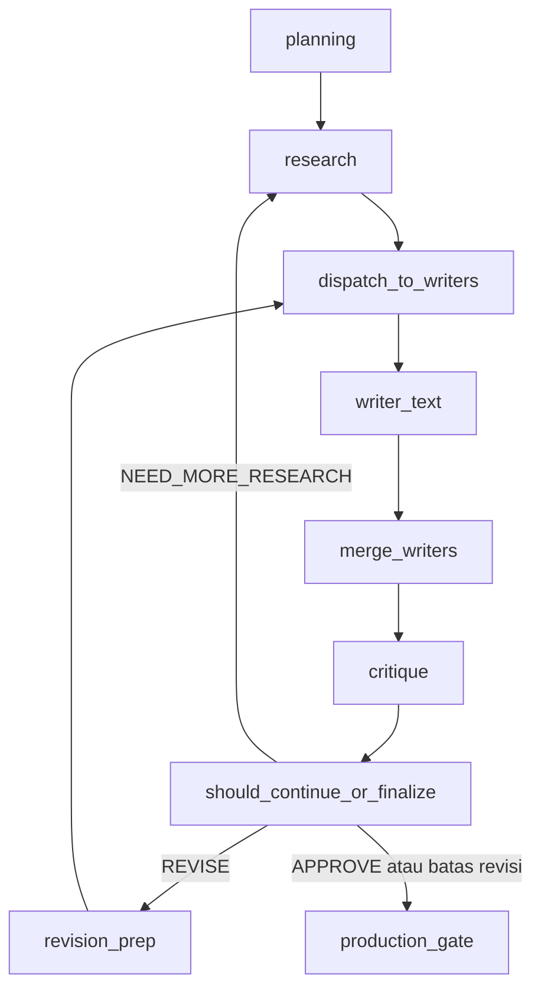

# Pengembangan Arsitektur Agentic AI — Alur Lengkap (Perencanaan → Riset → Penulisan → Kritik & Revisi)

**English:** This document describes the **story-based learning** agentic pipeline implemented under [`src/workflows/story_agent/`](../../src/workflows/story_agent/): structured **planning first**, **research**, **text writing** (primary path), **merge**, **critic** (educational + narrative coherence), and **revision / research loops**. Diagram/image production and optional RAGAS / G-EVAL / FABLES-style metrics are **out of scope** here except where noted. **Per-agent details** live in [`agents/`](agents/README.md).

**Bahasa Indonesia:** Dokumen ini menjadi referensi teknis untuk skripsi: parameter state, prompt, logika pemilihan, serta **routing revisi / riset**. Penjelasan mendalam **tiap agen** ada di file terpisah pada folder [`docs/architecture/agents/`](agents/README.md).

---

## Daftar isi

1. [Ringkasan arsitektur](#1-ringkasan-arsitektur)
2. [Fase perencanaan (pointer)](#2-fase-perencanaan-pointer)
3. [Diagram alur (jalur teks utama)](#3-diagram-alur-jalur-teks-utama)
4. [Kontrak state `StoryState`](#4-kontrak-state-storystate)
5. [Parameter & konfigurasi](#5-parameter--konfigurasi)
6. [Registry prompt](#6-registry-prompt)
7. [Tools & integrasi eksternal](#7-tools--integrasi-eksternal)
8. [Dokumen per agen](#8-dokumen-per-agen)
9. [Komponen per tahap (ringkas)](#9-komponen-per-tahap-ringkas)
10. [Keputusan revisi & routing graf](#10-keputusan-revisi--routing-graf)
11. [Yang sengaja tidak didokumentasikan di sini](#11-yang-sengaja-tidak-didokumentasikan-di-sini)
12. [Komponen data kecil](#12-komponen-data-kecil)
13. [Mapping API (FastAPI)](#13-mapping-api-fastapi)
14. [Referensi file](#14-referensi-file)

---

## 1. Ringkasan arsitektur

Sistem ini memakai **LangGraph** (`StateGraph`) dengan state global bertipe **`StoryState`**. Alur batch utama (`create_story_workflow` di [`graph.py`](../../src/workflows/story_agent/graph.py)):

1. **`planning`** — satu keluaran terstruktur (`PlannerOutput`) merencanakan outline, tokoh, pesan moral, judul, dan **pemilihan penulis** (`active_writers`).
2. **`research`** — mengumpulkan catatan pembelajaran (web dan/atau LightRAG sesuai rencana riset).
3. **`dispatch_to_writers`** — fan-out paralel ke penulis yang aktif (minimal **teks**; diagram hanya jika `diagram ∈ active_writers`).
4. **`merge_writers`** — titik sinkron (tanpa logika merge manual besar; agregasi state oleh LangGraph).
5. **`critique`** — `CriticAgent` menjalankan **evaluasi edukasi** dan **evaluasi koherensi** secara paralel, lalu menggabungkan keputusan.
6. **`should_continue_or_finalize`** — memutuskan **revisi penulisan**, **riset ulang**, atau **lanjut produksi** (gambar/skrip), dengan pengecualian **batas revisi**.

Inti evaluasi kualitas cerita: **edukasi** (skor 1–5 per dimensi) + **koherensi** (skor 0–10 + isu ber-`severity`). Detail rubrik dan logika agregat: [`agents/agent_critic.md`](agents/agent_critic.md).

---

## 2. Fase perencanaan (pointer)

Perencanaan mengikat riset dan penulisan melalui **`PlannerOutput`**. Penjelasan lengkap field, prompt, dan LLM: **[`agents/agent_planner.md`](agents/agent_planner.md)**.

---

## 3. Diagram alur (jalur teks utama)

Alur logis **fokus dokumen ini** (penulis teks + loop revisi). Cabang **diagram** hanya muncul jika planner mengaktifkan `diagram` dalam `active_writers`.

**Mapping ke kode:** `should_continue_or_finalize` membaca `structured_critique["decision"]` dan `revision_count` vs `MAX_REVISIONS` ([`graph.py`](../../src/workflows/story_agent/graph.py)).

---

## 4. Kontrak state `StoryState`

Definisi tunggal: [`state.py`](../../src/workflows/story_agent/state.py). Tabel berikut mengelompokkan field untuk pembangunan dan debugging.

### 4.1 Input & konteks pengguna

| Field | Tipe | Keterangan |
|-------|------|------------|
| `user_message` | `str` | Permintaan mentah. |
| `learning_objectives` | `str` | Tujuan pembelajaran. |
| `target_age` | `str` | Mis. `5-7`, `8-10`, … |
| `theme` | `str` | Tema cerita. |
| `user_characters`, `user_setting` | `str` | Batasan dari pengguna. |
| `story_style`, `narrative_style`, `emotional_tone`, `enriched_context` | `str` | Konteks kreatif / parser. |
| `language`, `story_length` | `str` | Bahasa output dan panjang. |

### 4.2 Riset

| Field | Keterangan |
|-------|------------|
| `research_notes` | Sintesis catatan untuk penulis. |
| `research_sources` | Daftar `{title, uri, …}`. |
| `used_sources` | URI yang dipilih penulis (relevan untuk jejak sumber). |
| `web_research_details` | Hasil per pertanyaan (jawaban + URI). |
| `retrieved_contexts` | Chunk mentah (dipakai fitur lain di luar cakupan dokumen ini). |

### 4.3 Rencana & naskah

| Field | Keterangan |
|-------|------------|
| `story_outline`, `characters`, `moral_message` | Output planner. |
| `draft_title`, `draft_content` | Judul dan isi draf teks. |
| `active_writers` | Kontrol dispatch penulis. |

### 4.4 Kritik & revisi

| Field | Keterangan |
|-------|------------|
| `critique_feedback` | Teks umpan balik gabungan untuk penulis. |
| `revision_count` | Jumlah siklus kritik yang telah dijalankan (di-increment di `CriticAgent`). |
| `quality_score` | Skor kualitas yang di-set ke **`overall_score`** (mengikuti skor edukasi utama, skala **1.0–5.0**). |
| `structured_critique` | `dict` hasil serialisasi **`StructuredCritique`** (skor edukasi, `coherence_score`, keputusan, isu paragraf, dll.). |
| `coherence_issues` | Daftar string ringkas untuk log/UI. |
| `story_canvas` | Serialisasi canvas paragraf (revisi terarah). |
| `needs_text_revision`, `needs_image_revision`, `needs_diagram_revision` | Flag per penulis (dispatch selektif). |

### 4.5 Interaktif & metadata

| Field | Keterangan |
|-------|------------|
| `supervisor_next`, `supervisor_response`, `interaction_mode`, `modification_scope`, `hitl_feedback`, `bypass_supervisor`, `review_plan` | Router supervisor & HITL. |
| `session_id`, `trace_id`, `total_tokens` | Observabilitas. |

**Catatan runtime:** evaluasi koherensi memakai `state.get("global_summary", "")` ([`eval_coherence.py`](../../src/workflows/story_agent/agents/critic/eval_coherence.py)); field ini **tidak** wajib ada di `TypedDict` tetapi dapat diisi oleh alur lain untuk konteks episodik.

---

## 5. Parameter & konfigurasi

Sumber utama: [`settings.py`](../../src/settings.py) — kelas **`StoryConfig`** dan **`LanguageConfig`**.

| Parameter / env | Makna | Default / catatan |
|-----------------|--------|-------------------|
| `MAX_REVISIONS` | Maksimum siklus kritik sebelum graf memaksa lanjut produksi | `3` |
| `QUALITY_THRESHOLD` | Ambang **rata-rata skor edukasi** `edu_score` (skala 1–5) | `4.0` |
| `COHERENCE_PENALTY_WEIGHT` | Tersedia di konfigurasi; tidak digunakan langsung dalam logika kritik di `CriticAgent` yang dijelaskan di [`agents/agent_critic.md`](agents/agent_critic.md) | `1.0` |
| `ENABLE_IMAGE_WRITER`, `ENABLE_DIAGRAM_WRITER`, `ENABLE_DIRECTOR` | Flag fitur penulis tambahan | default `false` |
| `LanguageConfig.SYSTEM_LANGUAGE` | Menentukan folder prompt `id` / `en` | — |

**Provider LLM:** [`llm_factory.py`](../../src/providers/llm_factory.py) — `get_llm_for_agent("planner" | "critic" | …)`; variabel seperti `LLM_PROVIDER`, `LLM_MODEL`, dan kunci API tergantung penyedia.

---

## 6. Registry prompt

Loader: [`prompts.py`](../../src/workflows/story_agent/prompts.py) — `get_registry(language)` membaca `prompts/<lang>/<name>.md`; jika tidak ada, fallback ke file legacy di `prompts/<name>.md`.

### 6.1 Nama prompt (`PROMPT_NAMES`)

Ringkasan; **detail per agen** ada di masing-masing file di [`agents/`](agents/README.md).

| Nama registry | Peran |
|-----------------|--------|
| `planner_unified`, `planner_parser`, `planner_short_guide` | Perencanaan & parsing |
| `researcher_planner`, `researcher_web` | Rencana & eksekusi riset |
| `writer`, `writer_instructions`, `writer_user`, `writer_revision`, `writer_revision_fallback` | Penulis teks & revisi |
| `critic` | Rubrik **edukasi** |
| `critic_coherence` | Rubrik **koherensi** |
| `supervisor` | Router interaktif |
| `image_gen_*`, `writer_diagram*`, `director`, … | Penulis produksi / diagram |

---

## 7. Tools & integrasi eksternal

| Mekanisme | Lokasi | Keterangan |
|-----------|--------|------------|
| **Google Search (grounding)** | [`researcher.py`](../../src/workflows/story_agent/agents/researcher.py) | `Tool(google_search=GoogleSearch())` pada client Google GenAI **hanya** jika provider LLM adalah Google (Vertex / GenAI). |
| **LightRAG** | [`lightrag_client.py`](../../src/workflows/story_agent/integrations/lightrag_client.py) | Retrieval ketika riset tidak memakai web atau sebagai pelengkap. Panduan integrasi: [`lightrag_integration.md`](lightrag_integration.md); spesifikasi EN/ID & indeks: [`lightrag/README.md`](lightrag/README.md). |
| **Structured output** | Semua agen utama | `with_structured_output(Pydantic)` untuk parser stabil. |
| **Langfuse** | [`langfuse_client.py`](../../src/workflows/story_agent/integrations/langfuse_client.py) | Span/generation/score untuk observabilitas. |

---

## 8. Dokumen per agen

| Agen | Dokumen |
|------|---------|
| **Indeks & tabel lengkap** | [`agents/README.md`](agents/README.md) |
| Planner | [`agents/agent_planner.md`](agents/agent_planner.md) |
| Research | [`agents/agent_researcher.md`](agents/agent_researcher.md) |
| Writer (teks) | [`agents/agent_writer.md`](agents/agent_writer.md) |
| Critic | [`agents/agent_critic.md`](agents/agent_critic.md) |
| Supervisor (interaktif) | [`agents/agent_supervisor.md`](agents/agent_supervisor.md) |
| Image generator | [`agents/agent_image_generator.md`](agents/agent_image_generator.md) |
| Writer diagram | [`agents/agent_writer_diagram.md`](agents/agent_writer_diagram.md) |
| Director | [`agents/agent_director.md`](agents/agent_director.md) |

---

## 9. Komponen per tahap (ringkas)

| Tahap / node | Agen | Dokumen |
|--------------|------|---------|
| `planning` | `PlannerAgent` | [agent_planner.md](agents/agent_planner.md) |
| `research` | `ResearchAgent` | [agent_researcher.md](agents/agent_researcher.md) |
| `writer_text` | `WriterAgent` | [agent_writer.md](agents/agent_writer.md) |
| `writer_diagram` | `WriterDiagramAgent` | [agent_writer_diagram.md](agents/agent_writer_diagram.md) |
| `merge_writers` | — (sinkron LangGraph) | — |
| `critique` | `CriticAgent` | [agent_critic.md](agents/agent_critic.md) |
| `revision_prep` → `dispatch_to_writers` | — | [§10](#10-keputusan-revisi--routing-graf) |
| `production_gate` → `writer_image` / `writer_director` | `ImageGeneratorAgent`, `DirectorAgent` | [agent_image_generator.md](agents/agent_image_generator.md), [agent_director.md](agents/agent_director.md) |
| `supervisor_node` (workflow interaktif) | `SupervisorAgent` | [agent_supervisor.md](agents/agent_supervisor.md) |

---

## 10. Keputusan revisi & routing graf

### 10.1 Logika agregat di dalam `CriticAgent`

Gabungan skor edukasi, koherensi, alignment, dan batas revisi — **penjelasan penuh**: [`agents/agent_critic.md`](agents/agent_critic.md) (bagian akhir: “Gabungan keputusan”).

### 10.2 `should_continue_or_finalize`

Di [`graph.py`](../../src/workflows/story_agent/graph.py). Urutan:

1. Jika **`revision_count >= MAX_REVISIONS`** → kembalikan **`"production"`** (cerita dipaksa lanjut).
2. Jika **`critic_decision == "NEED_MORE_RESEARCH"`** → **`"research"`**.
3. Jika **`critic_decision.startswith("APPROVE")`** (termasuk **`APPROVE (max revisi)`**) → **`"production"`**.
4. Selain itu → **`"dispatch_writers"`** (revisi): tepi ke **`revision_prep`** lalu **`dispatch_to_writers`**.

### 10.3 `dispatch_to_writers` (revisi)

- **`text`**: dikirim jika `revision_count == 0` **atau** `needs_text_revision` default **True** (lihat implementasi).
- **`diagram`**: hanya jika `diagram` ∈ `active_writers` dan flag revisi diagram; detail: [agent_writer_diagram.md](agents/agent_writer_diagram.md).

---

## 11. Yang sengaja tidak didokumentasikan di sini

- **RAGAS**, metrik **FABLES** / faithfulness otomatis tambahan, dan **G-EVAL** (DeepEval) — kode dapat menjalankan evaluasi lanjutan pada jalur finalize ketika konteks tersedia; **tidak** merupakan bagian dari spesifikasi arsitektur inti dokumen ini.
- **Detail implementasi** penulis gambar/diagram — ringkas di file agen masing-masing.

---

## 12. Komponen data kecil

| Komponen | File | Fungsi |
|----------|------|--------|
| **`StructuredCritique`** | [`story_canvas.py`](../../src/workflows/story_agent/story_canvas.py) | Menyimpan skor edukasi, **`coherence_score`**, keputusan, isu paragraf, `revision_targets`. |
| **`ParagraphIssue`** | `story_canvas.py` | Isu per paragraf untuk revisi terarah. |
| **`CoherenceIssue` (dataclass)** | [`critic/models.py`](../../src/workflows/story_agent/agents/critic/models.py) | Representasi internal masalah koherensi setelah parsing. |
| **Routing** | [`graph.py`](../../src/workflows/story_agent/graph.py) | `dispatch_to_writers`, `revision_prep`, `should_continue_or_finalize`. |

---

## 13. Mapping API (FastAPI)

Skema permintaan utama: [`schemas.py`](../../src/apps/api/schemas.py).

| Skema | Kegunaan |
|-------|----------|
| `WorkflowRequest` | Alur penuh: `prompt`, `target_age`, `language`, `story_length`, `active_writers` opsional. |
| `InteractiveRequest` | Chat thread: `thread_id`, `user_message`, `hitl_resume`, dll. |
| `CriticEvaluateRequest` | Evaluasi kritik mandiri: `draft_content`, `theme`, `characters`, `revision_count`, … |
| `PlannerParseRequest`, `PlannerPlanRequest` | Uji planner terpisah. |

Router terkait: [`routers/workflow.py`](../../src/apps/api/routers/workflow.py), [`routers/agents.py`](../../src/apps/api/routers/agents.py) (sesuai instalasi app).

---

## 14. Referensi file

| Topik | Path |
|-------|------|
| Graf & routing | `src/workflows/story_agent/graph.py` |
| State | `src/workflows/story_agent/state.py` |
| Planner | `src/workflows/story_agent/agents/planner.py` |
| Researcher | `src/workflows/story_agent/agents/researcher.py` |
| Writer | `src/workflows/story_agent/agents/writer.py` |
| Kritik | `src/workflows/story_agent/agents/critic/agent.py` |
| Edukasi | `src/workflows/story_agent/agents/critic/eval_educational.py` |
| Koherensi | `src/workflows/story_agent/agents/critic/eval_coherence.py` |
| Model kritik | `src/workflows/story_agent/agents/critic/models.py` |
| Prompt loader | `src/workflows/story_agent/prompts.py` |
| Konfigurasi | `src/settings.py` |
| LLM | `src/providers/llm_factory.py` |
| **Dokumen per agen** | `docs/architecture/agents/` |

---

*Dokumen ini diselaraskan dengan implementasi pada repositori pada saat penulisan. Untuk perilaku pasti pada cabang yang jarang dipakai, verifikasi dengan kode sumber terkini.*
