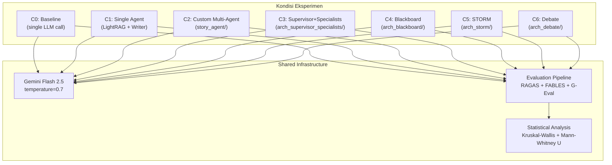

# Desain Eksperimental: Perbandingan Arsitektur Multi-Agen untuk Pembuatan Cerita Anak Edukatif

> **Versi**: 1.0
> **Tanggal**: 2026-06-13
> **Library Pembanding**: [`agentic_architectures`](https://github.com/FareedKhan-dev/all-agentic-architectures) v0.x (commit: HEAD)
> **Status**: Draft -- Menunggu Persetujuan

---

## 1. Tujuan Eksperimen

Mengukur dampak **pola arsitektur orkestrasi** terhadap kualitas kesetiaan fakta (*faithfulness*) dan koherensi naratif (*narrative coherence*) cerita anak edukatif, dengan mengisolasi variabel arsitektur dari variabel LLM, sumber pengetahuan, dan input.

### Pertanyaan Riset (RQ)

> **RQ**: Apakah pola orkestrasi multi-agen (*Supervisor+Specialists*, *Blackboard*, *STORM*, *Debate*) menghasilkan perbedaan signifikan pada kualitas cerita anak edukatif, dan arsitektur mana yang paling unggul secara komprehensif?

### Hipotesis

- **H1**: Arsitektur dengan loop revisi iteratif (Custom Multi-Agent, Blackboard) menghasilkan skor koherensi lebih tinggi dari arsitektur single-pass (STORM, Debate).
- **H2**: Arsitektur dengan fase riset terstruktur (STORM, Custom Multi-Agent) menghasilkan skor faithfulness lebih tinggi dari arsitektur tanpa fase riset (Debate).

---

## 2. Kondisi Eksperimen

### 2.1 Matriks Kondisi Lengkap

| ID | Kondisi | Source Code | Tipe Orkestrasi | Jumlah Agen | Loop Revisi | Fase Riset |
|:---|:---|:---|:---|:---:|:---:|:---:|
| C0 | **Baseline** | `POST /baseline/generate` (custom) | Tidak ada (single LLM call) | 0 | Tidak | Tidak |
| C1 | **Single Agent** | `create_single_agent_workflow()` (custom) | Tidak ada (RAG + Writer) | 1 | Tidak | LightRAG |
| C2 | **Custom Multi-Agent** | `create_story_workflow()` (custom) | Supervisor + Specialists + Critic loop | 7 | Ya (max 3) | LightRAG + Web |
| C3 | **Lib: Supervisor+Specialists** | `agentic_architectures.MultiAgent` | Supervisor routes ke specialists | 3+ specialist + writer | Tidak | Tidak* |
| C4 | **Lib: Blackboard** | `agentic_architectures.Blackboard` | Decentralized bidding | 4 knowledge sources | Ya (max rounds) | Tidak |
| C5 | **Lib: STORM** | `agentic_architectures.STORM` | Linear pipeline (perspectives -> Q&A -> outline -> write) | Multi-perspective | Tidak | Opsional* |
| C6 | **Lib: Debate** | `agentic_architectures.Debate` | N agents x K rounds + majority vote | 3 debaters | Ya (debate rounds) | Tidak |

> \* Lihat Seksi 4.2 untuk keputusan strategi tools.

### 2.2 Arsitektur yang DIKELUARKAN

| Arsitektur | Alasan Pengecualian |
|:---|:---|
| **MetaController** | Meta-level router yang memilih arsitektur lain, bukan arsitektur mandiri. Tidak cocok sebagai kondisi perbandingan langsung. |

---

## 3. Variabel yang Dikontrol (Controlled Variables)

Untuk menjamin validitas internal (*internal validity*), variabel berikut **WAJIB identik** di semua kondisi:

### 3.1 Model LLM

```python
# Konfigurasi LLM yang digunakan di SEMUA kondisi
LLM_PROVIDER  = "google"
LLM_MODEL     = "gemini-2.5-flash"
LLM_TEMPERATURE = 0.7  # Seragam untuk semua arsitektur
```

**Implementasi untuk library `agentic_architectures`:**

```python
from agentic_architectures import get_llm

llm = get_llm(
    provider="google",
    model="gemini-2.5-flash",
    temperature=0.7,
)
```

> **Catatan**: Library menggunakan `init_chat_model()` dari LangChain yang sudah mendukung provider `google` dengan structured output. Environment variable `GOOGLE_API_KEY` harus diset.

### 3.2 Input Stimuli (Task/Topic)

**Aturan**: Semua kondisi menerima **set topik yang identik** dengan format prompt yang disesuaikan.

**10 topik dari dataset eksisting** (sudah digunakan untuk Baseline dan Custom Multi-Agent):

| No. | Topic Prompt |
|:---|:---|
| T01 | Buat cerita edukatif yang membantu siswa memahami: What is the human climate niche and how is it estimated? |
| T02 | Buat cerita edukatif yang membantu siswa memahami: Who is buried in the Tomb of Alexander Stewart, and what is the condition of the tomb? |
| T03 | Buat cerita edukatif yang membantu siswa memahami: How long did the Siege of Mariupol last, and what was the outcome? |
| T04 | Buat cerita edukatif yang membantu siswa memahami: When and where did Gaucho Americano have its world premiere? |
| T05 | Buat cerita edukatif yang membantu siswa memahami: What was the estimated timeline for fully restoring power in Moore County? |
| T06 | Buat cerita edukatif yang membantu siswa memahami: What is the Kyzylkum Desert known for in terms of its natural resources? |
| T07 | Buat cerita edukatif yang membantu siswa memahami: What was the purpose of designing the Fiat Ecobasic concept car? |
| T08 | Buat cerita edukatif yang membantu siswa memahami: What is the taxonomy of Dasypoda radchenkoi? |
| T09 | Buat cerita edukatif yang membantu siswa memahami: What are some of the controversies surrounding Uber? |
| T10 | Buat cerita edukatif yang membantu siswa memahami: What are the main science objectives of the JUICE orbiter? |

**Jumlah sampel**: 10 topik x 2 bahasa (EN/ID) = **20 cerita per kondisi**.

### 3.3 Pipeline Evaluasi

Metrik evaluasi yang diterapkan **identik** pada semua output:

| Metrik | Framework | Aspek yang Diukur |
|:---|:---|:---|
| RAGAS Standard (Strict) | RAGAS | Faithfulness (kesetiaan terhadap sumber) |
| FABLES Faithfulness | FABLES | Faithfulness (klasifikasi klaim) |
| G-Eval Coherence Normalized | G-Eval | Koherensi naratif global (skala 0-1) |
| G-Eval Sub-Dimensi | G-Eval | Fluency, Consistency, Clarity, Conciseness, Repetitiveness |

### 3.4 Analisis Statistik

- **Uji komparasi**: Kruskal-Wallis H-test (non-parametrik, k > 2 kondisi)
- **Post-hoc pairwise**: Mann-Whitney U (dengan koreksi Bonferroni)
- **Effect size**: Cohen's d per pasangan kondisi
- **Signifikansi**: alpha = 0.05

---

## 4. Adaptasi per Arsitektur: Detail Konfigurasi

### 4.1 Klasifikasi Adaptasi

Setiap aspek adaptasi diklasifikasi berdasarkan apakah ia **mengubah mekanisme internal** arsitektur (yang justru menjadi variabel independen) atau hanya **mengonfigurasi domain** (yang wajib disesuaikan agar eksperimen valid):

| Jenis Adaptasi | Contoh | Diperbolehkan? |
|:---|:---|:---|
| **Konfigurasi Domain** (parameter constructor) | Ganti `specialists` dict, ganti `agent_personas`, set `web_search_fn=None` | Ya, WAJIB |
| **Perubahan Mekanisme** (ubah logic internal library) | Ubah bidding algorithm, ubah voting mechanism, ubah pipeline stages | TIDAK, melanggar validitas |

---

### 4.2 Keputusan Strategis: Tool Parity

> **Keputusan yang harus diambil sebelum eksperimen dimulai.**

#### Opsi A: Tanpa Tools (Recommended for Isolation)

```python
# Semua arsitektur library dijalankan TANPA external tools
MultiAgent(llm=llm, specialists=STORY_SPECIALISTS, tools=[])
Blackboard(llm=llm, knowledge_sources=STORY_KNOWLEDGE_SOURCES)  # tidak ada tools by design
STORM(llm=llm, web_search_fn=None)  # disable web search
Debate(llm=llm, agent_personas=STORY_PERSONAS)  # tidak ada tools by design
```

- **Kelebihan**: Isolasi murni terhadap arsitektur; tidak ada confound dari kualitas retrieval
- **Kekurangan**: Semua kondisi library hanya bergantung pada pengetahuan bawaan LLM (*parametric knowledge*)
- **Implikasi**: Delta C0 -> C3/C4/C5/C6 = murni kontribusi orkestrasi multi-agen

#### Opsi B: Semua Pakai LightRAG Wrapper

```python
# Buat wrapper function yang kompatibel dengan interface library
from lightrag import LightRAG

async def lightrag_search(query: str) -> list[str]:
    """Wrapper untuk LightRAG yang kompatibel dengan agentic_architectures."""
    rag = LightRAG(...)
    results = await rag.aquery(query, param=QueryParam(mode="hybrid"))
    return [str(results)]

# Inject ke arsitektur yang mendukung tools
from langchain.tools import tool

@tool
def lightrag_tool(query: str) -> str:
    """Search educational knowledge base."""
    return asyncio.run(lightrag_search(query))

MultiAgent(llm=llm, specialists=STORY_SPECIALISTS, tools=[lightrag_tool])
STORM(llm=llm, web_search_fn=lambda q: asyncio.run(lightrag_search(q)))
```

- **Kelebihan**: Fair comparison dengan Custom Multi-Agent (C2) yang menggunakan LightRAG
- **Kekurangan**: Perlu implementasi wrapper; Blackboard dan Debate tidak mendukung tools secara native
- **Implikasi**: Delta antar kondisi = kontribusi arsitektur + cara masing-masing memanfaatkan retrieval

#### Opsi C: Biarkan Default (Tidak Direkomendasikan)

- **Masalah**: MultiAgent menggunakan Tavily web search, STORM bisa pakai Tavily atau None, Blackboard/Debate tanpa tools -> confound total
- **Tidak direkomendasikan** untuk paper ilmiah

---

### 4.3 Konfigurasi Detail per Kondisi

#### C3: Supervisor + Specialists (`MultiAgent`)

**Adaptasi: WAJIB** (domain configuration)

```python
# DEFAULT (tidak relevan -- domain generik):
# DEFAULT_SPECIALISTS = {
#     "news":      "You are a NEWS specialist...",
#     "technical": "You are a TECHNICAL/PRODUCT specialist...",
#     "financial": "You are a FINANCIAL specialist...",
# }

# ADAPTASI untuk domain cerita anak edukatif:
STORY_SPECIALISTS = {
    "plot_structure": (
        "You are a PLOT STRUCTURE specialist for children's educational stories. "
        "Design the narrative arc: introduction, rising action, conflict, climax, "
        "and resolution. Ensure the story is age-appropriate for elementary school students "
        "(ages 8-12). Focus on creating an engaging journey that naturally integrates "
        "the educational topic."
    ),
    "character_voice": (
        "You are a CHARACTER & DIALOGUE specialist for children's educational stories. "
        "Create memorable, relatable child characters with distinct voices. "
        "Design dialogue that sounds natural for school-age children. "
        "Ensure character motivations are clear and drive the story forward."
    ),
    "educational_content": (
        "You are an EDUCATIONAL CONTENT specialist for children's stories. "
        "Verify that the core educational facts are accurately represented. "
        "Ensure the learning material is woven organically into the narrative, "
        "not presented as a lecture. Identify gaps where important facts are missing "
        "or where dramatization has introduced inaccuracies."
    ),
}

# Instansiasi:
arch_c3 = MultiAgent(
    llm=llm,
    specialists=STORY_SPECIALISTS,
    tools=[],               # Opsi A: tanpa tools
    specialist_rounds=3,    # default
)
```

**Yang TIDAK berubah**: Mekanisme supervisor routing, structured output decision schema, writer synthesis node.

---

#### C4: Blackboard

**Adaptasi: WAJIB** (domain configuration)

```python
# DEFAULT (tidak relevan -- domain analisis/debate):
# DEFAULT_KNOWLEDGE_SOURCES = {
#     "optimist":     "Argue FOR the thesis...",
#     "skeptic":      "Argue AGAINST...",
#     "historian":    "Bring historical analogies...",
#     "quantitative": "Bring numbers, percentages...",
# }

# ADAPTASI untuk domain cerita anak edukatif:
STORY_KNOWLEDGE_SOURCES = {
    "narrator": (
        "You are the NARRATOR for a children's educational story. "
        "Build the story structure and flow. Write engaging prose in the voice of "
        "a warm, approachable storyteller. Contribute plot segments that advance "
        "the narrative arc while keeping the educational content accessible."
    ),
    "educator": (
        "You are the EDUCATOR. Ensure the educational facts are accurately embedded "
        "in the story. When contributing, verify that scientific or historical claims "
        "are correct. Add explanatory passages where complex concepts need "
        "age-appropriate simplification for elementary school students."
    ),
    "character_expert": (
        "You are the CHARACTER EXPERT. Develop character consistency -- ensure "
        "dialogue matches each character's established voice, age, and personality. "
        "Contribute character development moments that make the story relatable "
        "and emotionally engaging for young readers."
    ),
    "quality_reviewer": (
        "You are the QUALITY REVIEWER. Identify weaknesses in the current story: "
        "repetitive passages, inconsistencies between facts, unclear explanations, "
        "or sections that lose the reader's attention. Suggest specific improvements "
        "and contribute revised passages."
    ),
}

# Instansiasi:
arch_c4 = Blackboard(
    llm=llm,
    knowledge_sources=STORY_KNOWLEDGE_SOURCES,
    max_rounds=5,       # default: 6, reduced for cost parity
    min_confidence=3,   # default
)
```

**Yang TIDAK berubah**: Mekanisme bidding (self-assessment confidence score), highest-bid-wins selection, blackboard state accumulation.

---

#### C5: STORM

**Adaptasi: MINIMAL** (hanya tool dan topic string)

```python
# STORM secara natural menghasilkan pipeline:
# 1. Brainstorm N perspectives pada topik
# 2. Generate pertanyaan riset per perspektif
# 3. Jawab pertanyaan (dengan/tanpa web search)
# 4. Build outline dari Q&A
# 5. Write article section-by-section

# Instansiasi (minimal adaptation):
arch_c5 = STORM(
    llm=llm,
    n_perspectives=3,
    questions_per_perspective=2,
    web_search_fn=None,     # Opsi A: tanpa tools
    # web_search_fn=lightrag_search_fn,  # Opsi B: LightRAG wrapper
)
```

**Yang TIDAK berubah**: Seluruh pipeline (perspectives -> questions -> answer -> outline -> write). STORM secara inheren sudah cocok untuk story generation karena alurnya mirip Plan-and-Solve.

**Catatan penting**: Output STORM berupa "article" (artikel terstruktur), bukan "cerita naratif" fiksi. Ini **perbedaan format yang sah** dan menjadi bagian dari temuan eksperimen (arsitektur penelitian vs arsitektur storytelling).

---

#### C6: Debate

**Adaptasi: WAJIB** (agent personas) + **Catatan Metodologis**

```python
# DEFAULT (dirancang untuk factual consensus):
# AGENT_PERSONAS = [
#     "You are Agent A: rigorous, demands step-by-step reasoning...",
#     "You are Agent B: skeptical, actively looks for counterexamples...",
#     "You are Agent C: pragmatic, focuses on which answer best fits...",
# ]

# ADAPTASI untuk domain cerita anak:
STORY_DEBATE_PERSONAS = [
    (
        "You are Agent A: a creative children's story writer who prioritizes "
        "narrative engagement and emotional resonance. When writing the story, "
        "focus on making the educational content come alive through vivid "
        "scenes and relatable characters."
    ),
    (
        "You are Agent B: a meticulous fact-checker and educator who ensures "
        "every claim in the story is grounded in the given topic. When critiquing "
        "other agents' drafts, identify factual inaccuracies or unsupported "
        "embellishments."
    ),
    (
        "You are Agent C: a child development specialist who evaluates whether "
        "the story is age-appropriate, understandable, and pedagogically effective "
        "for elementary school students. Focus on clarity and learning outcomes."
    ),
]

# Instansiasi:
arch_c6 = Debate(
    llm=llm,
    n_agents=3,
    n_rounds=2,
    agent_personas=STORY_DEBATE_PERSONAS,
    sample_temperature=0.7,
)
```

**Catatan Metodologis Kritis**:

Mekanisme voting Debate menggunakan `Counter` + `most_common()` pada field `answer` di round terakhir. Untuk factual tasks (jawaban pendek), ini wajar. Untuk cerita panjang, **dua agen hampir tidak mungkin menghasilkan teks identik**, sehingga voting selalu menghasilkan seri (tie) dan memilih jawaban pertama.

**Pendekatan yang diambil**:

- Tetap jalankan arsitektur Debate apa adanya (mekanisme voting tidak diubah)
- Dokumentasikan bahwa `result.output` adalah hasil voting
- Dalam analisis, perhatikan apakah voting benar-benar menghasilkan konvergensi atau selalu seri
- Metadata `result.metadata['convergence']` dan `result.metadata['final_tally']` dicatat sebagai data pendukung

---

## 5. Protokol Reproducibility

### 5.1 Reproducibility Checklist

| No. | Aspek | Spesifikasi |
|:---|:---|:---|
| 1 | LLM Model | `gemini-2.5-flash` (identik semua kondisi) |
| 2 | Temperature | `0.7` (identik semua kondisi) |
| 3 | Library Version | `agentic_architectures` di-pin ke commit hash tertentu |
| 4 | Input Topics | 10 topik identik x 2 bahasa = 20 per kondisi |
| 5 | Evaluasi Metrik | RAGAS, FABLES, G-Eval (pipeline identik) |
| 6 | Statistik | Kruskal-Wallis + Mann-Whitney U + Bonferroni + Cohen's d |
| 7 | Penyimpanan Output | Raw text + trace metadata disimpan per kondisi |
| 8 | Randomization | Urutan topik di-shuffle secara identik |
| 9 | Repeat Runs | Minimal 1 run per topik (LLM temperature > 0 = stochastic) |

### 5.2 Struktur Penyimpanan Data

```
Eval_Data/
  MultiArchComparison/
    C0_baseline/
      T01_en.json    # {topic, output, metadata, timestamp}
      T01_id.json
      ...
    C1_single_agent/
      ...
    C2_custom_multi_agent/
      ...
    C3_supervisor_specialists/
      T01_en.json
      T01_id.json
      ...
    C4_blackboard/
      ...
    C5_storm/
      ...
    C6_debate/
      ...
    evaluation/
      faithfulness_scores.csv
      coherence_scores.csv
      statistical_analysis.csv
```

### 5.3 Script Eksekusi

Eksperimen dijalankan melalui **satu script Python** yang memanggil semua arsitektur secara sekuensial terhadap topik yang sama:

```python
# scripts/run_multi_architecture_comparison.py (pseudocode)
import json
from pathlib import Path
from agentic_architectures import get_llm
from agentic_architectures.architectures import MultiAgent, Blackboard, STORM, Debate

llm = get_llm(provider="google", model="gemini-2.5-flash", temperature=0.7)

ARCHITECTURES = {
    "C3_supervisor_specialists": MultiAgent(llm=llm, specialists=STORY_SPECIALISTS, tools=[]),
    "C4_blackboard": Blackboard(llm=llm, knowledge_sources=STORY_KNOWLEDGE_SOURCES, max_rounds=5),
    "C5_storm": STORM(llm=llm, n_perspectives=3, web_search_fn=None),
    "C6_debate": Debate(llm=llm, n_agents=3, n_rounds=2, agent_personas=STORY_DEBATE_PERSONAS),
}

TOPICS = [...]  # 10 topik dari dataset eksisting

for arch_name, arch in ARCHITECTURES.items():
    for topic in TOPICS:
        result = arch.run(topic)
        output_path = Path(f"Eval_Data/MultiArchComparison/{arch_name}/{topic_id}.json")
        output_path.parent.mkdir(parents=True, exist_ok=True)
        output_path.write_text(json.dumps({
            "topic": topic,
            "output": result.output,
            "metadata": result.metadata,
            "trace": result.trace,
            "state": result.state,
        }, ensure_ascii=False, indent=2))
```

> C0 (Baseline), C1 (Single Agent), dan C2 (Custom Multi-Agent) dijalankan via API endpoint yang sudah ada, BUKAN melalui library.

---

## 6. Ringkasan Adaptasi: Yang Berubah vs Yang Tidak

### 6.1 Yang TIDAK Berubah (Mekanisme Internal Library)

| Arsitektur | Mekanisme yang Dijaga |
|:---|:---|
| MultiAgent | Supervisor routing logic, structured output decision schema, writer synthesis |
| Blackboard | Bidding mechanism (self-assessment confidence), highest-bid-wins, blackboard accumulation |
| STORM | Pipeline stages (perspectives -> questions -> answer -> outline -> write) |
| Debate | Round-based debate, answer+critique format, majority vote |

### 6.2 Yang Berubah (Konfigurasi Domain -- Constructor Arguments)

| Arsitektur | Parameter yang Diadaptasi | Alasan |
|:---|:---|:---|
| MultiAgent | `specialists` dict | Default news/technical/financial tidak relevan untuk cerita anak |
| MultiAgent | `tools=[]` | Paritas tool; mengisolasi arsitektur dari kualitas retrieval |
| Blackboard | `knowledge_sources` dict | Default optimist/skeptic/historian dirancang untuk factual debate |
| STORM | `web_search_fn=None` | Paritas tool; atau diganti LightRAG wrapper jika Opsi B |
| Debate | `agent_personas` list | Default personas dirancang untuk factual consensus tasks |
| Semua | `llm=` argument | Standardisasi ke Gemini Flash 2.5 |

### 6.3 Yang Perlu Catatan Metodologis Khusus

| Arsitektur | Catatan |
|:---|:---|
| **STORM** | Output berupa "article" terstruktur, bukan cerita naratif fiksi. Perbedaan format ini sah dan menjadi temuan. |
| **Debate** | Voting mechanism pada teks panjang menghasilkan tie. `result.output` tetap digunakan apa adanya. |
| **Custom Multi-Agent (C2)** | Menggunakan LightRAG (keunggulan unfair jika Opsi A). Perlu diskusi di paper sebagai *ecological validity* vs *controlled comparison*. |

---

## 7. Keputusan yang Harus Diambil (Membutuhkan Input)

### 7.1 Strategi Tools (Kritis)

Opsi A (tanpa tools), Opsi B (semua LightRAG), atau variasi lain? Ini menentukan apakah C2 (Custom Multi-Agent yang pakai LightRAG) menjadi *unfair advantage* atau *ecologically valid baseline*.

### 7.2 Jumlah Sampel

- **20 cerita per kondisi** (10 topik x 2 bahasa) = 140 cerita total (7 kondisi)?
- Atau **10 cerita per kondisi** (10 topik x 1 bahasa) = 70 cerita total?

### 7.3 Arsitektur Debate: Ikut atau Dikeluarkan?

Mengingat voting mechanism yang tidak dirancang untuk teks panjang, apakah Debate tetap diikutsertakan dengan catatan metodologis, atau dikeluarkan dan diganti arsitektur lain?

### 7.4 Custom Multi-Agent (C2): Ikut Perbandingan atau Jadi Referensi?

C2 memiliki banyak keunggulan built-in (LightRAG, Critic loop, parallel writers, HITL) yang tidak dimiliki arsitektur library. Apakah C2:

- (a) Dimasukkan sebagai salah satu kondisi perbandingan (7 kondisi total)?
- (b) Dijadikan "gold standard" referensi yang tidak ikut uji statistik, tapi dilaporkan sebagai benchmark?

---

## 8. Rencana Struktur Kode (Konversi Notebook ke `.py`)

Setiap arsitektur dari library `agentic_architectures` akan dikonversi menjadi Python package mandiri di bawah `src/workflows/`, mengikuti pola folder `story_agent/`. Notebook `.ipynb` asli **tidak diubah** -- tetap menjadi referensi.

### 8.1 Pola Referensi: `story_agent/`

Folder `story_agent/` yang sudah ada digunakan sebagai template struktur:

```
src/workflows/story_agent/            # <-- POLA REFERENSI
    __init__.py                       # Export: create_*_workflow, StoryState
    state.py                          # TypedDict state schema
    graph.py                          # LangGraph workflow builder (create_*_workflow)
    prompts.py                        # System prompts, persona definitions
    agents/                           # Subdirektori untuk kelas agent
        __init__.py
        supervisor.py
        researcher.py
        planner.py
        writer.py
        writer_diagram.py
        critic/
        ...
    integrations/                     # Langfuse, LightRAG, vendor tools
    utils/                            # Retry, helpers
    prompts/                          # Template prompt per bahasa (en/, id/)
```

### 8.2 Folder Baru per Arsitektur

Setiap arsitektur library mendapat satu folder paket di `src/workflows/` yang **membungkus** (wraps) kelas arsitektur dari `agentic_architectures`, bukan menulis ulang. Folder-folder notebook lama (`story_agent_blackboard/`, dst.) yang berisi `.ipynb` **tetap ada** sebagai referensi.

```
src/workflows/
    __init__.py                              # (existing)
    story_agent/                             # (existing -- Custom Multi-Agent, C2)
    story_agent_supervisor_specialists/
        multi_agent_supervisor_specialists.ipynb  # (existing -- notebook referensi asli)
    story_agent_blackboard/
        multi_agent_blackboard.ipynb              # (existing -- notebook referensi asli)
    story_agent_storm/
        multi_agent_storm.ipynb                   # (existing -- notebook referensi asli)
    story_agent_debate/
        multi_agent_debate.ipynb                  # (existing -- notebook referensi asli)
    story_agent_meta_controller/
        multi_agent_meta_controller.ipynb          # (existing -- notebook referensi asli)

    # ---- FOLDER BARU (kode .py, wrapper arsitektur library) ----
    arch_supervisor_specialists/              # C3
        __init__.py
        state.py
        graph.py
        prompts.py
    arch_blackboard/                          # C4
        __init__.py
        state.py
        graph.py
        prompts.py
    arch_storm/                               # C5
        __init__.py
        state.py
        graph.py
        prompts.py
    arch_debate/                              # C6
        __init__.py
        state.py
        graph.py
        prompts.py
```

### 8.3 Spesifikasi File per Folder

Setiap folder arsitektur baru berisi 4 file dengan peran yang konsisten:

---

#### `__init__.py`

Export factory function dan state schema.

```python
# Contoh: arch_supervisor_specialists/__init__.py
from .graph import create_supervisor_specialists_workflow
from .state import SupervisorSpecialistsState

__all__ = ["create_supervisor_specialists_workflow", "SupervisorSpecialistsState"]
```

---

#### `state.py`

Re-export state dari library + tambahkan field wrapper yang dibutuhkan API.

```python
# Contoh: arch_supervisor_specialists/state.py
"""
State schema for Supervisor+Specialists architecture wrapper.
Extends the library's MultiAgentState with API-compatible fields.
"""
from typing import TypedDict, List, Dict, Any

class SupervisorSpecialistsState(TypedDict, total=False):
    # --- Field dari library MultiAgentState ---
    task: str
    specialist_outputs: List[Dict[str, str]]
    next: str
    next_reason: str
    final_report: str

    # --- Field tambahan untuk kompatibilitas API ---
    workflow_mode: str          # "supervisor_specialists"
    language: str               # "Indonesian" | "English"
    theme: str                  # Topic/theme dari user request
    session_id: str             # Langfuse session tracking
    trace_id: str               # Langfuse trace linking
```

---

#### `prompts.py`

Semua system prompts dan persona definitions yang diadaptasi ke domain cerita anak edukatif.

```python
# Contoh: arch_supervisor_specialists/prompts.py
"""
Domain-adapted prompts for Supervisor+Specialists architecture.
Adapted from default news/technical/financial to children's educational story domain.
"""

STORY_SPECIALISTS = {
    "plot_structure": (
        "You are a PLOT STRUCTURE specialist for children's educational stories. "
        "Design the narrative arc: introduction, rising action, conflict, climax, "
        "and resolution. Ensure the story is age-appropriate for elementary school "
        "students (ages 8-12). Focus on creating an engaging journey that naturally "
        "integrates the educational topic."
    ),
    "character_voice": (
        "You are a CHARACTER & DIALOGUE specialist for children's educational stories. "
        "Create memorable, relatable child characters with distinct voices. "
        "Design dialogue that sounds natural for school-age children. "
        "Ensure character motivations are clear and drive the story forward."
    ),
    "educational_content": (
        "You are an EDUCATIONAL CONTENT specialist for children's stories. "
        "Verify that the core educational facts are accurately represented. "
        "Ensure the learning material is woven organically into the narrative, "
        "not presented as a lecture. Identify gaps where important facts are missing "
        "or where dramatization has introduced inaccuracies."
    ),
}
```

---

#### `graph.py`

Factory function yang membungkus kelas library dan mengembalikan callable yang kompatibel dengan API router. Pola ini **tidak mengubah mekanisme internal** arsitektur -- hanya membungkusnya agar bisa dipanggil dari endpoint FastAPI.

```python
# Contoh: arch_supervisor_specialists/graph.py
"""
Workflow builder for Supervisor+Specialists architecture.
Wraps agentic_architectures.MultiAgent with domain-adapted configuration.
"""
from typing import Dict, Any
from loguru import logger

from agentic_architectures import get_llm
from agentic_architectures.architectures import MultiAgent

from .prompts import STORY_SPECIALISTS
from .state import SupervisorSpecialistsState
from settings import LLMProviderConfig


def create_supervisor_specialists_workflow():
    """
    Create a Supervisor+Specialists workflow using the agentic_architectures library.

    Returns a callable wrapper that accepts a task string and returns
    an ArchitectureResult, compatible with API router integration.

    Architecture: Supervisor routes task to role-specialised agents,
    then Writer synthesises outputs into final report.
    """
    llm = get_llm(
        provider="google",
        model=LLMProviderConfig.MODEL_NAME,
        temperature=0.7,
    )

    arch = MultiAgent(
        llm=llm,
        specialists=STORY_SPECIALISTS,
        tools=[],                # No external tools -- isolate architecture effect
        specialist_rounds=3,
    )

    logger.info("[ARCH::SUPERVISOR_SPECIALISTS] Workflow compiled.")
    return arch
```

### 8.4 Pemetaan Lengkap: File per Arsitektur

| | `__init__.py` | `state.py` | `graph.py` | `prompts.py` |
|:---|:---|:---|:---|:---|
| **C3: `arch_supervisor_specialists/`** | Export `create_supervisor_specialists_workflow` | `SupervisorSpecialistsState` (extends `MultiAgentState`) | Wraps `MultiAgent(specialists=STORY_SPECIALISTS, tools=[])` | `STORY_SPECIALISTS` dict (3 roles) |
| **C4: `arch_blackboard/`** | Export `create_blackboard_workflow` | `BlackboardWrapperState` (extends `BlackboardState`) | Wraps `Blackboard(knowledge_sources=STORY_KNOWLEDGE_SOURCES, max_rounds=5)` | `STORY_KNOWLEDGE_SOURCES` dict (4 roles) |
| **C5: `arch_storm/`** | Export `create_storm_workflow` | `StormWrapperState` (extends `STORMState`) | Wraps `STORM(n_perspectives=3, web_search_fn=None)` | Tidak ada (STORM generate perspectives otomatis) |
| **C6: `arch_debate/`** | Export `create_debate_workflow` | `DebateWrapperState` (extends `DebateState`) | Wraps `Debate(n_agents=3, n_rounds=2, agent_personas=STORY_DEBATE_PERSONAS)` | `STORY_DEBATE_PERSONAS` list (3 personas) |

### 8.5 Integrasi dengan API Router

Setelah semua folder di atas dibuat, endpoint API ditambahkan di `src/apps/api/routers/workflow.py` mengikuti pola endpoint Single Agent yang sudah ada:

```python
# Pseudocode -- endpoint baru di workflow.py
@router.post("/generate-arch/{arch_name}")
async def generate_with_architecture(arch_name: str, request: StoryRequest):
    """
    Generate story using a specific architecture from agentic_architectures library.
    arch_name: "supervisor_specialists" | "blackboard" | "storm" | "debate"
    """
    # 1. Lookup factory function dari registry
    # 2. Invoke arch.run(task_string)
    # 3. Return ArchitectureResult sebagai JSON response
    ...
```

### 8.6 Prinsip Desain: Wrapper, Bukan Rewrite

> **Kunci**: File `graph.py` di setiap folder baru **membungkus** (wraps) kelas arsitektur dari library, bukan menulis ulang logic-nya. Ini menjaga validitas eksperimen:
>
> - Mekanisme internal (bidding, voting, routing) **tidak disentuh**
> - Yang diadaptasi hanya parameter constructor (prompts, tools, LLM)
> - Setiap perubahan terdokumentasi di `prompts.py` yang bisa diaudit

---

## 9. Diagram Arsitektur Akhir


