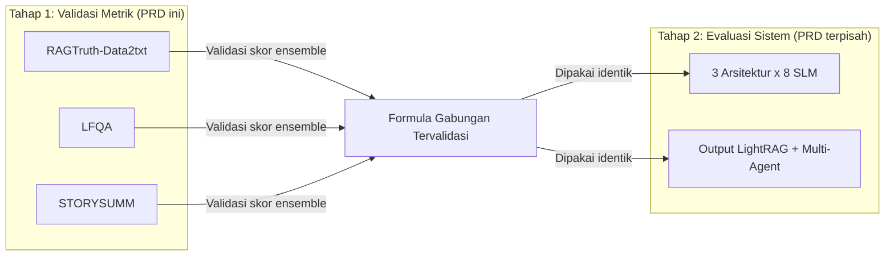
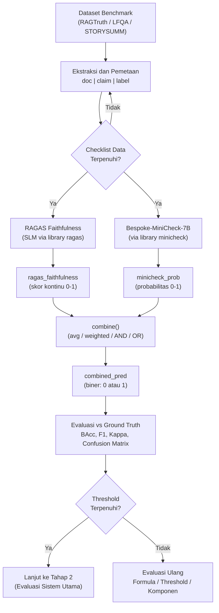

# PRD: Pengujian Validasi Metrik Faithfulness

> **Project**: Skripsi -- Analisis Kinerja Koherensi Naratif dan Faithfulness pada Sistem Agentic AI dan LightRAG
> **Author**: Mohammad Raya Satriatama
> **Version**: 1.0
> **Date**: 2026-06-21
> **Status**: Draft -- Menunggu Persetujuan

---

## 1. Executive Summary

Dokumen ini mendefinisikan protokol pengujian validasi untuk metrik faithfulness gabungan
(RAGAS Faithfulness + Bespoke-MiniCheck-7B) terhadap tiga dataset benchmark eksternal.
Tujuannya adalah membuktikan bahwa skor ensemble yang digunakan pada evaluasi sistem utama
(3 arsitektur x 8 SLM) memiliki validitas empiris sebelum diterapkan ke output pipeline
LightRAG dan multi-agent story generation.

**Cakupan PRD ini**:
- Ekstraksi dan pemetaan data dari tiga dataset benchmark
- Pemanggilan evaluator RAGAS dan Bespoke-MiniCheck-7B
- Penggabungan skor menjadi satu metrik ensemble
- Pelaporan statistik (Balanced Accuracy, F1, Cohen's Kappa, Confusion Matrix)
- Template prompt LLM-Judge manual sebagai alternatif library `ragas`

**Di luar cakupan PRD ini**:
- Evaluasi sistem utama (3 arsitektur x 8 SLM) -- dicakup oleh PRD terpisah
- Pengembangan arsitektur multi-agent -- dicakup oleh `experimental_design_multi_architecture_comparison.md`
- Evaluasi koherensi (G-Eval) -- dicakup oleh `prd_agentic_ai_evaluation.md`

---

## 2. Latar Belakang dan Motivasi

### 2.1 Mengapa Validasi Diperlukan

Sebelum mempercayai skor faithfulness gabungan untuk mengukur output sistem, perlu dibuktikan
bahwa skor tersebut berkorelasi dengan ground truth halusinasi/faithfulness yang sudah
dianotasi ahli. Tanpa langkah ini, klaim bahwa "arsitektur X menghasilkan faithfulness
lebih tinggi dari arsitektur Y" tidak memiliki dasar kredibel.

### 2.2 Hubungan dengan Tahap Evaluasi Utama



> [!IMPORTANT]
> Formula penggabungan yang dipakai di Tahap 1 **harus identik** dengan yang diterapkan
> di Tahap 2. Kalau formulanya berubah antar tahap, skor tidak bisa diperbandingkan.

---

## 3. Orientasi: Cara Kerja Kedua Evaluator

Kedua evaluator bekerja secara berbeda dan membutuhkan pemahaman sebelum implementasi:

| Evaluator | Butuh Prompt Manual? | Bentuk Input |
|:---|:---|:---|
| **Bespoke-MiniCheck-7B** | Tidak. Classifier terlatih (bukan LLM instruction-following biasa). Prompt internal sudah dibakukan di library `minicheck`. | `scorer.score(docs=[...], claims=[...])` |
| **RAGAS Faithfulness** | Ya, tapi sudah dibakukan di library `ragas` (2 langkah: *statement generation* lalu *NLI verification*). | `Faithfulness(llm=...).single_turn_ascore(sample)` |

### 3.1 Tiga Lapis Kerja

1. **Ekstraksi dan Pemetaan Data** -- struktur berbeda di tiap dataset, bagian yang paling banyak butuh penyesuaian manual.
2. **Pemanggilan Evaluator** -- menggunakan library resmi (`ragas`, `minicheck`), kode sudah distandardisasi.
3. **(Opsional) Prompt LLM-Judge Manual** -- untuk menjalankan langkah RAGAS secara manual pakai SLM lokal tanpa wrapper `ragas`. Template disediakan di Bagian 8.

> [!NOTE]
> Field/skema di bawah direkonstruksi dari dokumentasi resmi masing-masing dataset.
> **Wajib cetak `df.columns` / cek 1 baris contoh** sebelum menjalankan pipeline penuh --
> terutama untuk RAGTruth, karena skema JSON-nya belum diverifikasi baris-per-baris.

---

## 4. Prioritas Dataset

Urutan prioritas disusun berdasarkan empat kriteria: kecocokan struktur tugas dengan
pipeline, skala sampel, ketersediaan baseline performa metrik, dan kekuatan statistik.

| Urutan | Dataset | Peran | Wajib? |
|:---|:---|:---|:---|
| 1 | RAGTruth-Data2txt | Fondasi -- buktikan metrik bekerja pada transformasi data-ke-narasi | Wajib |
| 2 | LFQA | Buktikan metrik tahan pada sintesis multi-dokumen panjang | Wajib |
| 3 | STORYSUMM | Stress-test pada gaya bahasa naratif murni | Opsional |

### 4.1 Justifikasi Urutan

**RAGTruth-Data2txt (Prioritas 1)**:
- Struktur paling cocok (data terstruktur ke narasi, mirip logika LightRAG ke narasi edukatif)
- Skala sampel terbesar (~1.037 instans sumber x 6 model)
- Satu-satunya dataset dengan baseline performa metrik terpublikasi luas (BAcc Bespoke-MiniCheck-7B 84.0 pada RAGTruth -- angka agregat ketiga subtipe, bukan khusus Data2txt)
- Kalau metrik gagal di sini, tidak ada gunanya lanjut ke dua dataset berikutnya

**LFQA (Prioritas 2)**:
- Skor baseline bahkan lebih tinggi (86.7)
- Struktur paling dekat dengan "menyintesis banyak potongan dokumen jadi satu jawaban naratif panjang"
- Menguji dimensi berbeda: sintesis multi-dokumen, bukan transformasi format

**STORYSUMM (Prioritas 3)**:
- Genre paling relevan (cerita) tapi paling lemah secara kekuatan pembuktian
- Skala sangat kecil (32 cerita, masing-masing diringkas oleh 3 LLM)
- Tidak ada baseline Bespoke-MiniCheck-7B terverifikasi
- Paper asli menemukan tidak ada metrik otomatis yang melebihi 70% BAcc -- ini memang didesain sebagai *hard case*
- Posisikan sebagai stress-test, bukan bukti utama validitas metrik

> [!TIP]
> Kalau ada batasan waktu/halaman, RAGTruth-Data2txt + LFQA sudah cukup untuk klaim
> "metrik tervalidasi". STORYSUMM menjadi bagian diskusi/limitasi kalau sempat dikerjakan.

---

## 5. Dependencies dan Setup

### 5.1 Dependencies Tambahan

```bash
pip install "minicheck[llm] @ git+https://github.com/Liyan06/MiniCheck.git@main"
pip install ragas datasets pandas scikit-learn
```

> [!WARNING]
> Dependency `minicheck` di-install dari Git main branch. Pin ke commit hash tertentu
> untuk reproducibility. Library `ragas`, `pandas`, dan `scikit-learn` sudah ada di
> `pyproject.toml` proyek.

### 5.2 Import Standar

```python
import pandas as pd
import json
from sklearn.metrics import balanced_accuracy_score, f1_score, cohen_kappa_score, confusion_matrix
```

### 5.3 Sumber Data

| Dataset | Sumber | Format |
|:---|:---|:---|
| RAGTruth | `github.com/ParticleMedia/RAGTruth/tree/main/dataset` | `source_info.jsonl` + `response.jsonl` |
| LFQA | `lytang/LLM-AggreFact` (HuggingFace) | HF Dataset (split `test`, filter `dataset == "Lfqa"`) |
| STORYSUMM | `github.com/melaniesubbiah/storysumm` | `storysumm.json` |

---

## 6. Protokol Pengujian per Dataset

### 6.1 RAGTruth -- Subset Data2txt

#### 6.1.1 Ekstraksi Data

RAGTruth asli dipecah jadi dua file: `source_info.jsonl` (data sumber + tipe tugas) dan
`response.jsonl` (jawaban model + anotasi halusinasi). Kedua file terhubung lewat `source_id`.

```python
# unduh dari github.com/ParticleMedia/RAGTruth/tree/main/dataset
source_info = [json.loads(l) for l in open("source_info.jsonl")]
responses   = [json.loads(l) for l in open("response.jsonl")]

src_df  = pd.DataFrame(source_info)
resp_df = pd.DataFrame(responses)

# WAJIB: cek dulu nilai unik task_type sebelum filter
print(src_df["task_type"].unique())
# referensi dari dokumentasi resmi: nilainya mencakup "QA", "Data2txt", "Summary"

merged = resp_df.merge(src_df, on="source_id", suffixes=("_resp", "_src"))
data2txt = merged[merged["task_type"] == "Data2txt"].copy()

print(len(data2txt))     # cross-check dgn ekspektasi: ~1.037 instans sumber x 6 model
print(data2txt.iloc[0])  # lihat skema asli sebelum lanjut
```

```python
def build_doc(row):
    # source_info utk Data2txt berbentuk dict (data bisnis terstruktur, mis. Yelp JSON)
    return json.dumps(row["source_info"], ensure_ascii=False)

def build_label(row):
    # label response-level: 1 = faithful (tidak ada span halusinasi), 0 = unfaithful
    spans = row.get("labels", [])
    return 0 if len(spans) > 0 else 1

data2txt["doc"]   = data2txt.apply(build_doc, axis=1)
data2txt["claim"] = data2txt["response"]  # cek nama kolom asli: mungkin "response" atau "response_resp"
data2txt["label"] = data2txt.apply(build_label, axis=1)

ragtruth_d2t = data2txt[["doc", "claim", "label", "model"]].reset_index(drop=True)
```

> [!NOTE]
> Label di atas disederhanakan jadi **response-level** (ada/tidak ada halusinasi).
> Untuk presisi level-kalimat seperti pendekatan LLM-AggreFact, pecah `claim` jadi
> kalimat lalu cocokkan posisi `start`/`end` tiap span ke kalimat terkait.

#### 6.1.2 Jalankan RAGAS Faithfulness

```python
from ragas.dataset_schema import SingleTurnSample
from ragas.metrics import Faithfulness
from ragas.llms import llm_factory

evaluator_llm = llm_factory("nama-atau-endpoint-SLM-anda")  # ganti sesuai 8 SLM
scorer = Faithfulness(llm=evaluator_llm)

ragas_scores = []
for _, row in ragtruth_d2t.iterrows():
    sample = SingleTurnSample(
        user_input="Describe the business based on the structured data provided.",
        response=row["claim"],
        retrieved_contexts=[row["doc"]],
    )
    score = await scorer.single_turn_ascore(sample)
    ragas_scores.append(score)

ragtruth_d2t["ragas_faithfulness"] = ragas_scores
ragtruth_d2t["ragas_pred"] = (ragtruth_d2t["ragas_faithfulness"] >= 0.5).astype(int)
```

#### 6.1.3 Jalankan Bespoke-MiniCheck-7B

```python
from minicheck.minicheck import MiniCheck

mc_scorer = MiniCheck(model_name="Bespoke-MiniCheck-7B", cache_dir="./ckpts")
pred_label, raw_prob, _, _ = mc_scorer.score(
    docs=ragtruth_d2t["doc"].tolist(),
    claims=ragtruth_d2t["claim"].tolist(),
)
ragtruth_d2t["minicheck_pred"] = pred_label
ragtruth_d2t["minicheck_prob"] = raw_prob
```

---

### 6.2 LFQA -- Kondisi Retrieval Nyata

#### 6.2.1 Ekstraksi Data

Diambil dari versi yang sudah diformat ulang di **LLM-AggreFact** (sudah berbentuk
`doc`/`claim`/`label` siap pakai):

```python
from datasets import load_dataset

agg = load_dataset("lytang/LLM-AggreFact")
test_df = pd.DataFrame(agg["test"])

print(test_df["dataset"].unique())  # pastikan nama persisnya "Lfqa"
lfqa = test_df[test_df["dataset"] == "Lfqa"].reset_index(drop=True)
```

> [!WARNING]
> Dataset LFQA asli (SALAD, Chen et al. 2023) punya beberapa kondisi dokumen bukti,
> termasuk kondisi "dokumen acak/tidak relevan" yang sengaja dipakai sebagai distraktor.
> Kalau kolom metadata kondisi ini tidak ikut terbawa di versi LLM-AggreFact, tarik dari
> repo asli (`timchen0618/LFQA-Verification`) dan filter manual ke kondisi
> dokumen-relevan sebelum lanjut ke langkah evaluasi.

#### 6.2.2 RAGAS Faithfulness

Struktur identik dengan Bagian 6.1.2. Ganti `ragtruth_d2t` jadi `lfqa` dan `user_input`
jadi pertanyaan ELI5 dari kolom yang relevan (boleh generik kalau tidak tersedia):

```python
lfqa_scores = []
for _, row in lfqa.iterrows():
    sample = SingleTurnSample(
        user_input="Answer the long-form question based on the retrieved evidence.",
        response=row["claim"],
        retrieved_contexts=[row["doc"]],
    )
    lfqa_scores.append(await scorer.single_turn_ascore(sample))
lfqa["ragas_faithfulness"] = lfqa_scores
lfqa["ragas_pred"] = (lfqa["ragas_faithfulness"] >= 0.5).astype(int)
```

#### 6.2.3 Bespoke-MiniCheck-7B

```python
pred_label, raw_prob, _, _ = mc_scorer.score(
    docs=lfqa["doc"].tolist(),
    claims=lfqa["claim"].tolist(),
)
lfqa["minicheck_pred"] = pred_label
lfqa["minicheck_prob"] = raw_prob
```

---

### 6.3 STORYSUMM -- Stress-Test Naratif

#### 6.3.1 Ekstraksi Data

Skema `storysumm.json` (dari `github.com/melaniesubbiah/storysumm`) sudah baku:

```python
storysumm_raw = json.load(open("storysumm.json"))
ss = pd.DataFrame(storysumm_raw).T.reset_index().rename(columns={"index": "id"})

# field penting: label (0=unfaithful, 1=faithful), story, summary, errors,
# explanations, claims (atomic claims hasil dekomposisi GPT-4), split, model
ss["doc"]   = ss["story"]
ss["claim"] = ss["summary"].apply(lambda s: " ".join(s) if isinstance(s, list) else s)
ss["label"] = ss["label"]
```

> [!TIP]
> Kolom `claims` di STORYSUMM **sudah berisi atomic claims hasil dekomposisi GPT-4**
> dari ringkasan tiap cerita. Langkah "statement generation" RAGAS (Bagian 8.1) bisa
> dilewati untuk dataset ini -- langsung pakai `claims` sebagai `response` di tahap
> verifikasi NLI. Ini menghemat compute sekaligus mengurangi variasi dari dekomposisi otomatis.

#### 6.3.2 RAGAS Faithfulness

```python
ss_scores = []
for _, row in ss.iterrows():
    sample = SingleTurnSample(
        user_input="Summarize the key events of the story.",
        response=row["claim"],
        retrieved_contexts=[row["doc"]],
    )
    ss_scores.append(await scorer.single_turn_ascore(sample))
ss["ragas_faithfulness"] = ss_scores
ss["ragas_pred"] = (ss["ragas_faithfulness"] >= 0.5).astype(int)
```

#### 6.3.3 Bespoke-MiniCheck-7B

```python
pred_label, raw_prob, _, _ = mc_scorer.score(
    docs=ss["doc"].tolist(),
    claims=ss["claim"].tolist(),
)
ss["minicheck_pred"] = pred_label
ss["minicheck_prob"] = raw_prob
```

---

## 7. Penggabungan Skor Ensemble

RAGAS dan Bespoke-MiniCheck-7B **tidak dilaporkan sebagai dua metrik terpisah** --
keduanya digabung jadi satu skor ensemble. Dataset tetap dievaluasi terpisah
(RAGTruth-Data2txt / LFQA / STORYSUMM masing-masing punya baris hasil sendiri).

### 7.1 Formula Penggabungan

Pilih salah satu formula sesuai dengan yang sudah dipakai untuk mendapat hasil validasi.
Pasang di fungsi `combine()`:

```python
def combine(df, method="avg"):
    if method == "avg":
        # rata-rata skor kontinu RAGAS dan probabilitas MiniCheck
        df["combined_score"] = (df["ragas_faithfulness"] + df["minicheck_prob"]) / 2
        df["combined_pred"]  = (df["combined_score"] >= 0.5).astype(int)

    elif method == "weighted":
        # ganti w1/w2 sesuai bobot yang dipakai
        w1, w2 = 0.5, 0.5
        df["combined_score"] = w1 * df["ragas_faithfulness"] + w2 * df["minicheck_prob"]
        df["combined_pred"]  = (df["combined_score"] >= 0.5).astype(int)

    elif method == "and":
        # konservatif: faithful hanya kalau KEDUA metrik setuju faithful
        df["combined_pred"] = (df["ragas_pred"] & df["minicheck_pred"]).astype(int)

    elif method == "or":
        # longgar: faithful kalau SALAH SATU metrik bilang faithful
        df["combined_pred"] = (df["ragas_pred"] | df["minicheck_pred"]).astype(int)

    return df

for df in [ragtruth_d2t, lfqa, ss]:
    combine(df, method="avg")  # <- sesuaikan method dengan yang sudah digunakan
```

> [!IMPORTANT]
> Formula gabungan apa pun yang dipakai (rata-rata, berbobot, AND/OR) **harus sama
> persis** dipakai di ketiga dataset validasi ini maupun nanti di evaluasi sistem
> (3 arsitektur x 8 SLM). Kalau formulanya berubah-ubah antar tahap, skor tidak
> bisa diperbandingkan.

---

## 8. Prompt LLM-Judge Manual (Alternatif Tanpa Library `ragas`)

Untuk menjalankan langkah RAGAS secara manual lewat 8 SLM tanpa wrapper `ragas`,
gunakan dua prompt berikut secara berurutan. Prompt disusun mengikuti metodologi
dua-langkah RAGAS (dekomposisi pernyataan lalu verifikasi NLI), disesuaikan
istilahnya ke konteks narasi edukatif berbasis LightRAG.

### 8.1 Langkah 1 -- Dekomposisi Narasi ke Pernyataan Atomik

```
Anda akan diberikan sebuah narasi edukatif. Tugas Anda adalah memecah narasi
tersebut menjadi pernyataan-pernyataan tunggal yang masing-masing bisa
diverifikasi secara independen.

Aturan:
- Setiap pernyataan harus berdiri sendiri tanpa perlu kalimat lain sebagai konteks.
- Jangan gunakan kata ganti (dia, mereka, itu) -- sebutkan entitasnya secara eksplisit.
- Jangan menambah informasi baru di luar yang tertulis dalam narasi.
- Keluarkan hasil dalam format JSON list of strings.

Narasi:
{narasi_edukatif}

Output:
```

### 8.2 Langkah 2 -- Verifikasi Tiap Pernyataan Terhadap Dokumen Pengetahuan

```
Anda akan diberikan satu set pernyataan dan kumpulan dokumen pengetahuan yang
menjadi dasar penyusunan narasi. Untuk setiap pernyataan, tentukan apakah
pernyataan tersebut didukung langsung oleh informasi dalam dokumen.

Berikan verdict 1 jika pernyataan dapat disimpulkan langsung dari dokumen,
atau 0 jika tidak dapat disimpulkan dari dokumen (termasuk jika pernyataan
menambahkan detail, angka, atau klaim yang tidak ada di dokumen).

Sertakan alasan singkat sebelum verdict akhir tiap pernyataan.

Dokumen pengetahuan:
{dokumen_hasil_retrieval_lightrag}

Pernyataan:
1. {pernyataan_1}
2. {pernyataan_2}
...

Output format:
[{"pernyataan": "...", "alasan": "...", "verdict": 0 atau 1}, ...]
```

**Formula skor faithfulness**: `(jumlah verdict 1) / (total pernyataan)` -- persis formula RAGAS.

---

## 9. Evaluasi dan Pelaporan

### 9.1 Fungsi Evaluasi

Metrik wajib dilaporkan per dataset (TIDAK diagregasi lintas dataset):

```python
def report(df, name):
    return {
        "dataset": name,
        "n":       len(df),
        "bacc":    balanced_accuracy_score(df["label"], df["combined_pred"]),
        "f1":      f1_score(df["label"], df["combined_pred"]),
        "kappa":   cohen_kappa_score(df["label"], df["combined_pred"]),
    }

results = [
    report(ragtruth_d2t, "RAGTruth-Data2txt"),
    report(lfqa,         "LFQA"),
    report(ss,           "STORYSUMM"),
]
results_df = pd.DataFrame(results)
print(results_df)
results_df.to_csv("hasil_validasi_metrik_gabungan.csv", index=False)
```

### 9.2 Confusion Matrix per Dataset

Cetak confusion matrix untuk lampiran:

```python
for df, name in [(ragtruth_d2t, "RAGTruth-Data2txt"), (lfqa, "LFQA"), (ss, "STORYSUMM")]:
    print(name, "- Skor Gabungan:\n", confusion_matrix(df["label"], df["combined_pred"]))
```

### 9.3 Template Tabel Hasil untuk Laporan/Tesis

| Dataset | N sampel | BAcc (Skor Gabungan) | F1 (Skor Gabungan) | Kappa (Skor Gabungan) |
|:---|:---|:---|:---|:---|
| RAGTruth-Data2txt | | | | |
| LFQA (retrieval nyata) | | | | |
| STORYSUMM | | | | |

Cantumkan formula penggabungan yang dipakai (mis. "rata-rata skor kontinu RAGAS dan
probabilitas MiniCheck, ambang 0.5") sebagai catatan di bawah tabel -- supaya bisa direplikasi.

---

## 10. Panduan Interpretasi Hasil

### 10.1 Skenario Positif

Jika **RAGTruth-Data2txt dan LFQA** menunjukkan BAcc/Kappa tinggi:
- Klaim "skor gabungan RAGAS + Bespoke-MiniCheck-7B valid untuk pipeline LightRAG ke narasi"
  punya dasar kuat
- Metrik layak dipakai di evaluasi sistem utama (Tahap 2)

### 10.2 Skenario Campuran

Jika **STORYSUMM** turun signifikan dibanding dua dataset di atas:
- Temuan penting untuk bagian Diskusi/Limitasi
- Metrik faithfulness umum cenderung lebih lemah pada gaya bahasa naratif murni
  dibanding eksposisi/data terstruktur
- Hasil evaluasi sistem di Tahap 2 perlu dibaca dengan kehati-hatian ekstra,
  walau skornya sudah gabungan dua metrik

### 10.3 Skenario Negatif

Jika **RAGTruth-Data2txt** gagal (BAcc rendah, Kappa dekat 0):
- Formula ensemble perlu dievaluasi ulang
- Pertimbangkan kalibrasi threshold atau penggantian salah satu komponen evaluator
- Jangan lanjut ke Tahap 2 sebelum masalah ini terselesaikan

---

## 11. Acceptance Criteria

| Dataset | Metrik | Minimum Threshold | Catatan |
|:---|:---|:---|:---|
| RAGTruth-Data2txt | Balanced Accuracy (ensemble) | >= 0.75 | Baseline MiniCheck: 0.84 (agregat) |
| RAGTruth-Data2txt | Cohen's Kappa | >= 0.40 (moderate) | |
| LFQA | Balanced Accuracy (ensemble) | >= 0.75 | Baseline MiniCheck: 0.867 |
| LFQA | Cohen's Kappa | >= 0.40 (moderate) | |
| STORYSUMM | Balanced Accuracy (ensemble) | >= 0.60 | Hard case; paper asli < 0.70 |
| STORYSUMM | Cohen's Kappa | >= 0.20 (fair) | Threshold lebih rendah karena known difficulty |

---

## 12. Struktur Penyimpanan Data

```
Eval_Data/
  FaithfulnessValidation/
    datasets/
      ragtruth/
        source_info.jsonl       # raw dari repo RAGTruth
        response.jsonl          # raw dari repo RAGTruth
      lfqa/                     # otomatis dari HuggingFace datasets
      storysumm/
        storysumm.json          # raw dari repo storysumm
    results/
      ragtruth_d2t_scored.csv   # doc, claim, label, ragas_*, minicheck_*, combined_*
      lfqa_scored.csv
      storysumm_scored.csv
      hasil_validasi_metrik_gabungan.csv
    notebooks/
      01_ragtruth_data2txt.ipynb
      02_lfqa.ipynb
      03_storysumm.ipynb
      04_analisis_gabungan.ipynb
```

---

## 13. Rencana Implementasi

### Phase 1: RAGTruth-Data2txt (Fondasi -- Prioritas Tertinggi)

| Task | Effort |
|:---|:---|
| Unduh `source_info.jsonl` + `response.jsonl` dari repo RAGTruth | 0.5 jam |
| Eksplorasi skema, verifikasi field `task_type`, `source_id`, `labels` | 1 jam |
| Implementasi `build_doc()` dan `build_label()`, buat `ragtruth_d2t` DataFrame | 1 jam |
| Setup MiniCheck-7B, jalankan scoring pada seluruh subset Data2txt | 2-4 jam (tergantung GPU) |
| Setup RAGAS Faithfulness dengan SLM, jalankan scoring | 4-8 jam (tergantung SLM) |
| Hitung metrik ensemble, cetak confusion matrix | 0.5 jam |
| Validasi threshold: BAcc >= 0.75, Kappa >= 0.40 | 0.5 jam |

### Phase 2: LFQA (Pelengkap Struktural)

| Task | Effort |
|:---|:---|
| Load `lytang/LLM-AggreFact`, filter subset LFQA | 0.5 jam |
| Verifikasi apakah kondisi dokumen perlu difilter dari repo asli | 1 jam |
| Jalankan MiniCheck-7B + RAGAS scoring | 4-6 jam |
| Hitung metrik ensemble, validasi threshold | 0.5 jam |

### Phase 3: STORYSUMM (Opsional/Pelengkap)

| Task | Effort |
|:---|:---|
| Unduh `storysumm.json`, eksplorasi skema | 0.5 jam |
| Bangun DataFrame dengan `doc`/`claim`/`label` | 0.5 jam |
| Jalankan scoring (skala kecil, cepat) | 1-2 jam |
| Hitung metrik, analisis hasil sebagai stress-test | 0.5 jam |

### Phase 4: Pelaporan dan Integrasi

| Task | Effort |
|:---|:---|
| Gabungkan hasil ketiga dataset ke satu CSV final | 0.5 jam |
| Buat notebook analisis gabungan (tabel, confusion matrix, interpretasi) | 2 jam |
| Dokumentasikan formula ensemble final dan threshold yang dipilih | 1 jam |
| Update `experimental_design_multi_architecture_comparison.md` dengan referensi ke hasil validasi | 0.5 jam |

---

## 14. Risks and Limitations

| Risk | Impact | Mitigation |
|:---|:---|:---|
| Skema RAGTruth berubah antar versi | Ekstraksi data gagal | Cetak `df.columns` dan 1 baris contoh sebelum pipeline penuh |
| MiniCheck-7B butuh GPU besar (7B params) | Tidak bisa dijalankan lokal | Gunakan Colab/cloud GPU; atau pakai MiniCheck versi lebih kecil |
| Kolom kondisi dokumen LFQA tidak ikut di LLM-AggreFact | Evaluasi tercemar oleh distraktor | Tarik metadata kondisi dari repo asli LFQA |
| STORYSUMM N terlalu kecil (< 100) | Klaim statistik lemah | Posisikan sebagai stress-test, bukan bukti utama |
| Formula ensemble overfit ke benchmark | Generalisasi ke output sistem rendah | Pilih formula sederhana (avg), jangan tune per dataset |
| RAGAS API berubah di versi minor | Kode gagal saat upgrade | Pin versi ragas di `pyproject.toml` |

---

## 15. Referensi

1. Tang, L., et al. (2024). *MiniCheck: Efficient Fact-Checking of LLMs on Grounding Documents.* arXiv:2404.10774.
2. Niu, J., et al. (2024). *RAGTruth: A Hallucination Corpus for Developing Trustworthy Retrieval-Augmented Generation.* ACL 2024.
3. Chen, T., et al. (2023). *LFQA-Verification: Evaluating Long-Form Question Answering.* arXiv.
4. Subbiah, M., et al. (2024). *STORYSUMM: Evaluating Faithfulness in Story Summarization.* arXiv.
5. Shahul, E. S., et al. (2023). *RAGAS: Automated Evaluation of Retrieval Augmented Generation.* arXiv:2309.15217.
6. Es, S., et al. (2024). *RAGAS: Automated Evaluation of Retrieval Augmented Generation.* EACL 2024.
7. Kim, S., et al. (2024). *FABLES: Evaluating Faithfulness and Content Selection in Book-Length Summarization.* arXiv:2404.01261v2.

---

## Appendix A: Checklist Validasi Data Sebelum Scoring

Checklist ini **wajib dilengkapi** sebelum menjalankan pipeline scoring pada masing-masing dataset:

- [ ] `df.columns` dicetak dan dicocokkan dengan skema yang didokumentasikan di PRD ini
- [ ] 1 baris contoh (`df.iloc[0]`) diperiksa secara visual
- [ ] Distribusi label dicetak (`df["label"].value_counts()`) -- pastikan tidak terlalu imbalanced
- [ ] Kolom `doc` dan `claim` tidak ada yang kosong/NaN
- [ ] Untuk RAGTruth: `task_type` sudah difilter ke `"Data2txt"` saja
- [ ] Untuk LFQA: kondisi dokumen sudah diverifikasi (bukan distraktor)
- [ ] Untuk STORYSUMM: field `summary` yang berbentuk list sudah di-join jadi string

## Appendix B: Diagram Alur Pipeline Validasi


