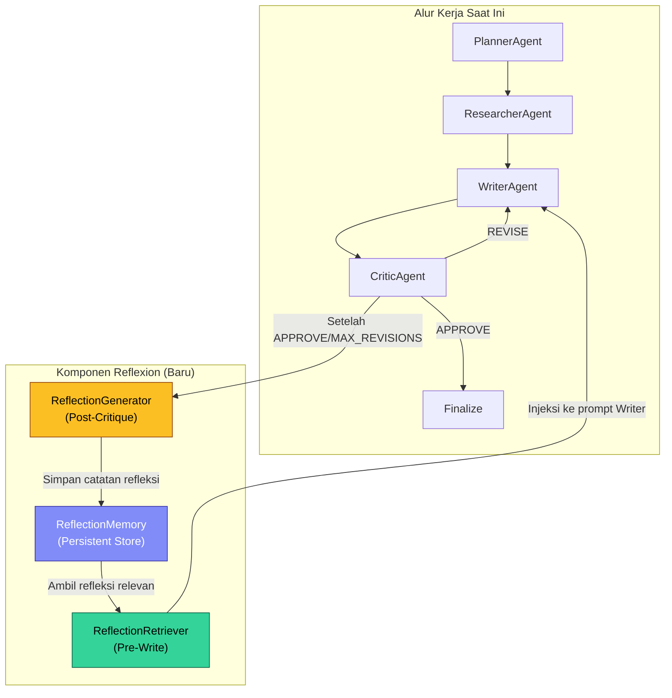
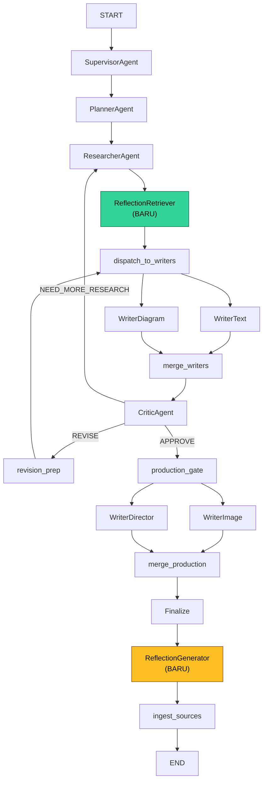

# PRD: Implementasi Arsitektur Reflexion pada Sistem Multi-Agen

> **Project**: Skripsi -- Analisis Kinerja Koherensi Naratif dan Faithfulness pada Sistem Agentic AI dan LightRAG
> **Author**: Mohammad Raya Satriatama
> **Version**: 1.0
> **Date**: 2026-06-09
> **Status**: Draft -- Menunggu Persetujuan

---

## 1. Ringkasan Eksekutif

Dokumen ini mendefinisikan rencana implementasi arsitektur **Reflexion** (Shinn et al., 2023) ke dalam sistem multi-agen pembuatan cerita anak berbasis LangGraph. Reflexion menambahkan kapabilitas **pembelajaran lintas sesi** (*cross-episode learning*) melalui memori refleksi persisten, sehingga sistem dapat menghindari kesalahan berulang dan meningkatkan kualitas output secara progresif.

**Tujuan**: Memperluas mekanisme Self-Refine yang sudah ada (perbaikan iteratif dalam satu sesi) menjadi Reflexion penuh (perbaikan berbasis memori lintas sesi).

---

## 2. Analisis Arsitektur Saat Ini

### 2.1 Paradigma yang Sudah Terimplementasi

| Paradigma | Komponen | Status |
|:---|:---|:---|
| **Plan-and-Solve** | PlannerAgent, ResearchAgent._plan_research() | Terpenuhi |
| **MRKL** | SupervisorAgent sebagai router semantik ke 7 agen spesialis | Terpenuhi |
| **Self-Refine** | CriticAgent -> WriterAgent (loop revisi iteratif) | Terpenuhi |
| **BSM** | Parallel dispatch (writer_text + writer_diagram) -> merge_writers | Terpenuhi |
| **Hierarchical ReAct** | SupervisorAgent: Observe state -> Reason -> Route to agent (berulang) | Terpenuhi |

### 2.2 Celah yang Diisi oleh Reflexion

| Aspek | Self-Refine (Saat Ini) | Reflexion (Target) |
|:---|:---|:---|
| Cakupan refleksi | Dalam satu sesi saja | Lintas sesi (persisten) |
| Memori kegagalan | Tidak ada | Catatan refleksi tersimpan di *memory store* |
| Pembelajaran progresif | Tidak ada | Sistem membaik seiring bertambahnya sesi |
| Pencegahan kesalahan berulang | Tidak ada | Refleksi masa lalu dimuat sebelum penulisan |

---

## 3. Desain Arsitektur Reflexion

### 3.1 Diagram Alur



### 3.2 Komponen Baru

#### A. ReflectionMemory (Persistent Store)

Penyimpanan catatan refleksi lintas sesi. Dua opsi implementasi:

| Opsi | Teknologi | Kelebihan | Kekurangan |
|:---|:---|:---|:---|
| **A1: LightRAG** | LightRAG API (sudah terintegrasi) | Tidak perlu infrastruktur baru, mendukung pencarian semantik | Catatan refleksi bercampur dengan konten riset |
| **A2: SQLite** | SQLite + embedding search | Isolasi data refleksi, kontrol penuh | Perlu implementasi pencarian semantik sendiri |

**Rekomendasi**: Opsi **A2 (SQLite)** dengan tabel khusus `reflections`, karena memisahkan data refleksi dari basis pengetahuan riset dan menghindari kontaminasi konteks.

**Skema Tabel:**

```sql
CREATE TABLE reflections (
    id INTEGER PRIMARY KEY AUTOINCREMENT,
    session_id TEXT NOT NULL,
    trace_id TEXT,
    timestamp DATETIME DEFAULT CURRENT_TIMESTAMP,

    -- Konteks cerita
    theme TEXT NOT NULL,
    language TEXT NOT NULL,
    topic_category TEXT,              -- 'science', 'history', 'culture', dll.

    -- Metrik evaluasi
    faithfulness_fables REAL,
    faithfulness_ragas REAL,
    geval_avg REAL,
    revision_count INTEGER,
    quality_score REAL,

    -- Catatan refleksi (dihasilkan oleh LLM)
    reflection_text TEXT NOT NULL,     -- Analisis naratif tentang kekuatan/kelemahan
    action_items TEXT,                 -- Langkah perbaikan spesifik (JSON array)
    failure_patterns TEXT,             -- Pola kegagalan yang teridentifikasi (JSON array)

    -- Embedding untuk pencarian semantik
    theme_embedding BLOB              -- Vektor embedding dari theme (opsional)
);

CREATE INDEX idx_reflections_topic ON reflections(topic_category);
CREATE INDEX idx_reflections_language ON reflections(language);
```

#### B. ReflectionGenerator (Post-Critique)

Modul yang menghasilkan catatan refleksi setelah `CriticAgent` memberikan keputusan akhir (APPROVE atau MAX_REVISIONS tercapai).

**Lokasi file**: `src/workflows/story_agent/agents/reflection.py`

```python
class ReflectionNote(BaseModel):
    """Structured reflection note generated after story completion."""
    strengths: List[str] = Field(
        ..., description="Aspek yang berhasil dilakukan dengan baik"
    )
    weaknesses: List[str] = Field(
        ..., description="Aspek yang memerlukan perbaikan"
    )
    failure_patterns: List[str] = Field(
        ..., description="Pola kegagalan yang teridentifikasi"
    )
    action_items: List[str] = Field(
        ..., description="Langkah spesifik untuk meningkatkan kualitas "
                         "pada cerita bertema serupa di masa depan"
    )
    topic_category: str = Field(
        ..., description="Kategori topik: science, history, culture, geography, biology, dll."
    )
    reflection_summary: str = Field(
        ..., description="Ringkasan refleksi dalam 2-3 kalimat"
    )


class ReflectionGenerator:
    """Generates structured reflection notes after story completion."""

    def __init__(self, model_name: str = None):
        self.llm = get_llm_for_agent("reflection", model_name=model_name)
        self.structured_llm = self.llm.with_structured_output(ReflectionNote)
        self.db_path = "Eval_Data/reflections.db"

    async def generate_and_store(self, state: StoryState) -> dict:
        """
        Menganalisis hasil akhir cerita dan menyimpan catatan refleksi.
        Dipanggil sebagai node LangGraph setelah finalize.
        """
        # 1. Kumpulkan konteks evaluasi
        context = self._build_reflection_context(state)

        # 2. Generate refleksi via LLM
        reflection = await self.structured_llm.ainvoke(context)

        # 3. Simpan ke SQLite
        self._store_reflection(state, reflection)

        return {"reflection_generated": True}

    def _build_reflection_context(self, state: StoryState) -> str:
        """Bangun prompt refleksi dari state akhir."""
        return f"""Analisis hasil pembuatan cerita berikut dan buat catatan refleksi:

Tema: {state.get('theme', '')}
Bahasa: {state.get('language', '')}
Jumlah Revisi: {state.get('revision_count', 0)}
Skor Kualitas Akhir: {state.get('quality_score', 0.0)}

Umpan Balik Kritik Terakhir:
{state.get('critique_feedback', 'Tidak ada')}

Ringkasan Draf (500 karakter pertama):
{(state.get('draft_content', '') or '')[:500]}

Catatan Riset (300 karakter pertama):
{(state.get('research_notes', '') or '')[:300]}

Berdasarkan informasi di atas, identifikasi:
1. Apa yang berhasil dengan baik?
2. Apa yang masih lemah?
3. Pola kegagalan apa yang perlu diwaspadai?
4. Langkah spesifik apa yang harus dilakukan untuk topik serupa di masa depan?
"""
```

#### C. ReflectionRetriever (Pre-Write)

Modul yang mengambil catatan refleksi relevan sebelum `WriterAgent` mulai menulis.

```python
class ReflectionRetriever:
    """Retrieves relevant past reflections before writing begins."""

    def __init__(self):
        self.db_path = "Eval_Data/reflections.db"

    async def retrieve(self, state: StoryState) -> dict:
        """
        Mengambil refleksi relevan berdasarkan kesamaan tema/kategori topik.
        Dipanggil sebagai node LangGraph sebelum dispatch_to_writers.
        """
        theme = state.get("theme", "")
        language = state.get("language", "")

        reflections = self._query_similar_reflections(theme, language, limit=3)

        if reflections:
            # Format refleksi menjadi teks yang dapat diinjeksikan ke prompt Writer
            reflection_prompt = self._format_for_writer(reflections)
            return {"past_reflections": reflection_prompt}

        return {"past_reflections": ""}

    def _query_similar_reflections(
        self, theme: str, language: str, limit: int = 3
    ) -> list:
        """Query refleksi berdasarkan kategori topik dan bahasa."""
        # Implementasi: query SQLite berdasarkan topic_category dan language
        # Opsional: gunakan embedding similarity untuk pencarian semantik
        ...

    def _format_for_writer(self, reflections: list) -> str:
        """Format catatan refleksi menjadi instruksi untuk WriterAgent."""
        lines = ["=== CATATAN REFLEKSI DARI SESI SEBELUMNYA ==="]
        for i, ref in enumerate(reflections, 1):
            lines.append(f"\n--- Refleksi #{i} (Tema: {ref['theme']}) ---")
            lines.append(f"Kelemahan: {ref['weaknesses']}")
            lines.append(f"Langkah perbaikan: {ref['action_items']}")
        lines.append("\nGunakan catatan di atas untuk menghindari "
                     "kesalahan serupa.\n")
        return "\n".join(lines)
```

---

## 4. Integrasi ke LangGraph Workflow

### 4.1 Perubahan pada `graph.py`

```python
# Impor baru
from .agents.reflection import ReflectionGenerator, ReflectionRetriever

# Inisialisasi
reflection_gen = ReflectionGenerator(credentials=credentials, project=PROJECT_ID)
reflection_ret = ReflectionRetriever()

# Node baru
workflow.add_node("retrieve_reflections", reflection_ret.retrieve)
workflow.add_node("generate_reflection", reflection_gen.generate_and_store)

# Perubahan alur: sisipkan retrieve_reflections sebelum writers
# SEBELUM:  research -> dispatch_to_writers
# SESUDAH:  research -> retrieve_reflections -> dispatch_to_writers
workflow.add_edge("research", "retrieve_reflections")
workflow.add_conditional_edges(
    "retrieve_reflections",
    dispatch_to_writers,
    ["writer_text", "writer_diagram"]
)

# Perubahan alur: sisipkan generate_reflection setelah finalize
# SEBELUM:  finalize -> ingest_sources -> END
# SESUDAH:  finalize -> generate_reflection -> ingest_sources -> END
workflow.add_edge("finalize", "generate_reflection")
workflow.add_edge("generate_reflection", "ingest_sources")
workflow.add_edge("ingest_sources", END)
```

### 4.2 Perubahan pada `writer.py`

```python
# Di dalam metode write(), tambahkan injeksi refleksi ke prompt:
past_reflections = state.get("past_reflections", "")
if past_reflections:
    writing_prompt += f"\n\n{past_reflections}"
```

### 4.3 Perubahan pada `state.py`

```python
# Tambahkan field baru ke StoryState
class StoryState(TypedDict, total=False):
    # ... field yang sudah ada ...
    past_reflections: str          # Catatan refleksi dari sesi sebelumnya
    reflection_generated: bool     # Flag bahwa refleksi sudah disimpan
```

### 4.4 Diagram Alur Akhir (Setelah Reflexion)



---

## 5. Perubahan File

### 5.1 File Baru

| File | Tujuan |
|:---|:---|
| `src/workflows/story_agent/agents/reflection.py` | ReflectionGenerator + ReflectionRetriever |
| `Eval_Data/reflections.db` | SQLite database untuk menyimpan catatan refleksi |
| `tests/test_reflection.py` | Unit test untuk modul refleksi |

### 5.2 File yang Dimodifikasi

| File | Perubahan |
|:---|:---|
| `src/workflows/story_agent/state.py` | Tambah field `past_reflections` dan `reflection_generated` |
| `src/workflows/story_agent/graph.py` | Tambah 2 node baru dan ubah alur edge |
| `src/workflows/story_agent/agents/writer.py` | Injeksi `past_reflections` ke prompt penulisan |
| `Streamlit/tabs/correlation.py` | (Opsional) Tambah visualisasi tren refleksi lintas sesi |

---

## 6. Rencana Evaluasi Dampak Reflexion

### 6.1 Metrik Perbandingan

| Metrik | Sebelum Reflexion | Target Sesudah |
|:---|:---|:---|
| FABLES Faithfulness (rata-rata) | Baseline saat ini | +5-10% peningkatan pada topik berulang |
| Jumlah revisi rata-rata | Baseline saat ini | Berkurang 15-25% pada topik berulang |
| G-Eval Coherence | Baseline saat ini | Stabil atau meningkat |

### 6.2 Desain Eksperimen

1. **Kelompok Kontrol**: 20 cerita dihasilkan TANPA Reflexion (alur saat ini)
2. **Kelompok Eksperimen**: 20 cerita dihasilkan DENGAN Reflexion (topik bertema serupa dijalankan berurutan)
3. **Variabel Dependen**: Skor FABLES, G-Eval, jumlah revisi
4. **Pengujian Statistik**: Mann-Whitney U (one-sided), Cohen's d

---

## 7. Estimasi Upaya

| Tahap | Tugas | Estimasi |
|:---|:---|:---|
| **1. Fondasi** | Buat `reflection.py` (Generator + Retriever + skema SQLite) | 1-2 hari |
| **2. Integrasi** | Modifikasi `graph.py`, `state.py`, `writer.py` | 1 hari |
| **3. Pengujian** | Unit test + integrasi test dengan 5 cerita berurutan | 1 hari |
| **4. Evaluasi** | Eksperimen 40 cerita (20 kontrol + 20 eksperimen) | 2-3 hari |
| **5. Analisis** | Statistik perbandingan + visualisasi Streamlit | 1 hari |
| | **Total** | **6-8 hari** |

---

## 8. Risiko dan Mitigasi

| Risiko | Dampak | Mitigasi |
|:---|:---|:---|
| Refleksi yang tidak relevan mencemari prompt Writer | Kualitas cerita menurun | Filter ketat berdasarkan kategori topik + batas 3 refleksi |
| Overhead latensi dari node Reflexion tambahan | Waktu pembuatan cerita bertambah | Operasi SQLite cepat (<100ms); LLM call refleksi paralel dengan ingestion |
| Catatan refleksi terlalu generik | Tidak memberikan perbaikan spesifik | Prompt refleksi yang terstruktur ketat (Pydantic schema) |
| Akumulasi refleksi tidak relevan seiring waktu | Database membengkak | Kebijakan retensi: simpan maksimal 100 refleksi terbaru per kategori |
| Bias konfirmasi: refleksi mengunci pola tertentu | Kreativitas menurun | Sertakan flag `diversity_mode` yang mengabaikan refleksi secara acak (10-20% sesi) |

---

## 9. Kriteria Penerimaan

| Kriteria | Ambang Batas |
|:---|:---|
| Catatan refleksi berhasil disimpan setelah setiap sesi | 100% sesi menghasilkan entry di `reflections.db` |
| Refleksi relevan berhasil diambil sebelum penulisan | Retrieval precision >= 80% (manual audit 20 sesi) |
| Peningkatan FABLES pada topik berulang | Delta rata-rata >= +0.05 (signifikan, p < 0.05) |
| Penurunan jumlah revisi pada topik berulang | Delta rata-rata >= -0.5 revisi |
| Tidak ada regresi pada G-Eval Coherence | Delta rata-rata >= -0.1 (tidak signifikan) |
| Latensi tambahan per sesi | < 3 detik (Retrieval + Generation) |

---

## 10. Referensi

1. Shinn, N., et al. (2023). *Reflexion: Language Agents with Verbal Reinforcement Learning.* NeurIPS 2023. arXiv:2303.11366.
2. Madaan, A., et al. (2023). *Self-Refine: Iterative Refinement with Self-Feedback.* NeurIPS 2023. arXiv:2303.17651.
3. Yao, S., et al. (2022). *ReAct: Synergizing Reasoning and Acting in Language Models.* ICLR 2023. arXiv:2210.03629.
4. Karpas, E., et al. (2022). *MRKL Systems: A modular, neuro-symbolic architecture that combines large language models, external knowledge sources and discrete reasoning.* arXiv:2205.00445.
5. Wang, L., et al. (2023). *Plan-and-Solve Prompting: Improving Zero-Shot Chain-of-Thought Reasoning by Large Language Models.* ACL 2023. arXiv:2305.04091.
